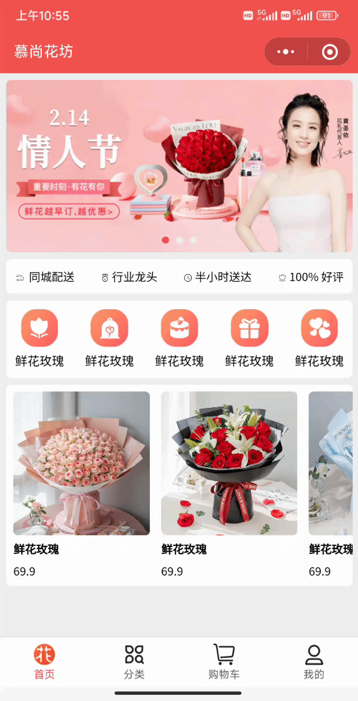
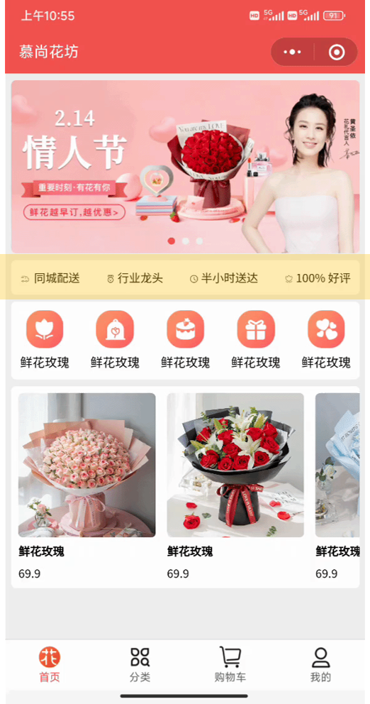
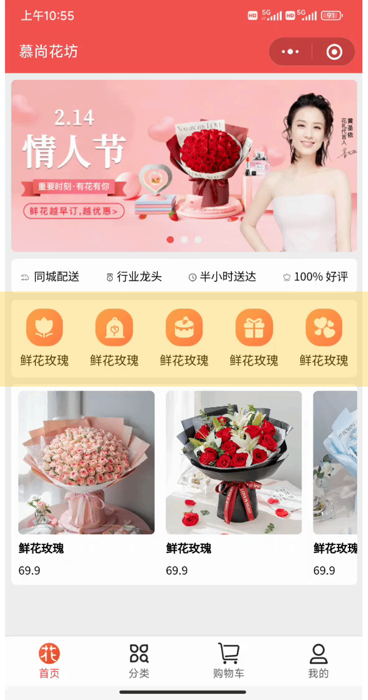
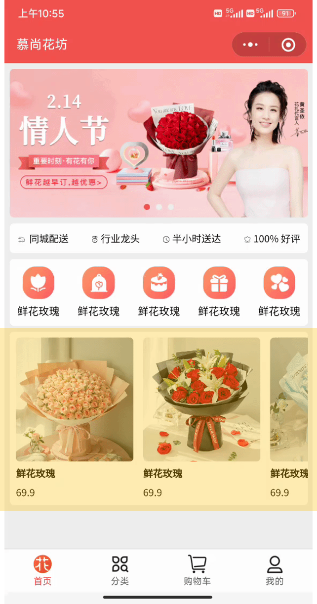
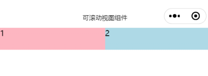
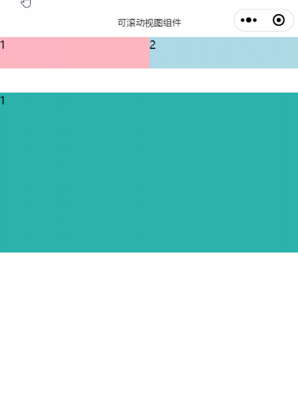
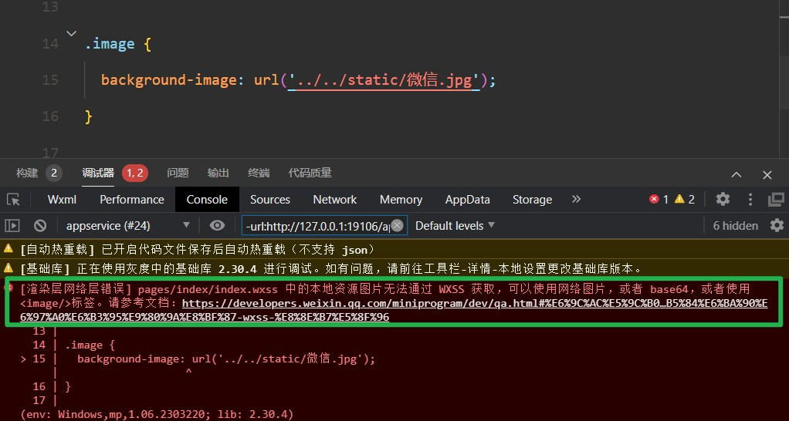
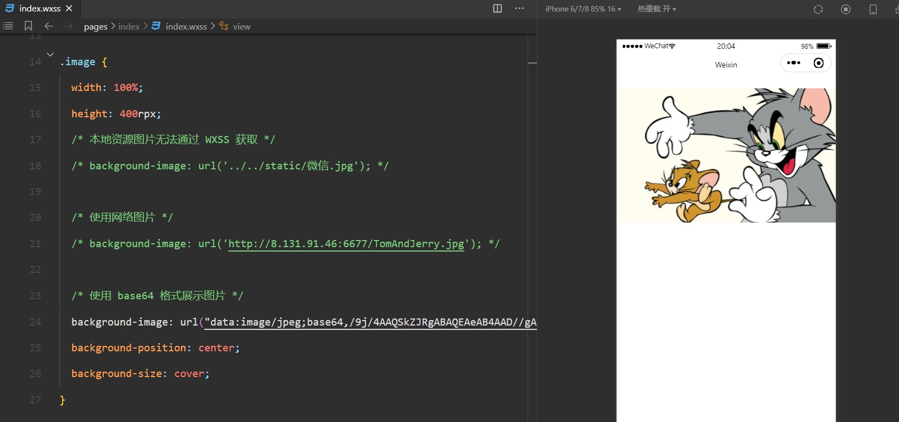

## 常用样式和组件


### 1. 组件和样式介绍


在开 Web 网站的时候：

页面的结构由 `HTML` 进行编写，例如：经常会用到 `div`、`p`、 `span`、`img`、`a` 等标签

页面的样式由 `CSS`   进行编写，例如：经常会采用 `.class` 、`#id` 、`element` 等选择器


**<font color="red">但在小程序中不能使用 `HTML` 标签，也就没有 `DOM` 和 `BOM`，同时仅仅支持部分 `CSS`选择器</font>**

不过不用担心，小程序中提供了同样的角色：


其中 `WXML` 充当的就是类似 `HTML` 的角色，只不过在 `WXML` 中没有`div`、`p`、 `span`、`img`、`a` 等原生标签的，在 `WXML` 中需要使用 小程序提供的 `view`、`text` 、`image`、`navigator` 等标签来构建页面结构，**小程序提供的这些标签，我们称为 "组件"**，开发者可以通过组合这些基础组件进行快速开发。


 `WXSS` 则充当的就是类似 `CSS` 的角色，`WXSS` 具有 `CSS` 大部分的特性，小程序在 `WXSS` 也做了一些扩充和修改，新增了尺寸单位 `rpx`、提供了**全局样式**和**局部样式**，另外需要注意的是`WXSS` 仅**支持部分 `CSS` 选择器**。


小程序给提供的组件文档：[WXML](https://developers.weixin.qq.com/miniprogram/dev/framework/view/wxml/)

小程序样式官方文档：[WXSS](https://developers.weixin.qq.com/miniprogram/dev/framework/view/wxss.html)


### 2. 样式-尺寸单位


随着智能手机的发展，手机设备的宽度也逐渐多元化，这就需要开发者在开发的时候，需要适配不同屏幕宽度的手机。为了解决屏幕适配的问题，微信小程序推出了 rpx 单位


小程序运行在手机移动端，宿主环境是微信，因为手机尺寸的不一致，在写 `CSS` 样式时，开发者需要考虑到手机设备的屏幕会有不同的宽度和设备像素比，会采用一些技巧来算像素单位从而实现页面的适配。而 `WXSS` 在底层支持**新的尺寸单位 `rpx`**，开发者可以**免去换算的烦恼**，只要交给小程序底层来换算即可。


`rpx `:  小程序新增的拓展单位，可以根据屏幕宽度进行自适应，小程序规定任何型号手机：**屏幕宽都为 750 rpx**。


> 📌 **注意事项：**
>
> ​	小程序规定任何型号手机：屏幕宽都为 750 rpx 


> 🔔 **开发建议**： 
>
> ​	开发微信小程序时设计师可以用 iPhone6 作为视觉稿的标准。
>
> ​	iPhone6 的设计稿一般是 750px，小程序的宽是 750rpx
>
> ​	在我们开发小程序页面时，量取多少 px ，直接写多少 rpx，开发起来更方便，也能够适配屏幕的适配
>
> 
>
> ​	原因：
>
> ​	设计稿宽度是 750px，而 iPhone6 的手机设备宽度是 375px， 设计稿想完整展示到手机中，刚好需要缩小一倍
>
> ​	在 iPhone6 下，px 和 rpx 的换算关系是：750rpx = 375px，1px = 2rpx，刚好能够填充满整个屏幕的宽度


**落地代码：**

`➡️ pages/index/index.wxml`

```html
<!-- 需求：绘制一个盒子，让盒子的宽度占据屏幕的一半 -->

<!-- view 是小程序提供的组件，是容器组件，类似于 div，也是一个块级元素，占据一行 -->
<!-- 如果想实现需求，不能使用 px，px 使固定单位，不能实现自适应，需要使用小程序提供的 rpx  -->
<!-- 微信小程序规定，不管是什么型号的手机，屏幕的宽度都是 750rpx -->
<!-- rpx 单位能够实现自适应的 -->
<view class="box">尚硅谷</view>
```


`➡️ pages/index/index.wxss`

```css
/* 通过演示使用 css 作为单位，px 是不具有响应式的 */

/* image {
  width: 375px;
  height: 600px;
  background-color: lightgreen;
} */

.box {
  width: 375rpx;
  height: 600rpx;
  background-color: lightgreen;
}

```


### 3. 样式-全局样式和局部样式


在进行网页开发时，我们经常创建 global.css、base.css 或者 reset.css 作为全局样式文件进行重置样式或者样式统一，然后在每个页面或组件中写当前页面或组件的局部样式，小程序中也存在全局样式和局部样式，这一节我们来学习一下小程序中的全局样式和局部样式


**知识点：**


全局样式：指在 `app.wxss`中定义的样式规则，作用于每一个页面，例如：设置字号、背景色、宽高等全局样式

局部样式：指在`page.wxss`中定义的样式规则，只作用在对应的页面，并会覆盖 app.wxss 中相同的选择器。


**案例：**


在 `app.wxss` 中定义全局样式，设置 `text` 组件的颜色以及字号大小，这段样式将会作用于任意页面的 `text` 组件

```css
/* app.wxss */

text {
  color: lightseagreen;
  font-size: 50rpx;
}

```


然后在 `cate.wxss` 中定义局部样式，设置 `text` 组件的颜色以及字号大小，会发现局部样式将全局样式进行了覆盖

```css
/* pages/index/index.wxss */

text {
  color: red;
  font-size: 30rpx;
}

```


### 4. 划分页面结构-view 组件





使用小程序常用的组件实现项目首页的效果，会使用以下组件：


1.view 组件

2.text 组件

3.image 组件

4.navigator 组件

5.swiper 和 swiper-item 组件

6.scroll-view 组件

7.字体图标


分析页面结构，使用 view 组件将页面拆分成 4 个区域


**view 是小程序提供的组件，是容器组件，类似于 div，也是一个块级元素，占据一行**


```html
<!-- 轮播图区域 -->
<view class="swiper">1</view>

<!-- 公司相关信息 -->
<view class="info">2</view>

<!-- 商品导航区域 -->
<view class="goods-nav">3</view>

<!-- 商品推荐区域 -->
<view class="hot">4</view>

```


### 5. 首页轮播图区域-swiper 组件


在前面我们已经介绍了小程序的组件应该怎么使用，又学习了小程序中的样式，接下来带着大家使用小程序提供的组件，完成小程序的基本结构，通过这个案例我们能够学习到小程序常用的组件以及一些布局技巧。


**知识点：**


在进行网页开发的时候，实现轮播图的时候，我们通常先使用 HTML 、CSS 实现轮播图的样式结构，然后使用 JS 控制轮播图的效果，或者直接使用插件实现轮播图的功能，而在小程序中实现小程序功能则相对简单很多。


在小程序中，提供了 `swiper` 和 `swiper-item` 组件实现轮播图：


1. `swiper`：滑块视图容器，常用来实现轮播图，其中只可放置 [swiper-item](https://developers.weixin.qq.com/miniprogram/dev/component/swiper-item.html) 组件，否则会导致未定义的行为
2. `swiper-item`：仅可放置在[swiper](https://developers.weixin.qq.com/miniprogram/dev/component/swiper.html)组件中，宽高自动设置为100%，代表 `swiper` 中的每一项


我们可以使用 `swiper` 组件提供的属性，实现轮播图的订制，常见属性如下：

|                             属性                             |         说明         |              类型               |
| :----------------------------------------------------------: | :------------------: | :-----------------------------: |
|                        indicator-dots                        |  是否显示面板指示点  |      boolean (默认 false)       |
|                       indicator-color                        |      指示点颜色      | color (默认：rgba(0, 0, 0, .3)) |
|                    indicator-active-color                    | 当前选中的指示点颜色 |      color (默认：#000000)      |
|                           autoplay                           |     是否自动切换     |      boolean (默认 false)       |
|                           interval                           |   自动切换时间间隔   |       number (默认 5000)        |
|                           circular                           |   是否采用衔接滑动   |      boolean (默认 false)       |
| [其他属性...](https://developers.weixin.qq.com/miniprogram/dev/component/swiper.html) |                      |                                 |


**落地代码：**


`➡️ pages/index/index.wxml`

```html
<!-- 轮播图区域 -->
<view class="swiper">
  <!-- swiper 组件实现轮播图区域的绘制 -->
  <!-- swiper 组件，滑块视图容器 -->
  <swiper
    circular
    autoplay
    indicator-dots
    interval="2000"
    indicator-color="#efefef"
    indicator-active-color="#ccc"
  >
    <!-- swiper 组件内部不能写其他组件或内容 -->
    <!-- 在 swiper 组件内部只能写 swiper-item 组件 -->
    <!-- swiper-item 组件只能放到 swiper 组件中，宽高自动设置为 100% -->
    <swiper-item>
      第一张轮播图
    </swiper-item>

    <swiper-item>
      第二张轮播图
    </swiper-item>

    <swiper-item>
      第三张轮播图
    </swiper-item>
  </swiper>
</view>
```


`➡️ pages/index/index.scss`

```scss
page {
  height: 100vh;
  background-color: #efefef !important;
}

swiper {
  swiper-item {

    // 在 Sass 拓展语言中，& 符号表示父选择器的引用。它用于在嵌套的选择器中引用父选择器
    // 下面这段代码在编译以后，生成的代码是 swiper-item:first-child
    &:first-child {
      background-color: skyblue;
    }

    &:nth-child(2) {
      background-color: lightcoral;
    }

    &:last-child {
      background-color: lightseagreen;
    }
  }
}
```


### 6. 首页轮播图区域-image 组件


在这一节中，我们开始来学习小程序中的`image`组件，通过学习该组件掌握组件的学习方法和使用技巧

在小程序中没有 img 标签，添加图片需要使用小程序提供的`image`组件，`image`组件的语法如下：


```html
<!-- src：图片资源地址 -->
<!-- mode：图片裁剪、缩放的模式 -->
<!-- show-menu-by-longpress：布尔属性，开启图片长按分享功能 -->
<!-- lazy-load：图片懒加载，在即将进入一定范围（上下三屏）时才开始加载 -->
<image src="/assets/tom.png" mode="heightFix" lazy-load=”{{ true }}“ />
```

**注意：**`image`组件具有默认宽高，宽320px、高240px。即使没有设置src属性也会占据位置。


**落地代码**


`➡️ pages/index/index.wxml`

```html
<!-- 轮播图区域 -->
<view class="swiper">
  <swiper
    circular
    autoplay
    indicator-dots
    interval="2000"
    indicator-color="#efefef"
    indicator-active-color="#ccc"
  >
    <swiper-item>
      <!-- 在小程序中图片不能使用 img 标签，使用后不会生效 -->
      <!--  -->

      <!-- 需要使用 images 组件 -->
      <!-- image 组件不给 src 属性设置默认值，也占据宽和高 -->
      <!-- image 默认具有宽度，宽是 320px 高度是 240px -->

      <!-- mode 属性：用来设置图片的裁切模式、纵横比例、显示的位置 -->
      <!-- show-menu-by-longpress 属性：长按转发给朋友、收藏、保存图片 -->
      <image src="../../assets/banner/banner-1.png" mode="aspectFill" show-menu-by-longpress />
    </swiper-item>

    <swiper-item>
      <image src="../../assets/banner/banner-2.png" />
    </swiper-item>

    <swiper-item>
      <image src="../../assets/banner/banner-3.png" />
    </swiper-item>
  </swiper>
</view>

```


`➡️ pages/index/index.scss`

```scss
/** index.wxss **/
page {
  height: 100vh;
  background-color: #efefef !important;
}

swiper {
  height: 360rpx;

  swiper-item {
    image {
      width: 100%;
      height: 100%;
    }

    // 在 Sass 拓展语言中，& 符号表示父选择器的引用。它用于在嵌套的选择器中引用父选择器
    // 下面这段代码在编译以后，生成的代码是 swiper-item:first-child
    // &:first-child {
    //   background-color: skyblue;
    // }

    // &:nth-child(2) {
    //   background-color: lightcoral;
    // }

    // &:last-child {
    //   background-color: lightseagreen;
    // }
  }
}
```


### 7. 公司宣传语区域-text 组件

在小程序中，如果需要渲染文本，需要使用 `text` 文本组件。它类似于 `<span>`，是行内元素。常用属性有2个：

- `user-select`：文本是否可选，用于长按选择文本
- `space`：显示连续空格

**注意：**

- 除了`text`组件，其他组件都无法长按选中
- `text`组件内只支持嵌套`text`



**落地代码：**


`➡️ pages/index/index.wxml`

```html
<!-- 公司相关信息 -->
<view class="info">
  <!-- text 是文本组件，类似于 span，是行内元素 -->

  <!-- user-select：文本是否可选 -->
  <!-- space：是否连续展示空格 -->
  <!-- <text user-select space="ensp">同城        配送</text> -->

  <text>同城配送</text>
  <text>行业龙头</text>
  <text>半小时送达</text>
  <text>100% 好评</text>
</view>
```


`➡️ pages/index/index.scss`

```scss
.info {
  display: flex;
  justify-content: space-between;
  align-items: center;
  margin: 16rpx 0rpx;
  padding: 20rpx;
  font-size: 24rpx;
  background-color: #fff;
  border-radius: 10rpx;
}
```


### 8. 商品导航的区域-组件结合使用


到目前为止我们已经学习了 `view` 、`text`、`image` 以及 `swiper` 和 `swiper-item`组件的使用

接下来我们继续来使用小程序提供的组件实现首页的功能，这节我们需要实现的是商品导航区域的结构


**知识点：**




在网页开发中，实现该布局非常简单，使用 `div` 嵌套 或者 `ul` 包裹住 `li`，`li` 在包裹住 `img` 就能够实现该效果

但在小程序中没有 HTML 中的 `div`、`ul`、`li` 标签，所以绘制导航区域需要使用小程序提供的的组件，我们先来学习小程序的两个组件：


1. `view`：视图容器组件，相当于 HTML 中的 `div`，是一个块级元素，独占一行
2. `text`：文本组件，相当于 `span`，是一个行内元素


**落地代码：**


`➡️ pages/index/index.wxml`

```html
<!-- view：视图容器，作用类似于 div，是一个块级元素，独占一行 -->
<view class="navs">
  <view>
    <!-- text：文本组件，类似于 span，是一个行内元素 -->
    <image src="/assets/cate-1.png" alt=""/>
    <text>爱礼精选</text>
  </view>
  <view>
    <image src="/assets/cate-2.png" alt=""/>
    <text>鲜花玫瑰</text>
  </view>
  <view>
    <image src="/assets/cate-3.png" alt=""/>
    <text>永生玫瑰</text>
  </view>
  <view>
    <image src="/assets/cate-4.png" alt=""/>
    <text>玫瑰珠宝</text>
  </view>
  <view>
    <image src="/assets/cate-5.png" alt=""/>
    <text>香水护体</text>
  </view>
</view>
```


`➡️ pages/index/index.wxss`

```css
// 商品导航区域
.good-nav {
  display: flex;
  justify-content: space-between;
  background-color: #fff;
  padding: 20rpx 16rpx;
  border-radius: 10rpx;

  view {
    display: flex;
    flex-direction: column;
    align-items: center;

    image {
      width: 80rpx;
      height: 80rpx;
    }

    text {
      font-size: 24rpx;
      margin-top: 12rpx;
    }
  }
}

```


### 9. 跳转到商品列表页面-navigator


**知识点：**


点击商品导航区域，需要跳转到商品列表界面，在网页开发中，如果想实现页面的跳转需要使用 a 标签，在小程序中如果想实现页面的跳转则需要使用 navigator 组件，语法如下：


```html
<!-- url：当前小程序内的跳转链接 --> 
<navigator url="/pages/list/list">
```

注意：这个url的值是`pages`配置项的值前面再加一个`/`

在小程序中，如果需要进行跳转，需要使用 navigation 组件，常用的属性有 2 个：

1. url ：当前小程序内的跳转链接

2. open-type ：跳转方式
   - navigate：保留当前页面，跳转到应用内的某个页面。但是不能跳到 tabbar 页面
   - redirect： 关闭当前页面，跳转到应用内的某个页面。但不能跳转到 tabbar 页面
   - switchTab：只能跳转到 tabBar 页面，并关闭其他所有非 tabBar 页面
   - reLaunch：关闭所有页面，打开到应用内的某个页面
   - navigateBack：关闭当前页面，返回上一页面或多级页面


> 📌 **注意事项：**
>
> 1. 路径后可以带参数。参数与路径之间使用 ? 分隔，参数键与参数值用 = 相连，不同参数用 & 分隔
>    例如：`/list?id=10&name=hua`，在 `onLoad(options)` 生命周期函数可以中获取传递的参数 
>
> 2. 属性 `open-type="switchTab"` 时，不支持带路径参数


**落地代码：**


`➡️ pages/index/index.wxml` ： 调整 view 为 navigator

```html
<!-- view：视图容器，作用类似于 div，是一个块级元素，独占一行 -->
<view class="navs">
  <navigator url="/pages/list/list">
    <!-- text：文本组件，类似于 span，是一个行内元素 -->
    <image src="/assets/cate-1.png" alt=""/>
    <text>爱礼精选</text>
  </navigator>
  <navigator url="/pages/list/list">
    <image src="/assets/cate-2.png" alt=""/>
    <text>鲜花玫瑰</text>
  </navigator>
  <navigator url="/pages/list/list">
    <image src="/assets/cate-3.png" alt=""/>
    <text>永生玫瑰</text>
  </navigator>
  <navigator url="/pages/list/list">
    <image src="/assets/cate-4.png" alt=""/>
    <text>玫瑰珠宝</text>
  </navigator>
  <navigator url="/pages/list/list">
    <image src="/assets/cate-5.png" alt=""/>
    <text>香水护体</text>
  </navigator>
</view>
```


`➡️ pages/index/index.wxss`： 

```css
// 商品导航区域
.good-nav {
  display: flex;
  justify-content: space-between;
  background-color: #fff;
  padding: 20rpx 16rpx;
  border-radius: 10rpx;

  view {
+    navigator {
+      display: flex;
+      flex-direction: column;
+      align-items: center;
+    }

    image {
      width: 80rpx;
      height: 80rpx;
    }

    text {
      font-size: 24rpx;
      margin-top: 12rpx;
    }
  }
}

```


### 10. 商品推荐区域-scroll-view


**可滚动视图区域**，适用于需要滚动展示内的场景，它可以在小程序中实现类似于网页中的滚动条效果，用户可以通过手指滑动或者点击滚动条来滚动内容，[scroll-view](https://developers.weixin.qq.com/miniprogram/dev/component/scroll-view.html) 组件可以设置滚动方向、滚动条样式、滚动到顶部或底部时的回调函数等属性，可以根据实际需求进行灵活配置。





#### 3.10.1 scroll-view 横向滚动


**知识点**：


使用横向滚动时，需要添加 `scroll-x` 布尔属性，然后通过 css 进行结构绘制，实现页面横向滚动




**落地代码：**


`➡️ pages/index/index.wxml`： 

```html
<!-- 商品推荐区域 -->
<view class="hot">
  <scroll-view class="scroll-x" scroll-x>
    <view>1</view>
    <view>2</view>
    <view>3</view>
  </scroll-view>
</view>
```


`➡️ pages/index/index.wxss`： 

```scss
.hot {
  margin-top: 16rpx;

  .scroll-x {
    width: 100%;
    white-space: nowrap;
    background-color: lightblue;

    view{
      display: inline-block;
      width: 50%;
      height: 80rpx;

      &:last-child{
        background-color: lightseagreen;
      }

      &:first-child{
        background-color: lightpink;
      }
    } 
  }
}
```


#### 3.10.2 scroll-view 纵向滚动


**知识点：**


使用竖向滚动时，需要给 `scroll-view` 一个固定高度，同时添加  `scroll-y` 布尔属性，实现页面纵向滚动





**落地代码：**


`➡️ pages/index/index.wxml：` 

```html
<!-- 商品推荐区域 -->
<view class="hot">
  <scroll-view class="scroll-x" scroll-x>
    <view>1</view>
    <view>2</view>
    <view>3</view>
  </scroll-view>

  <scroll-view class="scroll-y" scroll-y>
    <view>1</view>
    <view>2</view>
    <view>3</view>
  </scroll-view>
</view>
```


`➡️ pages/index/index.wxss`： 

```css
.hot {
  margin-top: 16rpx;

  .scroll-x {
    width: 100%;
    white-space: nowrap;
    background-color: lightblue;

    view{
      display: inline-block;
      width: 50%;
      height: 80rpx;

      &:last-child{
        background-color: lightseagreen;
      }

      &:first-child{
        background-color: lightcoral;
      }
    } 
  }

+  .scroll-y {
+    height: 400rpx;
+    background-color: lightsalmon;
+    margin-top: 60rpx;
+
+    view {
+      height: 400rpx;
+
+      &:nth-child(odd) {
+        background-color: lightseagreen;
+      }
+
+      &:nth-child(even) {
+        background-color: lightcoral;
+      }
+    }  
+  }
}
```


#### 3.10.3 实现商品推荐区域横向滚动


**落地代码**


`➡️ pages/index/index.wxml：` 

```html
<!-- 推荐商品 -->
<view class="good-hot">
  <scroll-view scroll-x class="scroll-x">
    
    <view>
      <view class="good-item">
        <image src="../../assets/floor/1.png" mode=""/>
        <text>鲜花玫瑰</text>
        <text>66</text>
      </view>
    </view>

    <view>
      <view class="good-item">
        <image src="../../assets/floor/2.png" mode=""/>
        <text>鲜花玫瑰</text>
        <text>77</text>
      </view>
    </view>

    <view>
      <view class="good-item">
        <image src="../../assets/floor/3.png" mode=""/>
        <text>鲜花玫瑰</text>
        <text>88</text>
      </view>
    </view>

    <view>
      <view class="good-item">
        <image src="../../assets/floor/4.png" mode=""/>
        <text>鲜花玫瑰</text>
        <text>99</text>
      </view>
    </view>

    <view>
      <view class="good-item">
        <image src="../../assets/floor/5.png" mode=""/>
        <text>鲜花玫瑰</text>
        <text>100</text>
      </view>
    </view>

  </scroll-view>
</view>
```


`➡️ pages/index/index.wxss：` 

```scss
// 推荐商品区域
.good-hot {
  background-color: #fff;
  padding: 16rpx;
  border-radius: 10rpx;
  font-size: 24rpx;

  .scroll-x {
    width: 100%;
    white-space: nowrap;

    view {
      display: inline-block;
      width: 320rpx;
      height: 440rpx;
      margin-right: 16rpx;

      .good-item {
        display: flex;
        flex-direction: column;
        justify-content: space-between;

        text {
          &:nth-of-type(1) {
            font-weight: bold;
          }
        }
      }

      image {
        width: 100%;
        height: 320rpx;
      }

      &:last-child {
        margin-right: 0;
      }
    }
  }
}
```


### 11. 字体图标的使用


在项目中使用到的小图标，一般由公司设计师进行设计，如果如果自行设计这些图标会比较麻烦且耗费时间，这时候我们就可以使用到阿里巴巴矢量图库，设计好以后上传到阿里巴巴矢量图标库，然后方便程序员来进行使用。


阿里巴巴矢量图库是阿里巴巴集团推出的一个免费的矢量图标库和图标管理工具。它汇集了大量的精美图标资源，包括品牌图标和各种主题和分类的图标。用户可以在阿里巴巴矢量图库中搜索和浏览所需的图标，也可以上传和管理自己的图标资源。


小程序中的字体图标使用方式与 `Web` 开发中的使用方式是一样的。

首先我们先找到所需的图标，加入到项目库，进入项目库中生成链接。也快将字体图标库下载到本地


点击链接，会将生成的 `CSS` 在新的链接页面进行打开，`ctrl + s`，将该文件重命名为`.wxss` 后缀名，然后保存到项目根目录下的`static` 文件夹下。


在全局样式文件`app.wxss`中导入`fonts.wxss`字体图标文件，然后获取到图标类名，在项目中使用即可，应用于页面

```css
@import "./static/fonts.wxss";
```

```html
<view class="myTest">
  <view class="iconfont icon-tuikuan"></view>
</view>
```


> 注意：使用字体图标可能会报错：
>
> ```shell
> [渲染层网络层错误] Failed to load font http://at.alicdn.com/t/c/font_3946178_q5oidsl5xo.woff2?t=1680795910637 net::ERR_CACHE_MISS (env: Windows,mp,1.06.2303220; lib: 2.30.4)
> ```
>
> 该错误可忽略，详见下面这个链接：
>
> https://developers.weixin.qq.com/miniprogram/dev/api/ui/font/wx.loadFontFace.html
>
> 
>
> **但在控制台出现错误，会影响开发调试，解决方案是：将字体图标转换成 base64 的格式**


**落地代码：**


`➡️ app.wxss`： 

```scss
// 在导入样式文件以后，必须以分号结尾，否则会出现异常

@import "./iconfont/iconfont.scss";
```


`➡️ pages/index/index.wxml`： 

```html
<!-- 公司信息 -->
<view class="info">
  <text><text class="iconfont icon-ps"></text> 同城配送</text>
  <text><text class="iconfont icon-lx"></text> 行业龙头</text>
  <text><text class="iconfont icon-time"></text> 半小时送达</text>
  <text><text class="iconfont icon-hp"></text> 100% 好评</text>
</view>

```


`➡️ pages/index/index.wxss`： 

```scss
// 公司信息区域
.info {
  display: flex;
  justify-content: space-between;
  background-color: #fff;
  padding: 20rpx 16rpx;
  border-radius: 10rpx;
  font-size: 24rpx;

+   .iconfont {
+     font-size: 24rpx;
+   }
}

```


### 12. 背景图片的使用


> 注：提供的网络地址连接：
>
> 
>
> 1. http://8.131.91.46:6677/bgimage.png
> 2. http://8.131.91.46:6677/TomAndJerry.jpg
>
> 


当编写小程序的样式文件时，我们可以使用 `background-image` 属性来设置一个元素的背景图像，但是**小程序的 `background-image` 不支持本地路径**。


```html
<view class="image"></view>
```

```css
.image {
  background-image: url('../../static/微信.jpg');
}
```




如图，在使用了本地资源图片以后，微信开发者工具提供的提示：

**`本地资源图片无法通过 WXSS 获取，可以使用网络图片，或者 base64，或者使用<image/>标签`**

```css
.image {
  width: 100%;
  height: 400rpx;
  /* 本地资源图片无法通过 WXSS 获取 */
  /* background-image: url('../../static/微信.jpg'); */

  /* 使用网络图片 */
  /* background-image: url('http://8.131.91.46:6677/TomAndJerry.jpg'); */
    
  /* 使用 base64 格式展示图片 */
  /* base64 编码的文件很长，这个地址老师在这边进行了简写，在测试的时候，需要自己将这里转成完成的 64 编码 */
  background-image: url("data:image/jpeg;base64,/9j/4AAQSkZJRgABAQEAeAB4AAD/.....")
  background-position: center;
  background-size: cover;

}
```



