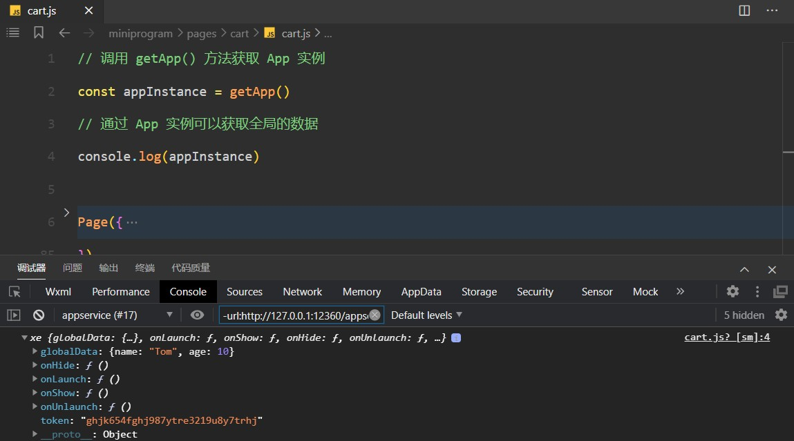

### 框架接口-getApp


`getApp()`  用于获取小程序全局唯一的 `App` 实例。

因此在 App() 中可以添加全局共享的数据、方法，从而实现页面、组件的数据传值


> 📌 **注意事项**：
>
> 1. 不能在 App() 方法中使用 getApp() ，使用 this 就可以拿到 app 实例
> 2. 通过 `getApp()` 获取实例之后，不要私自调用生命周期函数


**落地代码：**

`➡️ app.js`

```js
App({

  // 全局共享的数据
  globalData: {
    token: ''
  },

  // 全局共享的方法
  setToken (token) {
    // 如果想获取 token，可以使用 this 的方式进行获取
    this.globalData.token = token

    // 在 App() 方法中如果想获取 App() 实例，可以通过 this 的方式进行获取
    // 不能通过 getApp() 方法获取
  }

})
```


`➡️ pages/index/index.js`

```js
// getApp() 方法用来获取全局唯一的 App() 实例
const appInstance = getApp()

Page({

  login () {

    // 不要通过 app 实例调用钩子函数
    console.log(appInstance)

    appInstance.setToken('fghioiuytfghjkoiuytghjoiug')

  }

})
```





### 小程序页面间通信


如果一个页面通过 `wx.navigateTo` 打开一个新页面，这两个页面间将建立一条数据通道


1. 在 `wx.navigateTo` 的 `success` 回调中，可以通过 `event.eventChannel` 来获取`EventChannel`对象。该对象可以触发一个事件，在触发事件时就能传递数据。
2. 目标页面可以通过 `this.getOpenerEventChannel()` 方法获取一个 `EventChannel` 对象，这里可以绑定一个事件，当事件被触发时执行响应的回调，回调中可以接收到传递过来的数据。
3. `wx.navigateTo` 方法中可以定义 `events` 配置项，定义事件名和回调函数名。


这两个 `EventChannel` 对象间可以使用 `emit` 和 `on` 方法相互发送、监听事件。


**落地代码：**


页面 .js 文件

```js
Page({

  // 点击按钮触发的事件处理函数
  handler () {

    wx.navigateTo({
      url: '/pages/list/list',
      events: {
        // key：被打开页面通过 eventChannel 发射的事件
        // value：回调函数
        // 为事件添加一个监听器，获取到被打开页面传递给当前页面的数据
        currentevent: (res) => {
          console.log(res)
        }
      },
      success (res) {
        // console.log(res)
        // 通过 success 回调函数的形参，可以获取 eventChannel 对象
        // eventChannel 对象给提供了 emit 方法，可以发射事件，同时携带参数
        res.eventChannel.emit('myevent', { name: 'tom' })
      }
    })

  }

})
```


被页面 .js 文件

```js
Page({

  onLoad () {

    // 通过 this.getOpenerEventChannel() 可以获取 EventChannel 对象
    const EventChannel = this.getOpenerEventChannel()

    // 通过 EventChannel 提供的 on 方法监听页面发射的自定义事件
    EventChannel.on('myevent', (res) => {
      console.log(res)
    })

    // 通过 EventChannel 提供的 emit 方法也可以向上一级页面传递数据
    // 需要使用 emit 定义自定义事件，携带需要传递的数据
    EventChannel.emit('currentevent', { age: 10 })

  }

})
```


注意：由于 EventChannel 只能在页面之间传递数据，如果是组件间传递数据的话，可以使用全局事件总线 EventBus 来完成。

EventBus可以自己实现，但是有些麻烦。通常我们用第三方库来做，例如：`npm i pubsub-js`


### 自定义导航栏


小程序默认的导航栏与 APP 一样都位于顶部固定位置。但是默认导航栏可能会影响小程序整体风格，且无法满足特定的设计需求，这时候，就需要进行自定义导航栏。


在 app.json 或者 page.json 中，**配置 `navigationStyle` 属性为 `custom`**，即可 自定义导航栏

**在设置以后，就会移除默认的导航栏，只保留右上角胶囊按钮**


**落地代码：**

```json
{
  "usingComponents": {},
  "navigationStyle": "custom"
}
```


```html
<!--pages/cate/cate.wxml-->
<!-- <text>pages/cate/cate.wxml</text> -->

<swiper class="custom-swiper" indicator-dots autoplay interval="2000">
  <swiper-item>
    <image src="../../assets/banner/banner-1.png" mode=""/>
  </swiper-item>

  <swiper-item>
    <image src="../../assets/banner/banner-2.png" mode=""/>
  </swiper-item>

  <swiper-item>
    <image src="../../assets/banner/banner-3.png" mode=""/>
  </swiper-item>
</swiper>
```


```js
/* pages/cate/cate.wxss */

.custom-swiper {
  height: 440rpx;
}

.custom-swiper image {
  height: 100%;
  width: 100%;
}

```

