# Next.js

Next.js 是构建现代 Web 的全家桶：基于 React 服务器组件，配合 Server Actions 与 Cache Components 打通数据到 UI 的闭环；Next.js 16 默认启用 Turbopack，开发与构建更快。

> 如果你对上方的描述还是不太理解，没关系，接下来我们会逐步学习其中的概念。（学习该笔记之前，至少要熟悉 HTML/CSS/JS/React）

## 环境要求

在开始之前，请确保你的系统满足以下要求：

- [Node.js 20.9](https://nodejs.org/) 或更高版本。
- macOS、Windows（包括 WSL）或 Linux。

## 初识 Next.js

- #### 什么是 Next.js？

  Next.js 是一个用于构建全栈 Web 应用程序的 React 框架。你可以使用 React 组件来构建用户界面，并使用 Next.js 提供的额外功能和优化。

  它还会自动配置底层工具，如打包器和编译器。你可以专注于构建产品并快速交付。

  无论你是个人开发者还是大型团队的一员，Next.js 都可以帮助你构建交互式、动态且快速的 React 应用程序。

- #### App Router和Pages Router

  Next.js 有两个不同的路由器：

  - **（主流方式）App Router**：较新的路由器，支持新的 React 功能，如服务器端组件（Server Components）。
  - **Pages Router**：原始路由器，仍在支持并持续改进中。

  App Router 和 Pages Router 处理 React 版本的方式不同：

  - **App Router**：使用内置的 [React canary releases](https://react.dev/blog/2023/05/03/react-canaries)，其中包含所有稳定的 React 19 更改，以及在新 React 版本发布之前在框架中验证的更新功能。
  - **Pages Router**：使用项目 `package.json` 中安装的 React 版本。

  这种方法确保新的 React 功能在 App Router 中可靠运行，同时保持现有 Pages Router 应用程序的向后兼容性。

  大致意思是说，在App Roter 模式下，Next.js 内部会自动使用兼容的 React canary/stable 的版本，确保 App Router 新特性能工作。而不是取决于你`package.json`中指定的React版本。

  > 目前只需要知道这两种路由模式的项目目录结构不同，Next.js 会根据不同的代码目录结构来自动选择路由模式。
  >
  > 由于 App Router 是“新架构”，但太多老项目还在 Pages Router，一次性重构风险巨大。因此官方也支持两种路由模式混用，这样可以渐进迁移。混用的一个原则是：一个功能冲突的话，优先使用 App Router 中的设置。

## 安装

接下来我们创建一个新的 Next.js 应用程序并在本地运行它。

- #### 使用 CLI 创建

  1. 在当前目录中，创建一个名为 `my-app` 的新 Next.js 应用程序：（推荐使用`pnpm`包管理器）

     ```bash
     pnpm create next-app@latest my-app --yes
     ```

     > `--yes` 使用已保存的首选项或默认值跳过提示。默认设置启用 TypeScript、Tailwind、App Router 和 Turbopack，导入别名为 `@/*`。

     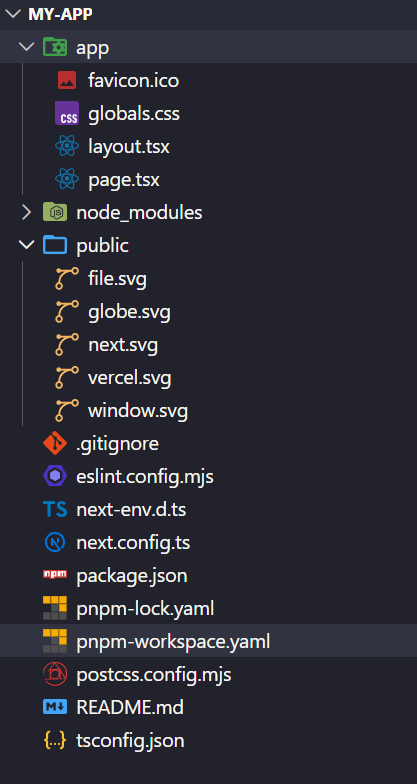

  2. `cd my-app` 后 `pnpm dev` 启动开发服务器。

  3. 访问 `http://localhost:3000`

- #### 手动创建

  1. ##### 安装所需的包：

     ```bash
     pnpm i next@latest react@latest react-dom@latest
     ```

  2. ##### 将以下脚本添加到你的 `package.json` 文件中：

     ```json
     {
       "scripts": {
         "dev": "next dev",
         "build": "next build",
         "start": "next start",
         "lint": "eslint",
         "lint:fix": "eslint --fix"
       }
     }
     ```

     这些脚本对应于开发应用程序的不同阶段：

     - `next dev`：使用 Turbopack（默认打包工具）启动开发服务器。
     - `next build`：为生产环境构建应用程序。
     - `next start`：启动生产服务器。
     - `eslint`：运行 ESLint。

     Turbopack 现在是默认的打包工具。要使用 Webpack，请运行 `next dev --webpack` 或 `next build --webpack`。有关配置详细信息，请参阅 [Turbopack 文档](https://nextjscn.org/docs/app/api-reference/turbopack)。

  3. ##### 创建 `app` 目录：

     Next.js 使用**文件系统路由**，这意味着**应用程序中的路由由你的文件结构决定**。

     创建一个 `app` 文件夹。然后，在 `app` 内部创建一个 `layout.tsx` 文件。这个文件是**根布局**。它是**必需的**，并且必须包含 `<html>` 和 `<body>` 标签。

     ```tsx
     export default function RootLayout({
       children,
     }: {
       children: React.ReactNode
     }) {
       return (
         <html lang="en">
           <body>{children}</body>
         </html>
       )
     }
     ```

     > **注意**：如果你忘记创建根布局，Next.js 将在使用 `next dev` 运行开发服务器时自动创建此文件。

     创建一个包含一些初始内容的主页 `app/page.tsx`：

     ```tsx
     export default function Page() {
       return <h1>Hello, Next.js!</h1>
     }
     ```

     当用户访问应用程序的根路径（`/`）时，`layout.tsx` 和 `page.tsx` 都将被渲染。

     

  4. ##### （可选）创建 `public` 目录：

     项目根目录的 `public` 目录用于存储静态资源，例如图片、字体等。`public` 内的文件可以通过基础 URL（`/`）被你的代码引用。该目录中的资源不会被打包到JS中。

     然后，你可以使用根路径（`/`）引用这些资源。例如，`public/profile.png` 可以被引用为 `/profile.png`：

     ```tsx
     import Image from 'next/image'
      
     export default function Page() {
       return <Image src="/profile.png" alt="Profile" width={100} height={100} />
     }
     ```

  5. ##### 运行开发服务器：

     - 运行 `npm run dev` 启动开发服务器。
     - 访问 `http://localhost:3000` 查看你的应用程序。
     - 编辑 `app/page.tsx` 文件并保存，在浏览器中查看更新后的结果。

  6. ##### （可选）设置 TypeScript：

     > 最低 TypeScript 版本：`v5.1.0`
     >
     > Next.js 内置了 TypeScript 支持。要将 TypeScript 添加到你的项目中，请将文件重命名为 `.ts` / `.tsx` 并运行 `next dev`。Next.js 将自动安装必要的依赖项，并创建一个包含推荐配置选项的 `tsconfig.json` 文件。

     ###### 启用VS Code中的 TS 插件：

     Next.js 包含一个自定义的 TypeScript 插件和类型检查器，VSCode 和其他代码编辑器可以使用它进行高级类型检查和自动补全。你可以通过以下步骤在 VS Code 中启用该插件：（有关更多信息，请参阅 [TypeScript 参考](https://nextjscn.org/docs/app/api-reference/config/next-config-js/typescript)）

     1. 打开命令面板（`Ctrl/⌘` + `Shift` + `P`）
     2. 搜索"TypeScript: Select TypeScript Version"
     3. 选择"Use Workspace Version"

  7. ##### （可选）设置代码检查：

     Next.js 支持使用 ESLint 或 Biome 进行代码检查。选择一个代码检查工具，并通过 `package.json` 脚本直接运行它。

     - 使用 **ESLint**（全面的规则）：

       ```json
       {
         "scripts": {
           "lint": "eslint",
           "lint:fix": "eslint --fix"
         }
       }
       ```

     - 使用 **Biome**（快速的代码检查工具 + 格式化工具）：

       ```json
       {
         "scripts": {
           "lint": "biome check",
           "format": "biome format --write"
         }
       }
       ```

     如果你的项目之前使用 `next lint`，请使用 `codemod` 将脚本迁移到 ESLint CLI：

     ```bash
     npx @next/codemod@canary next-lint-to-eslint-cli .
     ```

     如果你使用 ESLint，请创建一个显式配置（推荐使用 `eslint.config.mjs`）。ESLint 支持旧版 `.eslintrc.*` 和较新的 `eslint.config.mjs` 格式。

     > **值得注意的是**：从 Next.js 16 开始，`next build` 不再自动运行代码检查工具。你可以通过 NPM 脚本运行代码检查工具。

     有关更多信息，请参阅 [ESLint 插件](https://nextjscn.org/docs/app/api-reference/config/eslint)页面。

  8. ##### （可选）设置绝对导入和模块路径别名：

     Next.js 内置支持 `tsconfig.json` 和 `jsconfig.json` 文件的 `"paths"` 和 `"baseUrl"` 选项。

     这些选项允许你将项目目录别名为绝对路径，使导入模块更加简单和清晰。例如：

     ```js
     // 之前
     import { Button } from '../../../components/button'
      
     // 之后
     import { Button } from '@/components/button'
     ```

     要配置绝对导入，请将 `baseUrl` 配置选项添加到你的 `tsconfig.json` 或 `jsconfig.json` 文件中。例如：

     ```json
     {
       "compilerOptions": {
         "baseUrl": "src/"
       }
     }
     ```

     除了配置 `baseUrl` 路径之外，你还可以使用 `"paths"` 选项来为模块路径设置"别名"。

     例如，以下配置将 `@/components/*` 映射到 `components/*`：

     ```json
     {
       "compilerOptions": {
         "baseUrl": "src/",
         "paths": {
           "@/styles/*": ["styles/*"],
           "@/components/*": ["components/*"]
         }
       }
     }
     ```

     每个 `"paths"` 都相对于 `baseUrl` 位置。

## 项目结构

接下来看下 Next.js 中**所有**的目录和文件约定，以及组织项目的建议。

- #### 目录和文件约定

  - ##### 顶层目录：

    顶层文件夹用于组织应用程序的代码和静态资源。比如以下的顶层目录：

    - `app`：App Router
    - `pages`：Pages Router
    - `public`：要提供的静态资源。其中的资源不会被打包到JS中。
    - `src`：可选的应用程序源文件夹。

  - ##### 顶层文件：

    顶层文件用于配置应用程序、管理依赖项、运行代理、集成监控工具和定义环境变量。

    | **Next.js**          |                                       |
    | -------------------- | ------------------------------------- |
    | `next.config.js`     | Next.js 配置文件                      |
    | `package.json`       | 项目依赖项和脚本                      |
    | `instrumentation.ts` | OpenTelemetry 和 Instrumentation 文件 |
    | `proxy.ts`           | Next.js 请求代理                      |
    | `.env`               | 环境变量                              |
    | `.env.local`         | 本地环境变量                          |
    | `.env.production`    | 生产环境变量                          |
    | `.env.development`   | 开发环境变量                          |
    | `eslint.config.mjs`  | ESLint 配置文件                       |
    | `.gitignore`         | 要忽略的 Git 文件和文件夹             |
    | `next-env.d.ts`      | Next.js 的 TypeScript 声明文件        |
    | `tsconfig.json`      | TypeScript 配置文件                   |
    | `jsconfig.json`      | JavaScript 配置文件                   |

  - ##### 路由文件：

    添加 `page` 文件来暴露路由，`layout` 文件用于共享 UI（如 header、nav 或 footer），`loading` 用于骨架屏，`error` 用于错误边界，`route` 用于 API。

    | 路由文件       | 扩展名              | 描述             |
    | -------------- | ------------------- | ---------------- |
    | `layout`       | `.js` `.jsx` `.tsx` | 布局             |
    | `page`         | `.js` `.jsx` `.tsx` | 页面             |
    | `loading`      | `.js` `.jsx` `.tsx` | 加载 UI          |
    | `not-found`    | `.js` `.jsx` `.tsx` | 未找到 UI        |
    | `error`        | `.js` `.jsx` `.tsx` | 错误 UI          |
    | `global-error` | `.js` `.jsx` `.tsx` | 全局错误 UI      |
    | `route`        | `.js` `.ts`         | API 端点         |
    | `template`     | `.js` `.jsx` `.tsx` | 重新渲染的布局   |
    | `default`      | `.js` `.jsx` `.tsx` | 并行路由回退页面 |

    > 和传统路由不同的是：Next.js 的 `layout` 可以共享父级 UI，这种基于文件系统的路由在编译时就能知道组件的层次结构，因此不再需要`<Outlet>`组件指定子路由组件渲染的位置，它被 `layout` 组件中的 `children` prop取代了。

  - ##### 嵌套路由：

    文件夹定义 URL 段。嵌套文件夹会嵌套段。任何级别的布局（`layout`）都会包裹其子段。当存在 `page` 或 `route` 文件时，路由会变为公开的，也就是可以被用户访问到这个URL。

    | 路径                        | URL 模式        | 说明                  |
    | --------------------------- | --------------- | --------------------- |
    | `app/layout.tsx`            | —               | 根布局包裹所有路由    |
    | `app/blog/layout.tsx`       | —               | 包裹 `/blog` 及其后代 |
    | `app/page.tsx`              | `/`             | 公开路由              |
    | `app/blog/page.tsx`         | `/blog`         | 公开路由              |
    | `app/blog/authors/page.tsx` | `/blog/authors` | 公开路由              |

  - ##### 动态路由：

    使用方括号对段进行参数化。使用 `[segment]` 表示单个参数，`[...segment]` 表示捕获所有，`[[...segment]]` 表示可选的捕获所有。通过 `params` prop 访问值。

    | 路径                            | URL 模式                                                     |
    | ------------------------------- | ------------------------------------------------------------ |
    | `app/blog/[slug]/page.tsx`      | `/blog/my-first-post`                                        |
    | `app/shop/[...slug]/page.tsx`   | `/shop/clothing`，`/shop/clothing/shirts`                    |
    | `app/docs/[[...slug]]/page.tsx` | `/docs`，`/docs/layouts-and-pages`，`/docs/api-reference/use-router` |

  - ##### 路由组和私有文件夹：

    使用路由组 `(group)` 组织代码而不改变 URL，使用私有文件夹 `_folder` 放置不可路由的文件。

    | 路径                            | URL 模式 | 说明                         |
    | ------------------------------- | -------- | ---------------------------- |
    | `app/(marketing)/page.tsx`      | `/`      | 组在 URL 中被省略            |
    | `app/(shop)/cart/page.tsx`      | `/cart`  | 在 `(shop)` 内共享布局       |
    | `app/blog/_components/Post.tsx` | —        | 不可路由；UI 工具的安全位置  |
    | `app/blog/_lib/data.ts`         | —        | 不可路由；实用工具的安全位置 |

  - ##### 并行路由和拦截路由：

    这些功能适用于特定的 UI 模式，例如基于插槽的布局或模态路由。

    使用 `@slot` 表示由父布局渲染的命名插槽。使用拦截模式在当前布局内渲染另一个路由而不改变 URL，例如，在列表上以模态框显示详情视图。

    | 模式（文档）     | 含义     | 典型用例                   |
    | ---------------- | -------- | -------------------------- |
    | `@folder`        | 命名插槽 | 侧边栏 + 主内容            |
    | `(.)folder`      | 拦截同级 | 在模态框中预览同级路由     |
    | `(..)folder`     | 拦截父级 | 将父级的子级作为覆盖层打开 |
    | `(..)(..)folder` | 拦截两级 | 深度嵌套的覆盖层           |
    | `(...)folder`    | 从根拦截 | 在当前视图中显示任意路由   |

  - ##### 元数据文件约定：

    | 应用图标     |                                     |                       |
    | ------------ | ----------------------------------- | --------------------- |
    | `favicon`    | `.ico`                              | Favicon 文件          |
    | `icon`       | `.ico` `.jpg` `.jpeg` `.png` `.svg` | 应用图标文件          |
    | `icon`       | `.js` `.ts` `.tsx`                  | 生成的应用图标        |
    | `apple-icon` | `.jpg` `.jpeg`, `.png`              | Apple 应用图标文件    |
    | `apple-icon` | `.js` `.ts` `.tsx`                  | 生成的 Apple 应用图标 |

    | Open Graph 和 Twitter 图片 |                              |                        |
    | -------------------------- | ---------------------------- | ---------------------- |
    | `opengraph-image`          | `.jpg` `.jpeg` `.png` `.gif` | Open Graph 图片文件    |
    | `opengraph-image`          | `.js` `.ts` `.tsx`           | 生成的 Open Graph 图片 |
    | `twitter-image`            | `.jpg` `.jpeg` `.png` `.gif` | Twitter 图片文件       |
    | `twitter-image`            | `.js` `.ts` `.tsx`           | 生成的 Twitter 图片    |

    | SEO       |             |                    |
    | --------- | ----------- | ------------------ |
    | `sitemap` | `.xml`      | 站点地图文件       |
    | `sitemap` | `.js` `.ts` | 生成的站点地图     |
    | `robots`  | `.txt`      | Robots 文件        |
    | `robots`  | `.js` `.ts` | 生成的 Robots 文件 |

- #### 组织你的项目

  Next.js 对如何组织和放置项目文件**不持意见**。但它确实提供了几个功能来帮助你组织项目。

  - ##### 组件层次结构：

    特殊文件中定义的组件按特定层次结构渲染：

    - `layout.js`
    - `template.js`
    - `error.js`（React 错误边界）
    - `loading.js`（React suspense 边界）
    - `not-found.js`（"未找到" UI 的 React 错误边界）
    - `page.js` 或嵌套的 `layout.js`

    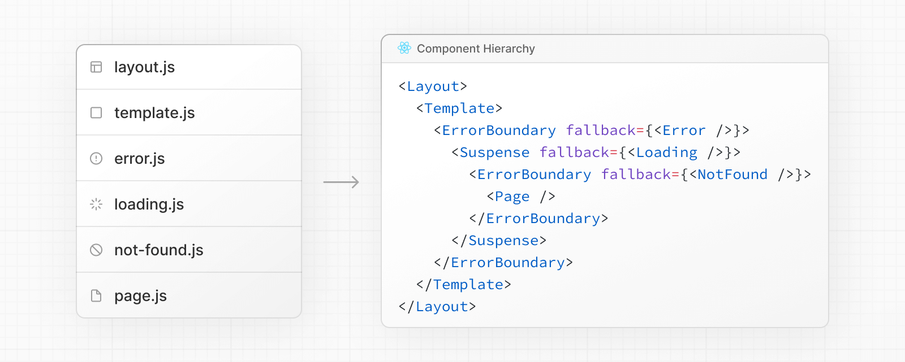

    在嵌套路由中，组件会递归渲染，这意味着路由段的组件将依次嵌套在其父段的 `layout` 内部。

    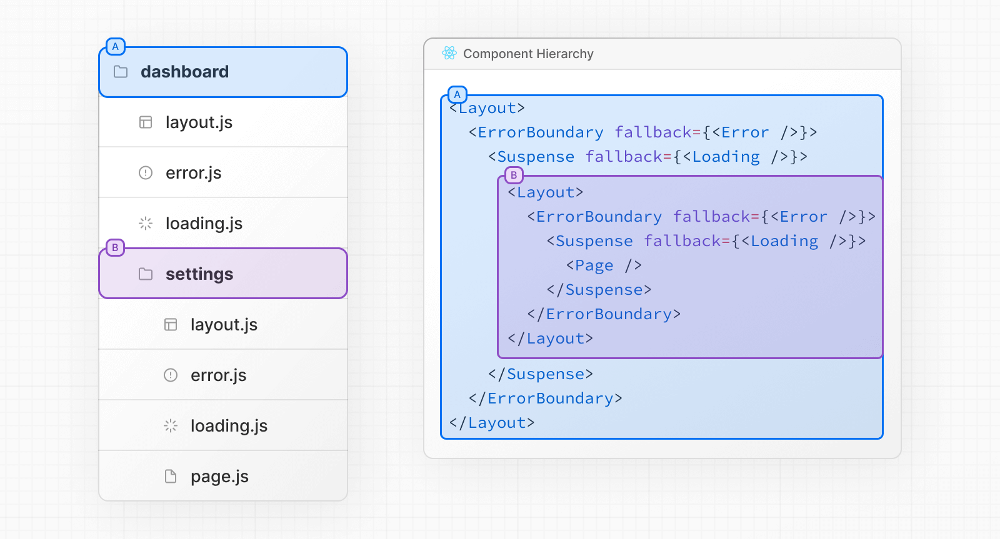

  - ##### 文件放置：

    在 `app` 目录中，嵌套文件夹定义路由结构。每个文件夹代表一个路由段，该段映射到 URL 路径中的相应段。

    然而，即使通过文件夹定义了路由结构，在将 `page.js` 或 `route.js` 文件添加到路由段之前，该路由**不会公开访问**。

    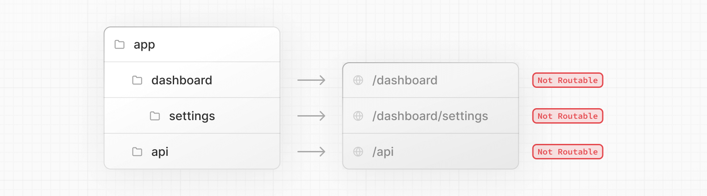

    而且，即使路由被公开访问，也只有 `page.js` 或 `route.js` **返回的内容**会被发送到客户端。

    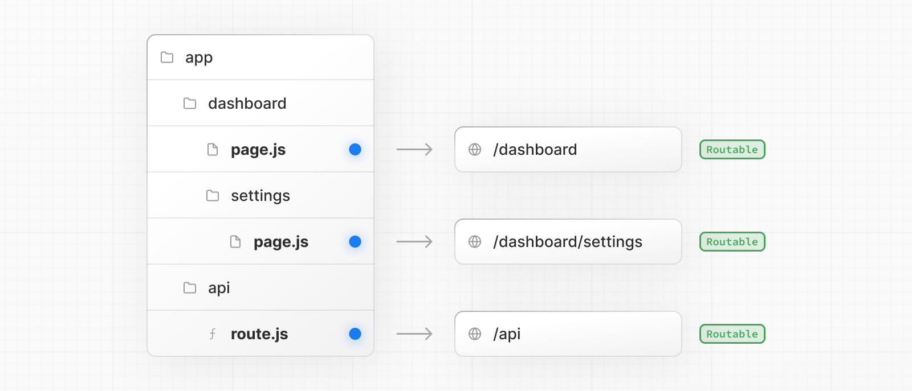

    这意味着**项目文件**可以**安全地放置**在 `app` 目录的路由段内，而不会意外地变为可路由，从而被用户访问到。

    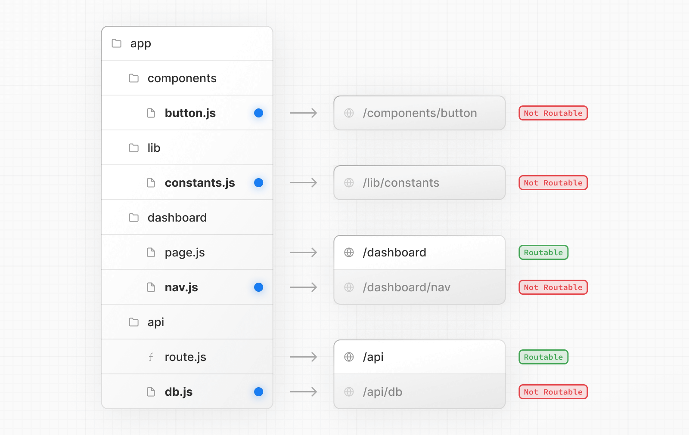

    注意：虽然你**可以**将项目文件放置在 `app` 中，但你不**必须**这样做。如果你愿意，可以**将它们保留在 `app` 目录之外**。

  - ##### 私有文件夹：

    可以通过在文件夹前加下划线来创建私有文件夹：`_folderName`，这表示该文件夹是私有实现细节，路由系统不应考虑它，从而**使该文件夹及其所有子文件夹**退出路由系统。即不会被用户访问到。

    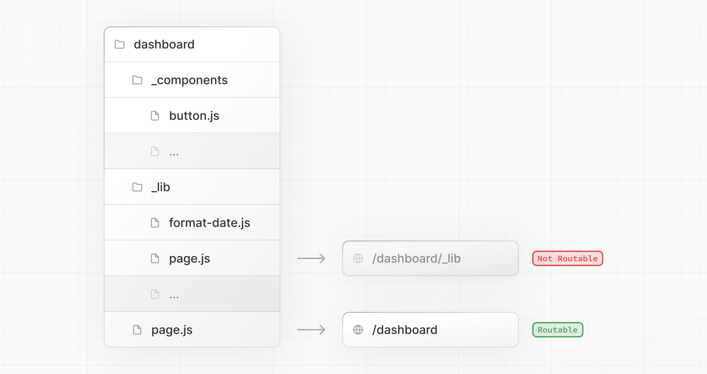

    由于 `app` 目录中的文件可以**默认安全地放置**（即放在 app 目录里的文件，不会自动变成路由或暴露给用户），因此文件放置不需要私有文件夹。但是，它们可用于：

    - 将 UI 逻辑与路由逻辑分离。
    - 在项目和 Next.js 生态系统中一致地组织内部文件。
    - 在代码编辑器中对文件进行排序和分组。
    - 避免与未来的 Next.js 文件约定产生潜在的命名冲突。

    **注意**：你可以通过在文件夹名称前加上 `%5F`（下划线的 URL 编码形式）来创建以下划线开头的 URL 段：`%5FfolderName`。

  - ##### 路由组：

    可以通过用括号包裹文件夹来创建路由组：`(folderName)`，这表示该文件夹用于组织目的，不会创建对应的路由段。

    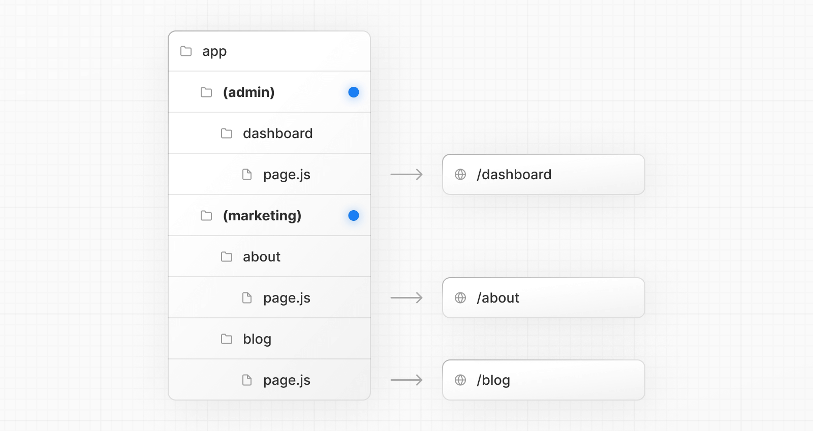

    路由组对以下情况很有用：

    - 按站点部分、意图或团队组织路由。例如，营销页面、管理页面等。
    - 在同一路由段级别启用嵌套布局：
      - 在同一段中创建多个嵌套布局，包括多个根布局
      - 将布局添加到公共段中的路由子集

  - ##### `src` 文件夹：

    Next.js 支持将应用程序代码（包括 `app`）存储在可选的 `src` 目录中。这将应用程序代码与主要位于项目根目录的项目配置文件分离。

    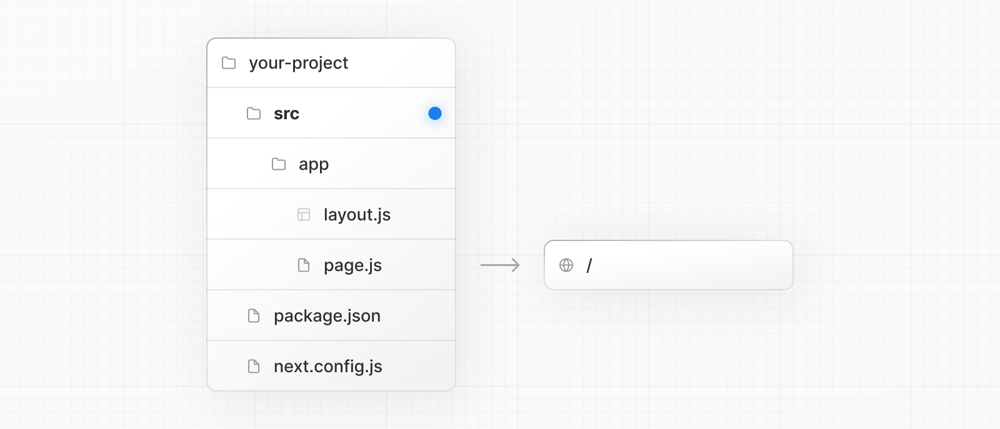

- #### 常见的 Next.js 的目录结构

  以下部分列出了常见策略的高级概述。最简单的要点是选择一个适合你和你的团队的策略，并在整个项目中保持一致。Next.js 对目录非必须的目录结构没有特殊的要求，不冲突的情况下，文件名随意。

  - ##### 将项目文件存储在 app 之外

    此策略将所有应用程序代码存储在**项目根目录**的共享文件夹中，并将 `app` 目录纯粹用于路由目的。

    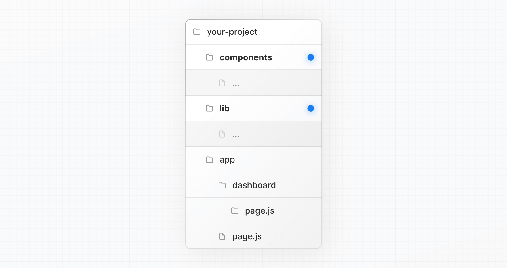

  - ##### 将项目文件存储在 app 内的顶层文件夹中

    此策略将所有应用程序代码存储在 **`app` 目录根目录**的共享文件夹中。

    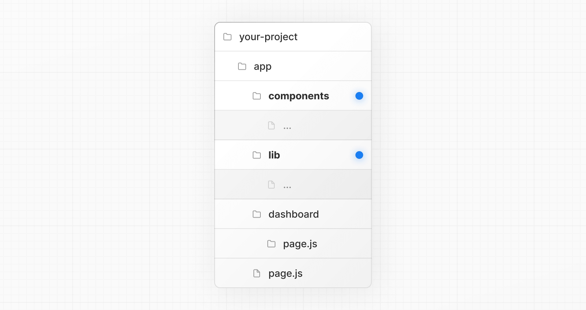

  - ##### 按功能或路由拆分项目文件

    此策略将全局共享的应用程序代码存储在根 `app` 目录中，并将更具体的应用程序代码**拆分**到使用它们的路由段中。

    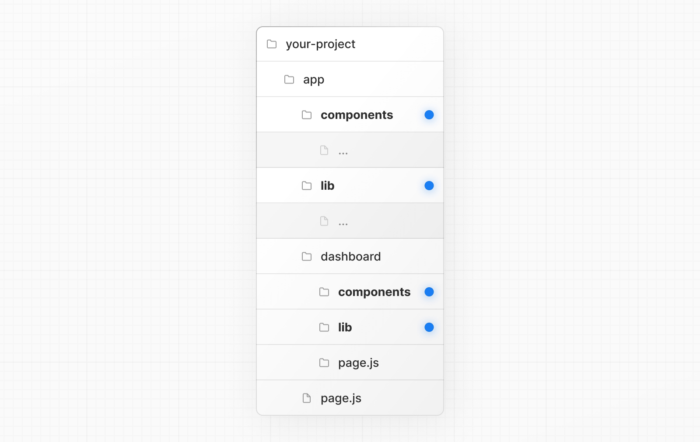

  - ##### 组织路由而不影响 URL 路径

    要在不影响 URL 的情况下组织路由，请创建一个组以将相关路由保持在一起。括号中的文件夹将从 URL 中省略（例如 `(marketing)` 或 `(shop)`）。

    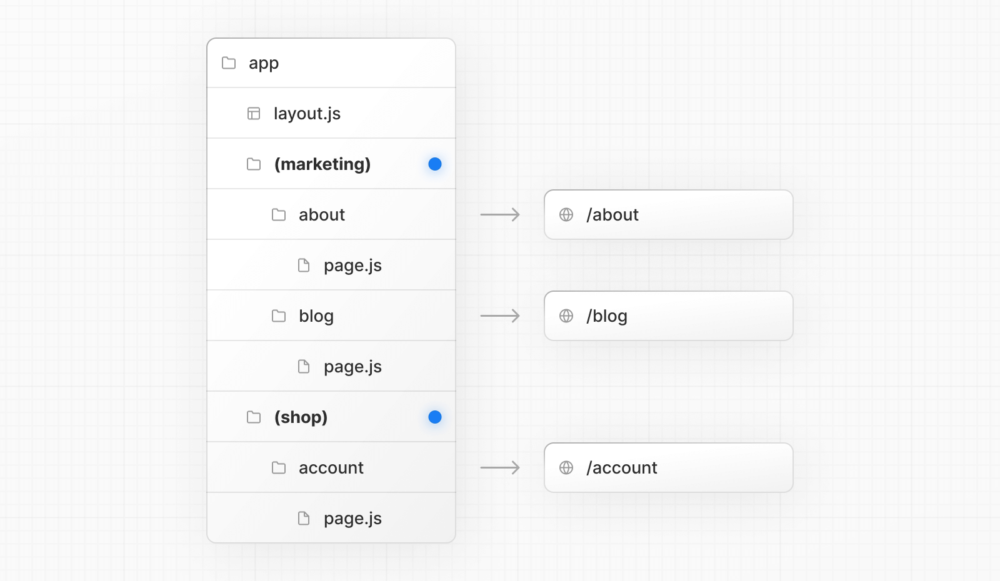

    即使 `(marketing)` 和 `(shop)` 内的路由共享相同的 URL 层次结构，你也可以通过在它们的文件夹内添加 `layout.js` 文件来为每个组创建不同的布局。

    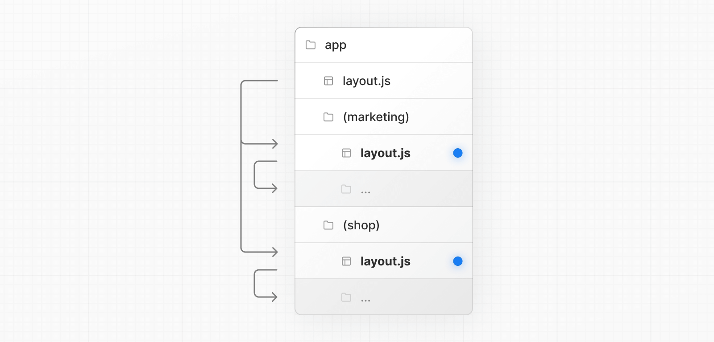

  - ##### 将特定段选择加入布局

    要将特定路由选择加入布局，请创建一个新的路由组（例如 `(shop)`），并将共享相同布局的路由移动到该组中（例如 `account` 和 `cart`）。组外的路由将不会共享该布局（例如 `checkout`）。

    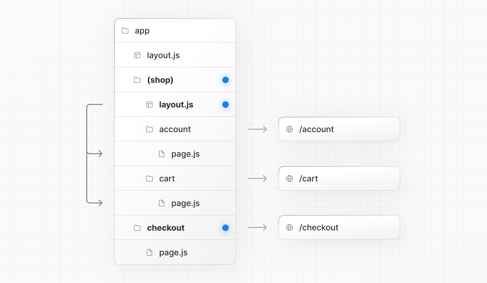

  - ##### 在特定路由上选择加入加载骨架屏

    要通过 `loading.js` 文件将加载骨架屏应用于特定路由，请创建一个新的路由组（例如 `/(overview)`），然后将你的 `loading.tsx` 移动到该路由组内。

    

    现在，`loading.tsx` 文件将仅应用于你的 dashboard → overview 页面，而不是所有 dashboard 页面，而不会影响 URL 路径结构。

  - ##### 创建多个根布局

    要创建多个根布局，请删除顶层的 `layout.js` 文件，并在每个路由组内添加一个 `layout.js` 文件。这对于将应用程序划分为具有完全不同 UI 或体验的部分很有用。需要将 `<html>` 和 `<body>` 标签添加到每个根布局。

    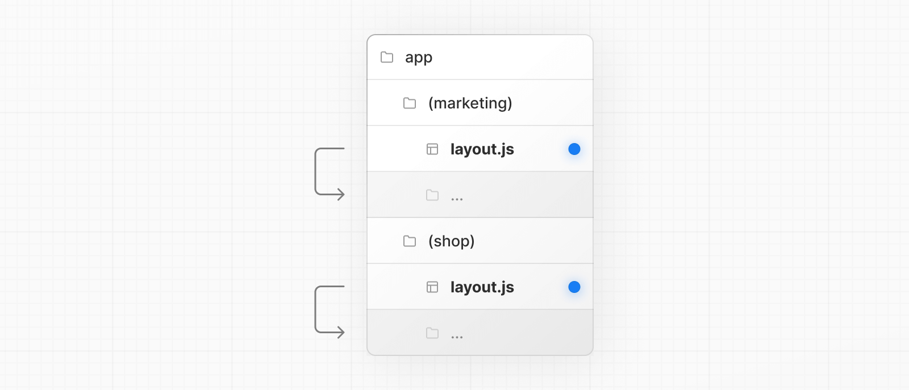

    在上面的示例中，`(marketing)` 和 `(shop)` 都有自己的根布局。

## 布局和页面

Next.js 使用**基于文件系统的路由**，这意味着你可以使用文件夹和文件来定义路由。接下来将指导你，具体如何写布局(`layout`)和页面(`page`)，以及在它们之间进行链接。

- #### 创建页面

  **页面**是在特定路由上渲染的 UI。要创建页面，请在 `app` 目录中添加一个 `page.tsx` 文件**默认导出**一个 React 组件。例如，要创建索引页面（`/`）：

  

  ```tsx
  export default function Page() {
    return <h1>Hello Next.js!</h1>
  }
  ```

- 创建布局

- 创建嵌套路由

- 嵌套布局

- 创建动态段

- 使用搜索参数进行渲染

  - 何时使用什么

- 在页面之间链接

- Route Props 辅助类型

