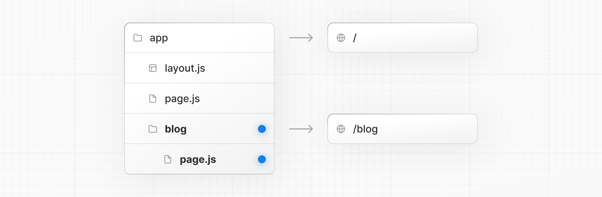
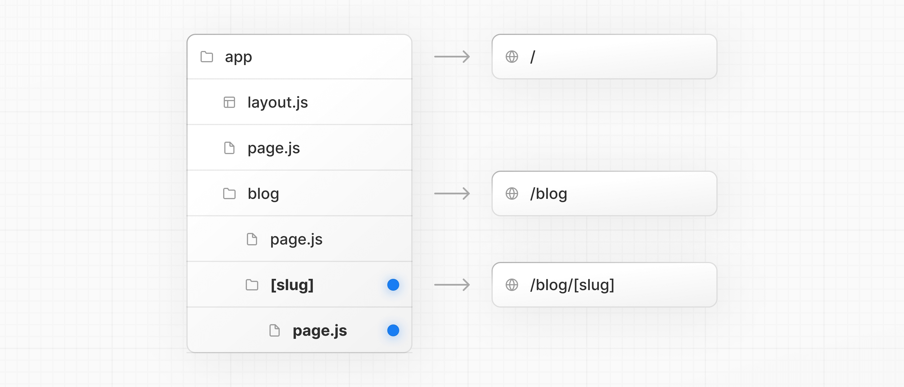
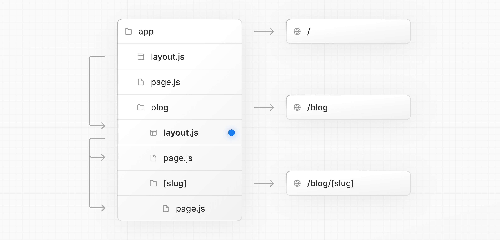
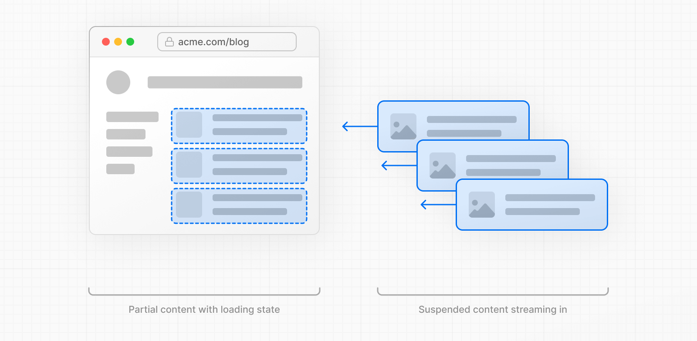

# Next.js

Next.js 是构建现代 Web 的全家桶：基于 React 服务器组件，配合 Server Actions 与 Cache Components 打通数据到 UI 的闭环；Next.js 16 默认启用 Turbopack，开发与构建更快。

> 如果你对上方的描述还是不太理解，没关系，接下来我们会逐步学习其中的概念。（学习Next.js之前，至少要熟悉 HTML、CSS、JS、React）

## 环境要求

在开始之前，请确保你的系统满足以下要求：

- [Node.js 20.9](https://nodejs.org/) 或更高版本。
- macOS、Windows（包括 WSL）或 Linux。

## 初识 Next.js

- #### 什么是 Next.js？

  Next.js 是一个用于构建**全栈** Web 应用程序的 React 框架。你可以使用 React 组件来构建用户界面，并使用 Next.js 提供的额外功能和优化。

  它还会自动配置底层工具，如打包器和编译器。你可以专注于构建产品并快速交付。

  无论你是个人开发者还是大型团队的一员，Next.js 都可以帮助你构建交互式、动态且快速的 React 应用程序。

- #### App Router和Pages Router

  Next.js 有两个不同的路由器：

  - **（主流方式）App Router**：较新的路由器，支持新的 React 功能，如服务器端组件（Server Components）。
  - **Pages Router**：原始路由器，仍在支持并持续改进中。

  App Router 和 Pages Router 处理 React 版本的方式不同：

  - **App Router**：使用内置的 [React canary releases](https://react.dev/blog/2023/05/03/react-canaries)，其中包含所有稳定的 React 19 更改，以及在新 React 版本发布之前在框架中验证的更新功能。
  - **Pages Router**：使用项目 `package.json` 中安装的 React 版本。

  这种方法确保新的 React 功能在 App Router 中可靠运行，同时保持现有 Pages Router 应用程序的向后兼容性。

  大致意思是说，在App Roter 模式下，Next.js 内部会自动使用兼容的 React canary/stable 的版本，确保 App Router 新特性能工作。而不是取决于你`package.json`中指定的React版本。

  > 目前只需要知道这**两种路由模式的项目目录结构不同**，Next.js 会根据不同的代码目录结构来自动选择路由模式。
  >
  > 由于 App Router 是“新架构”，但太多老项目还在 Pages Router，一次性重构风险巨大。因此官方也支持两种路由模式混用，这样可以渐进迁移。混用的一个原则是：一个功能冲突的话，**优先使用 App Router 中的设置**。
  
  接下来我们主要学习的就是 App Router 模式下，Next.js 相关的概念和用法。

## 安装

接下来我们创建一个新的 Next.js 应用程序并在本地运行它。

- #### 使用 CLI 创建

  1. 在当前目录中，创建一个名为 `my-app` 的新 Next.js 应用程序：（推荐使用`pnpm`包管理器）

     ```bash
     pnpm create next-app@latest my-app --yes
     ```

     > `--yes` 使用已保存的首选项或默认值跳过提示。默认设置启用 TypeScript、Tailwind、App Router 和 Turbopack，导入别名为 `@/*`。

     

  2. `cd my-app` 后 `pnpm dev` 启动开发服务器。

  3. 访问 `http://localhost:3000`

- #### 手动创建

  1. ##### 安装所需的包：

     ```bash
     pnpm i next@latest react@latest react-dom@latest
     ```

  2. ##### 将以下脚本添加到你的 `package.json` 文件中：

     ```json
     {
       "scripts": {
         "dev": "next dev",
         "build": "next build",
         "start": "next start",
         "lint": "eslint",
         "lint:fix": "eslint --fix"
       }
     }
     ```

     这些脚本对应于开发应用程序的不同阶段：

     - `next dev`：使用 Turbopack（默认打包工具）启动开发服务器。
     - `next build`：为生产环境构建应用程序。
     - `next start`：启动生产服务器。
     - `eslint`：运行 ESLint。

     > Turbopack 现在是默认的打包工具。要使用 Webpack，请运行 `next dev --webpack` 或 `next build --webpack`。有关配置详细信息，请参阅 [Turbopack 文档](https://nextjscn.org/docs/app/api-reference/turbopack)。

  3. ##### 创建 `app` 目录：

     Next.js 使用**文件系统路由**，这意味着**应用程序中的路由由你的文件结构决定**。

     创建一个 `app` 文件夹。然后，在 `app` 内部创建一个 `layout.tsx` 文件。这个文件是**根布局**。它是**必需的**，并且必须包含 `<html>` 和 `<body>` 标签。

     ```tsx
     export default function RootLayout({
       children,
     }: {
       children: React.ReactNode
     }) {
       return (
         <html lang="en">
           <body>{children}</body>
         </html>
       )
     }
     ```

     > **注意**：如果你忘记创建根布局，Next.js 将在使用 `next dev` 运行开发服务器时自动创建此文件。

     创建一个包含一些初始内容的主页 `app/page.tsx`：

     ```tsx
     export default function Page() {
       return <h1>Hello, Next.js!</h1>
     }
     ```

     当用户访问应用程序的根路径（`/`）时，`layout.tsx` 和 `page.tsx` 都将被渲染。

     

  4. ##### （可选）创建 `public` 目录：

     项目根目录的 `public` 目录用于存储静态资源，例如图片、字体等。`public` 内的文件可以通过基础 URL（`/`）被你的代码引用。该目录中的资源不会被打包到JS中。

     然后，你可以使用根路径（`/`）引用这些资源。例如，`public/profile.png` 可以被引用为 `/profile.png`：

     ```tsx
     import Image from 'next/image'
      
     export default function Page() {
       return <Image src="/profile.png" alt="Profile" width={100} height={100} />
     }
     ```

  5. ##### 运行开发服务器：

     - 运行 `npm run dev` 启动开发服务器。
     - 访问 `http://localhost:3000` 查看你的应用程序。
     - 编辑 `app/page.tsx` 文件并保存，在浏览器中查看更新后的结果。

  6. ##### （可选）设置 TypeScript：

     > 最低 TypeScript 版本：`v5.1.0`
     >
     > Next.js 内置了 TypeScript 支持。要将 TypeScript 添加到你的项目中，请将文件重命名为 `.ts` / `.tsx` 并运行 `next dev`。Next.js 将自动安装必要的依赖项，并创建一个包含推荐配置选项的 `tsconfig.json` 文件。

     ###### 启用VS Code中的 TS 插件：

     Next.js 包含一个自定义的 TypeScript 插件和类型检查器，VSCode 和其他代码编辑器可以使用它进行高级类型检查和自动补全。你可以通过以下步骤在 VS Code 中启用该插件：（有关更多信息，请参阅 [TypeScript 参考](https://nextjscn.org/docs/app/api-reference/config/next-config-js/typescript)）

     1. 打开命令面板（`Ctrl/⌘` + `Shift` + `P`）
     2. 搜索"TypeScript: Select TypeScript Version"
     3. 选择"Use Workspace Version"

  7. ##### （可选）设置代码检查：

     Next.js 支持使用 ESLint 或 Biome 进行代码检查。选择一个代码检查工具，并通过 `package.json` 脚本直接运行它。

     - 使用 **ESLint**（全面的规则）：

       ```json
       {
         "scripts": {
           "lint": "eslint",
           "lint:fix": "eslint --fix"
         }
       }
       ```

     - 使用 **Biome**（快速的代码检查工具 + 格式化工具）：

       ```json
       {
         "scripts": {
           "lint": "biome check",
           "format": "biome format --write"
         }
       }
       ```

     如果你的项目之前使用 `next lint`，请使用 `codemod` 将脚本迁移到 ESLint CLI：

     ```bash
     npx @next/codemod@canary next-lint-to-eslint-cli .
     ```

     如果你使用 ESLint，请创建一个显式配置（推荐使用 `eslint.config.mjs`）。ESLint 支持旧版 `.eslintrc.*` 和较新的 `eslint.config.mjs` 格式。

     > **值得注意的是**：从 Next.js 16 开始，`next build` 不再自动运行代码检查工具。你可以通过 NPM 脚本运行代码检查工具。

     有关更多信息，请参阅 [ESLint 插件](https://nextjscn.org/docs/app/api-reference/config/eslint)页面。

  8. ##### （可选）设置绝对导入和模块路径别名：

     Next.js 内置支持 `tsconfig.json` 和 `jsconfig.json` 文件的 `"paths"` 和 `"baseUrl"` 选项。

     这些选项允许你将项目目录别名为绝对路径，使导入模块更加简单和清晰。例如：

     ```js
     // 之前
     import { Button } from '../../../components/button'
      
     // 之后
     import { Button } from '@/components/button'
     ```

     要配置绝对导入，请将 `baseUrl` 配置选项添加到你的 `tsconfig.json` 或 `jsconfig.json` 文件中。例如：

     ```json
     {
       "compilerOptions": {
         "baseUrl": "src/"
       }
     }
     ```

     除了配置 `baseUrl` 路径之外，你还可以使用 `"paths"` 选项来为模块路径设置"别名"。

     例如，以下配置将 `@/components/*` 映射到 `components/*`：

     ```json
     {
       "compilerOptions": {
         "baseUrl": "src/",
         "paths": {
           "@/styles/*": ["styles/*"],
           "@/components/*": ["components/*"]
         }
       }
     }
     ```

     每个 `"paths"` 都相对于 `baseUrl` 位置。

## 项目结构

接下来看下 Next.js 中**所有**的目录和文件约定，以及组织项目的建议。

- #### 目录和文件约定

  - ##### 顶层目录：

    顶层文件夹用于组织应用程序的代码和静态资源。比如以下的顶层目录：

    - `app`：App Router
    - `pages`：Pages Router
    - `public`：要提供的静态资源。其中的资源不会被打包到JS中。
    - `src`：可选的应用程序源文件夹。

  - ##### 顶层文件：

    顶层文件用于配置应用程序、管理依赖项、运行代理、集成监控工具和定义环境变量。

    | **Next.js**项目配置文件 |                                       |
    | ----------------------- | ------------------------------------- |
    | `next.config.js`        | Next.js 配置文件                      |
    | `package.json`          | 项目依赖项和脚本                      |
    | `instrumentation.ts`    | OpenTelemetry 和 Instrumentation 文件 |
    | `proxy.ts`              | Next.js 请求代理                      |
    | `.env`                  | 环境变量                              |
    | `.env.local`            | 本地环境变量                          |
    | `.env.production`       | 生产环境变量                          |
    | `.env.development`      | 开发环境变量                          |
    | `eslint.config.mjs`     | ESLint 配置文件                       |
    | `.gitignore`            | 要忽略的 Git 文件和文件夹             |
    | `next-env.d.ts`         | Next.js 的 TypeScript 声明文件        |
    | `tsconfig.json`         | TypeScript 配置文件                   |
    | `jsconfig.json`         | JavaScript 配置文件                   |

  - ##### 路由文件：

    添加 `page` 文件来暴露路由，`layout` 文件用于共享 UI（如 header、nav 或 footer），`loading` 用于骨架屏，`error` 用于错误边界，`route` 用于 API。

    | 路由文件       | 扩展名              | 描述             |
    | -------------- | ------------------- | ---------------- |
    | `layout`       | `.js` `.jsx` `.tsx` | 布局             |
    | `page`         | `.js` `.jsx` `.tsx` | 页面             |
    | `loading`      | `.js` `.jsx` `.tsx` | 加载 UI          |
    | `not-found`    | `.js` `.jsx` `.tsx` | 未找到 UI        |
    | `error`        | `.js` `.jsx` `.tsx` | 错误 UI          |
    | `global-error` | `.js` `.jsx` `.tsx` | 全局错误 UI      |
    | `route`        | `.js` `.ts`         | API 端点         |
    | `template`     | `.js` `.jsx` `.tsx` | 重新渲染的布局   |
    | `default`      | `.js` `.jsx` `.tsx` | 并行路由回退页面 |

    > 和传统路由不同的是：Next.js 的 `layout` 可以共享父级 UI，这种基于文件系统的路由在编译时就能知道组件的层次结构，因此不再需要`<Outlet>`组件指定子路由组件渲染的位置，它被 `layout` 组件中的 `children` prop取代了。

  - ##### 嵌套路由：

    文件夹定义 URL 段。嵌套文件夹会嵌套段。任何级别的布局（`layout`）都会包裹其子段。当存在 `page` 或 `route` 文件时，路由会变为公开的，也就是可以被用户访问到这个URL。

    | 路径                        | URL 模式        | 说明                  |
    | --------------------------- | --------------- | --------------------- |
    | `app/layout.tsx`            | —               | 根布局包裹所有路由    |
    | `app/blog/layout.tsx`       | —               | 包裹 `/blog` 及其后代 |
    | `app/page.tsx`              | `/`             | 公开路由              |
    | `app/blog/page.tsx`         | `/blog`         | 公开路由              |
    | `app/blog/authors/page.tsx` | `/blog/authors` | 公开路由              |

  - ##### 动态路由：

    使用方括号对段进行参数化。使用 `[segment]` 表示单个参数，`[...segment]` 表示捕获所有（不包括某些特殊字符，如`/`），`[[...segment]]` 表示可选的捕获所有。通过 `params` prop 访问值。

    | 路径                            | URL 模式                                                     |
    | ------------------------------- | ------------------------------------------------------------ |
    | `app/blog/[slug]/page.tsx`      | `/blog/my-first-post`                                        |
    | `app/shop/[...slug]/page.tsx`   | `/shop/clothing`，`/shop/clothing/shirts`                    |
    | `app/docs/[[...slug]]/page.tsx` | `/docs`，`/docs/layouts-and-pages`，`/docs/api-reference/use-router` |

  - ##### 路由组和私有文件夹：

    使用路由组 `(group)` 组织代码而不改变 URL，使用私有文件夹 `_folder` 放置不可路由的文件。

    | 路径                            | URL 模式 | 说明                         |
    | ------------------------------- | -------- | ---------------------------- |
    | `app/(marketing)/page.tsx`      | `/`      | 组在 URL 中被省略            |
    | `app/(shop)/cart/page.tsx`      | `/cart`  | 在 `(shop)` 内共享布局       |
    | `app/blog/_components/Post.tsx` | —        | 不可路由；UI 工具的安全位置  |
    | `app/blog/_lib/data.ts`         | —        | 不可路由；实用工具的安全位置 |

  - ##### 并行路由和拦截路由：

    这些功能适用于特定的 UI 模式，例如基于插槽的布局或模态路由。

    使用 `@slot` 表示由父布局渲染的命名插槽。使用拦截模式在当前布局内渲染另一个路由而不改变 URL，例如，在列表上以模态框显示详情视图。

    | 模式（文档）     | 含义     | 典型用例                   |
    | ---------------- | -------- | -------------------------- |
    | `@folder`        | 命名插槽 | 侧边栏 + 主内容            |
    | `(.)folder`      | 拦截同级 | 在模态框中预览同级路由     |
    | `(..)folder`     | 拦截父级 | 将父级的子级作为覆盖层打开 |
    | `(..)(..)folder` | 拦截两级 | 深度嵌套的覆盖层           |
    | `(...)folder`    | 从根拦截 | 在当前视图中显示任意路由   |

  - ##### 元数据文件约定：

    | 应用图标     |                                     |                       |
    | ------------ | ----------------------------------- | --------------------- |
    | `favicon`    | `.ico`                              | Favicon 文件          |
    | `icon`       | `.ico` `.jpg` `.jpeg` `.png` `.svg` | 应用图标文件          |
    | `icon`       | `.js` `.ts` `.tsx`                  | 生成的应用图标        |
    | `apple-icon` | `.jpg` `.jpeg`, `.png`              | Apple 应用图标文件    |
    | `apple-icon` | `.js` `.ts` `.tsx`                  | 生成的 Apple 应用图标 |

    | Open Graph 和 Twitter 图片 |                              |                        |
    | -------------------------- | ---------------------------- | ---------------------- |
    | `opengraph-image`          | `.jpg` `.jpeg` `.png` `.gif` | Open Graph 图片文件    |
    | `opengraph-image`          | `.js` `.ts` `.tsx`           | 生成的 Open Graph 图片 |
    | `twitter-image`            | `.jpg` `.jpeg` `.png` `.gif` | Twitter 图片文件       |
    | `twitter-image`            | `.js` `.ts` `.tsx`           | 生成的 Twitter 图片    |

    | SEO       |             |                    |
    | --------- | ----------- | ------------------ |
    | `sitemap` | `.xml`      | 站点地图文件       |
    | `sitemap` | `.js` `.ts` | 生成的站点地图     |
    | `robots`  | `.txt`      | Robots 文件        |
    | `robots`  | `.js` `.ts` | 生成的 Robots 文件 |

- #### 组织你的项目

  Next.js 对如何组织和放置项目文件**不持意见**。但它确实提供了几个功能来帮助你组织项目。

  - ##### 组件层次结构：

    特殊文件中定义的组件按特定层次结构渲染：

    - `layout.js`
    - `template.js`
    - `error.js`（React 错误边界）
    - `loading.js`（React suspense 边界）
    - `not-found.js`（"未找到" UI 的 React 错误边界）
    - `page.js` 或嵌套的 `layout.js`

    

    在嵌套路由中，组件会递归渲染，这意味着**路由段的组件将依次嵌套在其父段的 `layout` 内部**。

    

  - ##### 文件放置：

    在 `app` 目录中，嵌套文件夹定义路由结构。每个文件夹代表一个路由段，该段映射到 URL 路径中的相应段。

    然而，即使通过文件夹定义了路由结构，在将 `page.js` 或 `route.js` 文件添加到路由段之前，该路由**不会公开访问**。

    

    而且，即使路由被公开访问，也只有 `page.js` 或 `route.js` **返回的内容**会被发送到客户端。

    

    这意味着**项目文件**可以**安全地放置**在 `app` 目录的路由段内，而不会意外地变为可路由，从而被用户访问到。

    

    注意：虽然你**可以**将项目文件放置在 `app` 中，但你不**必须**这样做。如果你愿意，可以**将它们保留在 `app` 目录之外**。

  - ##### 私有文件夹：

    可以通过在文件夹前加下划线来创建私有文件夹：`_folderName`，这表示该文件夹是私有实现细节，路由系统不应考虑它，从而**使该文件夹及其所有子文件夹**退出路由系统。即不会被用户访问到。

    

    由于 `app` 目录中的文件可以**默认安全地放置**（即放在 app 目录里的文件，不会自动变成路由或暴露给用户），因此文件放置不需要私有文件夹。但是，它们可用于：

    - 将 UI 逻辑与路由逻辑分离。
    - 在项目和 Next.js 生态系统中一致地组织内部文件。
    - 在代码编辑器中对文件进行排序和分组。
    - 避免与未来的 Next.js 文件约定产生潜在的命名冲突。

    **注意**：你可以通过在文件夹名称前加上 `%5F`（下划线的 URL 编码形式）来创建以下划线开头的 URL 段：`%5FfolderName`。

  - ##### 路由组：

    可以通过用括号包裹文件夹来创建路由组：`(folderName)`，这表示该文件夹用于组织目的，不会创建对应的路由段。

    

    路由组对以下情况很有用：

    - 按站点部分、意图或团队组织路由。例如，营销页面、管理页面等。
    - 在同一路由段级别启用嵌套布局：
      - 在同一段中创建多个嵌套布局，包括多个根布局
      - 将布局添加到公共段中的路由子集

  - ##### `src` 文件夹：

    Next.js 支持将应用程序代码（包括 `app`）存储在可选的 `src` 目录中。这将应用程序代码与主要位于项目根目录的项目配置文件分离。

    

- #### （了解）常见的 Next.js 的目录结构

  以下部分列出了常见策略的高级概述。最简单的要点是选择一个适合你和你的团队的策略，并在整个项目中保持一致。Next.js 对目录非必须的目录结构没有特殊的要求，不冲突的情况下，文件名随意。

  - ##### 将项目文件存储在 app 之外

    此策略将所有应用程序代码存储在**项目根目录**的共享文件夹中，并将 `app` 目录纯粹用于路由目的。

    

  - ##### 将项目文件存储在 app 内的顶层文件夹中

    此策略将所有应用程序代码存储在 **`app` 目录根目录**的共享文件夹中。

    

  - ##### 按功能或路由拆分项目文件

    此策略将全局共享的应用程序代码存储在根 `app` 目录中，并将更具体的应用程序代码**拆分**到使用它们的路由段中。

    

  - ##### 组织路由而不影响 URL 路径

    要在不影响 URL 的情况下组织路由，请创建一个组以将相关路由保持在一起。括号中的文件夹将从 URL 中省略（例如 `(marketing)` 或 `(shop)`）。

    

    即使 `(marketing)` 和 `(shop)` 内的路由共享相同的 URL 层次结构，你也可以通过在它们的文件夹内添加 `layout.js` 文件来为每个组创建不同的布局。

    

  - ##### 将特定段选择加入布局

    要将特定路由选择加入布局，请创建一个新的路由组（例如 `(shop)`），并将共享相同布局的路由移动到该组中（例如 `account` 和 `cart`）。组外的路由将不会共享该布局（例如 `checkout`）。

    

  - ##### 在特定路由上选择加入加载骨架屏

    要通过 `loading.js` 文件将加载骨架屏应用于特定路由，请创建一个新的路由组（例如 `/(overview)`），然后将你的 `loading.tsx` 移动到该路由组内。

    

    现在，`loading.tsx` 文件将仅应用于你的 dashboard → overview 页面，而不是所有 dashboard 页面，而不会影响 URL 路径结构。

  - ##### 创建多个根布局

    要创建多个根布局，请删除顶层的 `layout.js` 文件，并在每个路由组内添加一个 `layout.js` 文件。这对于将应用程序划分为具有完全不同 UI 或体验的部分很有用。需要将 `<html>` 和 `<body>` 标签添加到每个根布局。

    

    在上面的示例中，`(marketing)` 和 `(shop)` 都有自己的根布局。

## 布局和页面

Next.js 使用**基于文件系统的路由**，这意味着你可以使用文件夹和文件来定义路由。接下来将指导你，具体如何写布局(`layout`)和页面(`page`)，以及在它们之间进行链接。

- #### 创建页面

  **页面**是在特定路由上渲染的 UI。要创建页面，请在 `app` 目录中添加一个 `page.tsx` 文件**默认导出**一个 React 组件。例如，要创建索引页面（`/`）：

  

  ```tsx
  export default function Page() {
    return <h1>Hello Next.js!</h1>
  }
  ```

- #### 创建布局

  布局是在多个页面之间**共享**的 UI。**在导航时，布局会保留状态**，保持交互性，并且**不会重新渲染**。

  你可以通过从 `layout.tsx` 文件**默认导出**一个 React 组件来定义布局。该组件应接受一个 `children` prop，它可以是页面或另一个 `layout` 布局。

  例如，要创建一个接受`index`页面作为子元素的布局，请在 `app` 目录中添加一个 `layout.tsx` 文件：

  

  ```tsx
  export default function DashboardLayout({
    children,
  }: {
    children: React.ReactNode
  }) {
    return (
      <html lang="en">
        <body>
          {/* 布局 UI */}
          {/* 将 children 放在你想要渲染页面或嵌套布局的位置 */}
          <main>{children}</main>
        </body>
      </html>
    )
  }
  ```

  上面的布局称为**根布局**，因为它定义在 `app` 目录的根目录。根布局是**必需的**，并且必须包含 `html` 和 `body` 标签。

- #### 创建嵌套路由

  嵌套路由是由多个 URL 段组成的路由。例如，`/blog/[slug]` 路由由三个段组成：

  - `/`（根段）
  - `blog`（段）
  - `[slug]`（叶段）

  在 Next.js 中：

  - **文件夹**用于定义映射到 URL 段的路由段。
  - **文件**（如 `page` 和 `layout`）用于创建为段显示的 UI。

  要创建嵌套路由，你可以将文件夹嵌套在彼此内部。例如，要添加 `/blog` 路由，请在 `app` 目录中创建一个名为 `blog` 的文件夹。然后，为了使 `/blog` 可公开访问，添加一个 `page.tsx` 文件：

  

  你可以继续嵌套文件夹来创建嵌套路由。例如，要为特定博客文章创建路由，请在 `blog` 中创建一个新的 `[slug]` 文件夹并添加一个 `page` 文件：

  

  将文件夹名称包裹在方括号中（例如 `[slug]`）会创建一个**动态路由段**，用于从数据生成多个页面。例如博客文章、产品页面等。

- #### 嵌套布局

  默认情况下，文件夹层次结构中的布局也是嵌套的，这意味着它们通过 `children` prop 包裹子布局。你可以通过在特定路由段（文件夹）内添加 `layout` 来嵌套布局。

  例如，要为 `/blog` 路由创建布局，请在 `blog` 文件夹内添加一个新的 `layout` 文件。

  

  ```tsx
  export default function BlogLayout({
    children,
  }: {
    children: React.ReactNode
  }) {
    return <section>{children}</section>
  }
  ```

  如果你将上面的两个布局组合在一起，根布局（`app/layout.js`）会包裹博客布局（`app/blog/layout.js`），后者会包裹博客页面（`app/blog/page.js`）和博客文章页面（`app/blog/[slug]/page.js`）。

- #### 创建动态段

  动态段允许你创建从数据生成的路由。例如，无需为每篇博客文章手动创建路由，你可以创建一个动态段来根据博客文章数据生成路由。

  要创建动态段，请将段（文件夹）名称包裹在方括号中：`[segmentName]`。例如，在 `app/blog/[slug]/page.tsx` 路由中，`[slug]` 是动态段。

  ```tsx
  export default async function BlogPostPage({
    params,
  }: {
    params: Promise<{ slug: string }>
  }) {
    const { slug } = await params
    const post = await getPost(slug)
   
    return (
      <div>
        <h1>{post.title}</h1>
        <p>{post.content}</p>
      </div>
    )
  }
  ```

  > 动态段中的嵌套布局也可以访问 `params` props。

- #### 使用搜索参数进行渲染

  在 Server Component 页面中，你可以使用 `searchParams` prop 访问 URL Search 参数：

  ```tsx
  export default async function Page({
    searchParams,
  }: {
    searchParams: Promise<{ [key: string]: string | string[] | undefined }>
  }) {
    const filters = (await searchParams).filters
  }
  ```

  使用 `searchParams` 会使你的页面选择进入**动态渲染（服务器端渲染-ssr）**，因为它需要传入的请求来读取搜索参数。

  Client Components 可以使用 `useSearchParams` hook 读取搜索参数。

  ##### 何时使用什么？

  - 当你需要搜索参数来**为页面加载数据**时（例如分页、从数据库过滤），使用 `searchParams` prop。

  - 当搜索参数**仅在客户端使用**时（例如过滤已通过 props 加载的列表），使用 `useSearchParams`。

    > - 它对 URL 中的 Search 参数进行订阅，只要其发生变化就会重新渲染**使用了这个 Hook 的那个特定的客户端组件**。
    > - 并且 Next.js 的路由系统“监听并接管”了浏览器的 History API，所以你即使用原生 `pushState / replaceState` 改 URL，Next.js 也能感知到并同步更新页面状态。
    >
    > `pushState` 和 `replaceState` 调用集成到 Next.js Router 中，允许你与 [`usePathname`](https://nextjscn.org/docs/app/api-reference/functions/use-pathname) 和 [`useSearchParams`](https://nextjscn.org/docs/app/api-reference/functions/use-search-params) 同步。

  - 作为一个小优化，你可以在**回调或事件处理程序**中使用 `new URLSearchParams(window.location.search)` 来读取搜索参数而不触发重新渲染。

- #### 在页面之间链接

  你可以使用 `<Link>` 组件在路由之间导航。`<Link>` 是一个内置的 Next.js 组件，它扩展了 HTML `<a>` 标签以提供**预取**和**客户端导航**。

  例如，要生成博客文章列表，从 `next/link` 导入 `<Link>` 并将 `href` prop 传递给组件：

  ```tsx
  import Link from 'next/link'
   
  export default async function Post({ post }) {
    const posts = await getPosts()
   
    return (
      <ul>
        {posts.map((post) => (
          <li key={post.slug}>
            <Link href={`/blog/${post.slug}`}>{post.title}</Link>
          </li>
        ))}
      </ul>
    )
  }
  ```

  **注意**：`<Link>` 是在 Next.js 中在路由之间导航的主要方式。你也可以使用 `useRouter` hook 进行更高级的导航。

- #### Route Props 辅助类型

  Next.js 公开了实用类型，可以从你的路由结构推断 `params` 和命名插槽：

  - **PageProps**：`page` 页面组件的 Props，包括 `params` 和 `searchParams`。
  - **LayoutProps**：`layout` 布局组件的 Props，包括 `children` 和任何命名插槽（例如像 `@analytics` 这样的文件夹）。

  这些是全局可用的辅助类型，在运行 `next dev`、`next build` 或 `next typegen` 时自动生成。

  > app/blog/[slug]/page.tsx：

  ```tsx
  export default async function Page(props: PageProps<'/blog/[slug]'>) {
    const { slug } = await props.params
    return <h1>Blog post: {slug}</h1>
  }
  ```

  > app/dashboard/layout.tsx：

  ```tsx
  export default function Layout(props: LayoutProps<'/dashboard'>) {
    return (
      <section>
        {props.children}
        {/* 如果你有 app/dashboard/@analytics，它会作为类型化插槽出现： */}
        {/* {props.analytics} */}
      </section>
    )
  }
  ```

  > **注意：**
  >
  > - 静态路由将 `params` 解析为 `{}`。
  > - `PageProps`、`LayoutProps` 是**全局辅助类型**——**无需导入**。
  > - 类型在 `next dev`、`next build` 或 `next typegen` 期间生成。

## 链接和导航

在 Next.js 中，**路由组件默认在服务器上渲染**。这通常意味着客户端必须等待服务器响应才能显示新路由。Next.js 内置了**预取**、**流式传输**和**客户端转换**，确保导航保持快速和响应。

本篇介绍下 Next.js 中导航的工作原理，以及如何针对**动态路由**和**慢速网络**进行优化。

要理解 Next.js 中导航的工作原理，熟悉以下概念会有所帮助：

- #### 服务器渲染

  在 Next.js 中，**布局和页面**默认是 React Server Components。在初始导航和后续导航中，React Server Component Payload（RSC Payload）在发送到客户端之前会在服务器上生成。

  服务器渲染有两种类型，基于*何时*发生：

  - **静态渲染（或预渲染）**发生在**构建**时或**重新验证**期间，结果会被缓存。
  - **动态渲染**发生在**每次请求时**，响应客户端请求。

  服务器渲染的权衡是客户端必须等待服务器响应才能显示新路由。Next.js 通过**预取**用户可能访问的路由和执行**客户端转换**来解决这种延迟。

  **注意**：HTML 也会为初始访问生成。

- #### 预取

  预取是在用户导航到路由之前在后台加载路由的过程。这使得应用程序中路由之间的导航感觉即时，因为当用户点击链接时，渲染下一个路由的数据已经在客户端可用。

  **当使用 `<Link>` 组件链接的路由进入用户的视口时，Next.js 会自动预取这些路由的资源**。

  预取路由的多少取决于它是静态的还是动态的：

  - **静态路由**：完整路由被预取。
  - **动态路由**：预取被跳过，或者如果存在 `loading.tsx`，路由会被部分预取。

  通过跳过或部分预取动态路由，Next.js 避免了对用户可能永远不会访问的路由在服务器上进行不必要的工作。然而，在导航前等待服务器响应可能会给用户留下应用程序无响应的印象。

  要改善对动态路由的导航体验，你可以使用**流式传输**。

- #### 流式传输

  流式传输允许服务器在动态路由的各个部分准备就绪后立即将其发送到客户端，而不是等待整个路由渲染完成。这意味着用户能更快看到内容，即使页面的某些部分仍在加载。

  对于动态路由，这意味着它们可以被**部分预取**。也就是说，共享布局和加载骨架可以提前请求。

  

  要使用流式传输，在路由文件夹中创建一个 `loading.tsx`：

  

  ```tsx
  export default function Loading() {
    // 添加在路由加载时显示的后备 UI。
    return <LoadingSkeleton />
  }
  ```

  在幕后，Next.js 会自动将 `page.tsx` 的内容包装在 `<Suspense>` 边界中。预取的后备 UI 将在路由加载时显示，并在准备就绪后替换为实际内容。

  > **注意**：你也可以使用 `<Suspense>` 为嵌套组件创建加载 UI。

  `loading.tsx` 的好处：

  - 为用户提供即时导航和视觉反馈。
  - 共享布局保持交互性，导航可中断。
  - 改善核心 Web 指标：[TTFB](https://web.dev/articles/ttfb)、[FCP](https://web.dev/articles/fcp) 和 [TTI](https://web.dev/articles/tti)。

  为了进一步改善导航体验，Next.js 使用 `<Link>` 组件执行**客户端转换**。

- #### 客户端转换

  传统的`<a>`元素，导航到服务器渲染的页面会触发完整的页面加载。这会清除状态、重置滚动位置并阻止交互。

  Next.js 使用 `<Link>` 组件通过**客户端转换**避免了这种情况。它不会重新加载页面，而是通过以下方式动态更新内容：

  - 保留任何共享布局和 UI。
  - 用预取的加载状态或新页面（如果可用）替换当前页面。

  客户端转换使服务器渲染的应用程序感觉像客户端渲染的应用程序。当与**预取**和**流式传输**配合时，即使对于动态路由也能实现快速转换。

这些 Next.js 优化使导航快速且响应迅速。然而，在某些条件下，转换仍然可能*感觉*缓慢。以下是一些常见原因以及如何改善用户体验：

- ##### 没有 `loading.tsx` 的动态路由：

  当导航到动态路由时，客户端必须等待服务器响应才能显示结果。这可能会给用户留下应用程序无响应的印象。

  我们建议为动态路由添加 `loading.tsx` 以启用部分预取、触发即时导航并在路由渲染时显示加载 UI。

  ```tsx
  export default function Loading() {
    return <LoadingSkeleton />
  }
  ```

  **注意**：在开发模式下，你可以使用 Next.js Devtools 来识别路由是静态的还是动态的。

- ##### 没有 `generateStaticParams` 的动态段：

  如果动态段本可以被预渲染但因为缺少 `generateStaticParams` 而没有预渲染，该路由将在请求时回退到动态渲染。

  通过**添加 `generateStaticParams` 确保路由在构建时静态生**成：

  ```tsx
  export async function generateStaticParams() {
    const posts = await fetch('https://.../posts').then((res) => res.json())
   
    return posts.map((post) => ({
      slug: post.slug,
    }))
  }
   
  export default async function Page({
    params,
  }: {
    params: Promise<{ slug: string }>
  }) {
    const { slug } = await params
    // ...
  }
  ```

- ##### 慢速网络：

  在慢速或不稳定的网络上，预取可能在用户点击链接之前无法完成。这会影响静态和动态路由。在这些情况下，`loading.js` 后备可能不会立即出现，因为它还没有被预取。

  为了改善感知性能，你可以使用 `useLinkStatus` hook 在转换进行中时显示即时反馈。

  ```tsx
  'use client'
   
  import { useLinkStatus } from 'next/link'
   
  export default function LoadingIndicator() {
    const { pending } = useLinkStatus()
    return (
      <span aria-hidden className={`link-hint ${pending ? 'is-pending' : ''}`} />
    )
  }
  ```

  你可以通过添加初始动画延迟（例如 100ms）并以不可见状态开始（例如 `opacity: 0`）来"防抖"提示。这意味着只有当导航时间超过指定延迟时，才会显示加载指示器。

  > **注意**：你可以使用其他视觉反馈模式，如进度条。

- ##### 禁用预取：

  你可以通过在 `<Link>` 组件上将 `prefetch` prop 设置为 `false` 来选择退出预取。这对于在渲染大量链接列表（例如无限滚动表格）时避免不必要的资源使用很有用。

  ```tsx
  <Link prefetch={false} href="/blog">Blog</Link>
  ```

  当禁用预取后：

  - **静态路由**只会在用户点击链接时才被获取。
  - **动态路由**需要首先在服务器上渲染，然后客户端才能导航到它。

  要减少资源使用而不完全禁用预取，你可以仅在悬停时预取。这将预取限制在用户更*可能*访问的路由，而不是视口中的所有链接。

  ```tsx
  'use client'
   
  import Link from 'next/link'
  import { useState } from 'react'
   
  function HoverPrefetchLink({
    href,
    children,
  }: {
    href: string
    children: React.ReactNode
  }) {
    const [active, setActive] = useState(false)
   
    return (
      <Link
        href={href}
        prefetch={active ? null : false}
        onMouseEnter={() => setActive(true)}
      >
        {children}
      </Link>
    )
  }
  ```

- ##### 水合未完成：

  `<Link>` 是一个客户端组件，必须**在水合后才能预取路由**。在初始访问时，较大的 JS 包可能会延迟水合，从而阻止预取立即开始。

  React 通过选择性水合来缓解这个问题，你可以通过以下方式进一步改进：

  - 使用 [`@next/bundle-analyzer`](https://nextjscn.org/docs/app/guides/package-bundling#analyzing-javascript-bundles) 插件识别并通过删除大型依赖项来减少包大小。
  - 尽可能将逻辑从客户端移到服务器，代替客户端中大量的 JS 内容。

## 客户端组件和服务器组件

默认情况下，布局和页面都是**服务器组件（Server Components）**，这使你可以在服务器上获取数据并渲染 UI 的各个部分，可选地缓存结果，并将其流式传输到客户端。当你需要交互性或浏览器 API 时，可以使用**客户端组件（Client Components）**来分层添加功能。

当你需要以下情况时使用 **Client Components**：

- 状态和事件处理程序。例如 `onClick`、`onChange`。
- 生命周期逻辑。例如 `useEffect`。
- 仅浏览器 API。例如 `localStorage`、`window`、`Navigator.geolocation` 等。
- 自定义 hooks。

当你需要以下情况时使用 **Server Components**：

- 从数据库或靠近数据源的 API 获取数据。
- 使用 API 密钥、令牌和其他密钥而不将它们暴露给客户端。
- 减少发送到浏览器的 JS 量。
- 改善 [First Contentful Paint (FCP)](https://web.dev/fcp/)，并逐步将内容流式传输到客户端。

例如，`<Page>` 组件是一个 Server Component，它获取有关文章的数据，并将其作为 props 传递给处理客户端交互的 `<LikeButton>`。

> app/[id]/page.tsx：

```tsx
import LikeButton from '@/app/ui/like-button'
import { getPost } from '@/lib/data'
 
export default async function Page({
  params,
}: {
  params: Promise<{ id: string }>
}) {
  const { id } = await params
  const post = await getPost(id)
 
  return (
    <div>
      <main>
        <h1>{post.title}</h1>
        {/* ... */}
        <LikeButton likes={post.likes} />
      </main>
    </div>
  )
}
```

> app/ui/like-button.tsx：

```tsx
'use client'
 
import { useState } from 'react'
 
export default function LikeButton({ likes }: { likes: number }) {
  // ...
}
```

#### Server 和 Client 组件在 Next.js 中如何工作？

- ##### 在服务器上：

  在服务器上，Next.js 使用 React 的 API 来编排渲染。渲染工作按各个路由段（布局和页面）被分割成块：

  - **Server Components** 被渲染成一种称为 React Server Component Payload（RSC Payload）的特殊数据格式。
  - **Client Components** 和 RSC Payload 用于*预渲染*HTML。

  > **什么是 React Server Component Payload（RSC）？**
  >
  > RSC Payload 是已渲染的 React Server Components 树的紧凑二进制表示。它被 React 在客户端用于更新浏览器的 DOM。RSC Payload 包含：
  >
  > - Server Components 的渲染结果
  > - Client Components 应该渲染的位置的占位符以及对其 JavaScript 文件的引用
  > - 从 Server Component 传递到 Client Component 的任何 props

- ##### 在客户端（首次加载）：

  然后，在客户端：

  1. **HTML** 用于立即向用户显示路由的快速非交互式预览。
  2. **RSC Payload** 用于协调 Client 和 Server Component 树。
  3. **JavaScript** 用于水合 Client Components 并使应用程序具有交互性。

  > **什么是水合（hydration）？**
  >
  > 水合是 React 将*事件处理程序*附加到 DOM 的过程，以使静态 HTML 具有交互性。

- ##### 在后续导航中：

  - **RSC Payload** 被预取并缓存以实现即时导航。

  - **Client Components** 完全在客户端渲染，无需服务器渲染的 HTML。
