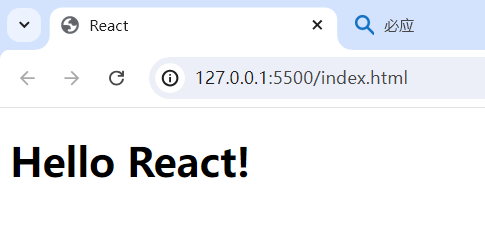
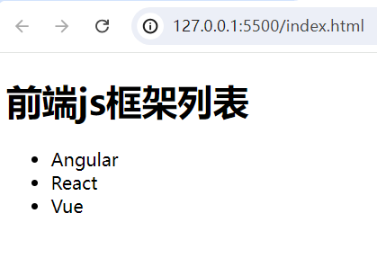
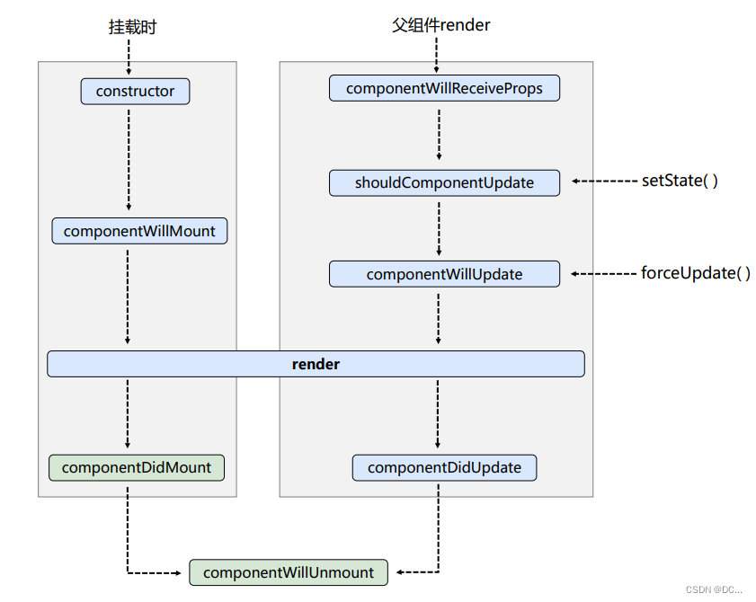
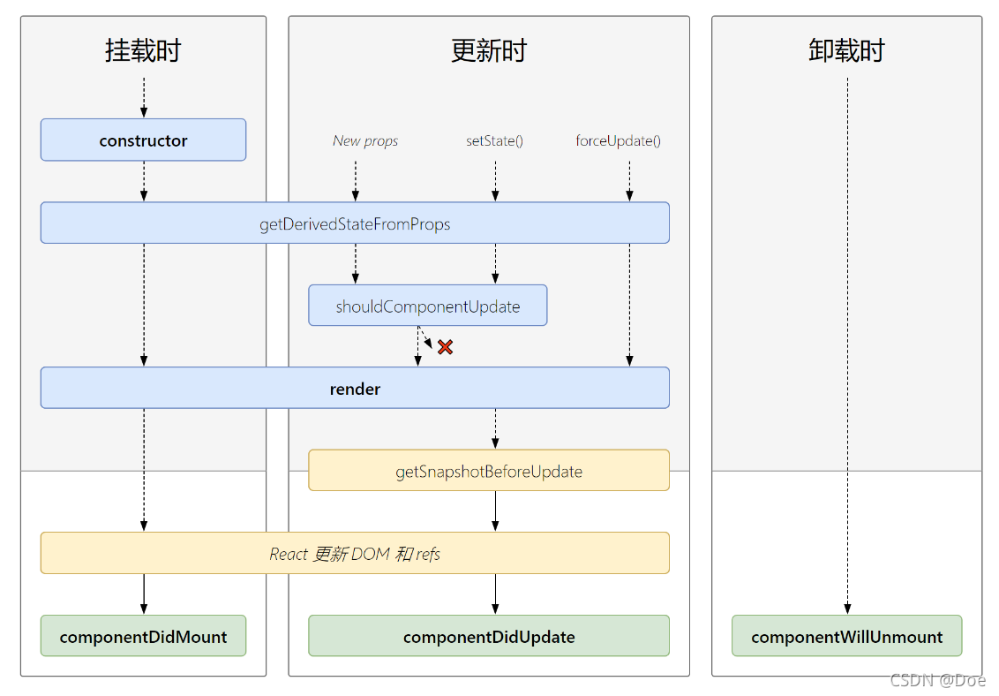
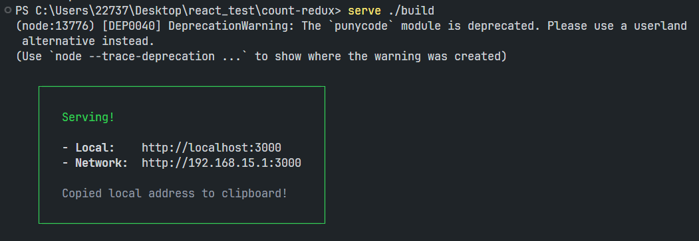

# React

React 是一个用于构建用户界面（UI）的 JS 库。用户界面由按钮、文本和图像等小单元内容构建而成。React 帮助你把它们组合成可重用、可嵌套的 *组件*。从 web 端网站到移动端应用，屏幕上的所有内容都可以被分解成组件。

##### React 的发展史：

1. 起初是由**Facebook**的软件工程师Jordan Walke创建。

2. 于2011年部署于Facebook的newsfeed。

3. 随后在2012年部署于Instagram。

4. 2013年5月宣布开源。

   ......

*近10年“陈酿”React正在被腾讯、阿里等一线大厂广泛使用。*

##### 为什么要用React？

原生JS操作DOM繁琐、效率低。因为浏览器会进行大量的重绘重排。

原生JS没有组件化编码方案，代码复用率很低。

##### React的特点：

1. React使用**虚拟DOM** + 优秀的**Diffing算法**，尽量减少与真实DOM的交互。
2. 采用组件化模式、声明化编码，提高开发效率及组件复用率。
3. 在**React Native**中可以使用React进行移动端（安卓、IOS）开发。

##### 关于 `@babel/standalone`：

`@babel/standalone` 是 Babel 的一个特殊版本，专为**浏览器环境**设计，它可以在浏览器中实时编译并运行 ES6+/JSX 代码。

##### 什么时候用 `@babel/standalone`：

由于这种方式是实时编译的JSX语法，因此效率低。我们学习阶段可以先用它来写React代码。如果你在生产环境中使用 Babel，你通常不应该使用 `@babel/standalone`。相反，你应该使用在 Node.js 上运行的构建系统，例如 Webpack、Rollup 或 Parcel，来提前转换 React 的 JSX 代码。

##### 用法：

可以通过包管理器手动安装到本地：`npm i @babel/standalone`，或直接通过 [UNPKG](https://unpkg.com/@babel/standalone/babel.min.js) 在HTML中引入。这是一种将其嵌入网页的简单方法，无需进行任何其他设置：

```html
<script src="https://unpkg.com/@babel/standalone/babel.min.js"></script>
```

当在浏览器中加载时，`@babel/standalone` 将自动编译并执行所有 `type` 属性值为 `text/babel` 或 `text/jsx` 的 `<script>` 标签：

```html
<!-- 1、引入@babel/standalone -->
<script src="https://unpkg.com/@babel/standalone/babel.min.js"></script>
<!-- 2、编写es6或jsx代码 -->
<script type="text/babel">
  const getMessage = () => "Hello World";
  document.getElementById("output").innerHTML = getMessage();
</script>
```

上方代码中，由于 HTML 的 `<script>` 标签不支持 `text/babel` 类型，因此该标签会被浏览器忽略。而Babel会去接管这个 `<script>` 标签，将其中的内容编译后生成新的 `<script>` 标签插入到HTML中。

- ### 第一个React程序

  我们先来做一个React程序，这里先用React的旧版本（16）。目前，我们会用到3个文件：

  1. `babel.min.js`：我们之前用babel来将ES6语法（实时）转换为ES5，其实它还有一个功能是：将React的**JSX语法**转换成JS。

     > 类似Vue中的**模板解析器**，将Vue容器中的模板语法解析为JS。

  2. `react.development.js`：它是React的核心库。所有React的功能通过它来实现。

  3. `react-dom.development.js`：React的扩展库。用于支持React去操作DOM（以及虚拟DOM）。

     > `react` 提供了 React 的所有核心功能以及API。而`react-dom` 负责把 React 描述的 UI 渲染到浏览器 DOM。
     >
     > 这样的好处是：同一个 React 组件可以渲染到不同平台。比如在移动端使用 react + react-native，react-native 将 React 组件渲染为移动端组件，而不是浏览器中的DOM。

  ##### 第一个React程序，`index.html`：

  ```jsx
  <!DOCTYPE html>
  <html lang="en">
    <head>
      <meta charset="UTF-8">
      <title>React</title>
    </head>
  <body>
    <div id="app">33</div>
  
    <!-- 引入@babel/standalone，用于将jsx转为js -->
    <script src="https://unpkg.com/@babel/standalone/babel.min.js"></script>
    <!-- 引入react核心库 -->
    <script src="https://unpkg.com/react@16/umd/react.development.js"></script>
    <!-- 引入react-dom，用于支持react操作dom。该文件必须在react核心库之后引入 -->
    <script src="https://unpkg.com/react-dom@16/umd/react-dom.development.js"></script>
  
    <!-- type属性写text/babel，表示里面写的是jsx语法（在js的基础上加了xml语法），jsx语法得通过babel来转成js -->
    <script type="text/babel">
      // 1、创建虚拟DOM（虚拟DOM其实就是JS对象）
      const vdom = <h1 id="title">Hello React!</h1>/* JSX中，xml标签能和JS混着写 */
      // 2、将创建的虚拟DOM渲染到页面中（div内部）
        //引入上面两个react库之后，全局就多了一个React和ReactDOM对象
      ReactDOM.render(vdom, document.getElementById('app'))//参数1是虚拟DOM，参数2是dom容器对象
  </script>
  </body>
  </html>
  ```

  ##### 浏览器中运行`index.html`：

  

  ##### F12打开控制台，发现控制台上有黄色的提示信息：

  ```tex
  You are using the in-browser Babel transformer. Be sure to precompile your scripts for production - https://babeljs.io/docs/setup/
  ```

  上面这个提示就是说：你使用 React 的方式不太对，代码一多可能会有问题。

  其实浏览器拿到`<script>`，发现`type`属性值非法，因此不会执行里面的JS代码。而Babel在浏览器渲染完毕之后，从DOM树中获取了所有`type='text/babel'`的`<script>`标签，将其中的JSX语法代码解析完毕后，重新生成了新的`<script>`并插入到HTML中。

  不过由于这种方式是运行时解析，因此效率较低影响用户体验。我们目前先用这种方式学习 React 的语法，后面通过React脚手架来开发就不存在这个问题了。

  下面还有一个提示是说：可以用框架提供的**调试工具**来开发 React 项目（一般框架都会提供它专门的调试工具）。所以我们将这个 React 的 Chrome 调试工具插件下载下来，方便后面代码的调试。

  ##### 一个疑问：为什么我们不用 JS 来创建虚拟DOM，而要使用 JSX 来创建虚拟DOM呢？

  要说清楚这个问题，首先我们将上面 JSX 创建虚拟DOM的方式，改为用 JS 来写：（由于这里不用 JSX 语法了，因此不需要引入 `@babel/standalone` 了）

  ```jsx
  <script>
    // 1、用React对象上的createElement(标签名,标签属性,标签内容)方法来创建虚拟DOM
    const vdom = React.createElement('h1',{id:'title'},'Hello React!')
    // 2、将创建的虚拟DOM渲染到页面上
    ReactDOM.render(vdom, document.getElementById('app'))
  </script>
  ```

  ##### 这种方式好像也可以，那为什么还要用JSX语法呢？

  因为这种方式，如果元素简单还好，稍微复杂一点代码就无法再看了。例如：要求h1标签中还有个span，span中写“Hello React！”，此时就需要将`createElement()`的第3个参数变为：`React.createElement('span',{}/null,'Hello React!')`

  而使用 JSX 语法来创建虚拟DOM（VDOM）就简单多了：

  ```jsx
  // 加外层的小括号表示里面的虚拟DOM是一个整体，否则会有JS的语法错误
  const vdom = (
    <h1 id="title">
      <span>Hello React!</span>
    </h1>
  )
  ```

  > 我们引入的 Babel 就为了将 JSX 翻译为上方的JS：`React.createElement('h1',{id:'title'},'Hello React!')`

  这就是为什么React要打造JSX语法的原因。总结：

  JSX 只为解决一个问题：**JS 创建虚拟DOM太麻烦了，用 JSX 可以让编码人员更加简单的创建虚拟DOM，写起来更流畅**。

- ### 虚拟DOM与真实DOM

  刚刚我们创建的虚拟DOM（VDOM）到底是个什么东西呢？

  我们在控制台上打印VDOM，发现它其实就是一个普通JS对象。

  和真正的DOM相比，虚拟DOM比较“轻”。因为虚拟DOM只是 React 内部在用，无需真实DOM上的那么多的属性。

  在Web端，虚拟DOM最终会被 ReactDOM 映射为HTML上的真实DOM。

  > **ReactDOM 是 React 官方提供的用于操作 DOM 的库**，主要负责将 React 组件渲染到浏览器 DOM 中，并处理 DOM 更新。
  >
  > **为什么需要分离**：
  >
  > - **平台无关性**：React 核心只处理组件逻辑，不涉及具体平台
  > - **多平台支持**：有 ReactDOM（Web）、React Native（移动端）、React VR/AR 等
  > - **关注点分离**：组件逻辑与渲染逻辑分离

- ### JSX

  JSX 全称为 JavaScript XML，是React定义的一种类似于XML的JS的扩展语法：JS + XML。本质上是`React.createElement('h1',{id:'title'},'Hello React!')`的语法糖，简化了创建虚拟DOM的JS代码。

  ##### JSX的语法规则：

  1. JSX的标签结构要更严格，**根标签只能有一个**，且每个**标签必须闭合**。

     > **为什么根标签只能有一个**：JSX 虽然看起来很像 HTML，但在底层其实被转化为了 JS 对象，你不能在一个函数中返回多个对象，除非用一个数组把他们包装起来。这就是为什么多个 JSX 标签必须要用一个父元素包起来。
     >
     > 根标签也可以用空标签（`<></>`）、或者用React 16.2提供的`<React.Fragment>`组件（语法糖），这样做的好处是：不会多一层HTML结构。
     >
     > 但是要注意：空标签`< />`中不能有任何属性。

  2. 由于是XML语法，因此JSX中可以写任意名字的标签。其中小写字母开头的标签会被当作HTML标签解析，**大写字母开头的标签，会被当作组件**去渲染。

  3. 如果标签要动态化，要用`{}`包起来。当React解析 JSX 时会立即执行里面的JS表达式。

  4. 如果`{}`里面的是数组，那么React会自动帮你遍历数组，数组中每个元素都当作虚拟DOM（JSX的标签）顺序放在`{}`所在的位置。

  5. 和HTML中不同的是，标签的`class`属性改为了`className`。因为JSX中包含JS语法，而`class`是JS中的关键字。

  6. 和HTML中不同的是，标签的`style`样式属性的值不能用字符串，也就是不能这样写：`<span style='margin: 10px'></span>`，值必须是JS中的对象（动态的），如：`<span style={ {backgroundColor:'red',color:'red'} }></span>`，CSS属性名采用小驼峰形式。

  7. **JSX 标签的属性必须写成小驼峰形式**。因此，事件句柄属性也要写成小驼峰形式，且值为回调函数名：`<div onClick={handleClick}></div>`。

     > 注意：
     >
     > 1. 函数名后不要加小括号。React在解析 JSX 时会给该事件绑定上该函数的地址，而不是调用它。
     > 2. 由于历史原因，`aria-*`和`data-*`属性还是以带`-`的 HTML 格式书写的。
     > 3. 如果是自定义组件，组件标签的属性名（props）可以是任意风格，但建议统一风格用小驼峰格式。

  ##### 小练习：

  ```jsx
  <!DOCTYPE html>
  <html lang="en">
  <head>
    <meta charset="UTF-8">
    <title>React</title>
  </head>
  <body>
    <div id="app"></div>
  
    <!-- 引入@babel/standalone，用于将jsx转为js -->
    <script src="https://unpkg.com/@babel/standalone/babel.min.js"></script>
    <!-- 引入react核心库 -->
    <script src="https://unpkg.com/react@16/umd/react.development.js"></script>
    <!-- 引入react-dom，用于支持react操作dom。该文件必须在react核心库之后引入 -->
    <script src="https://unpkg.com/react-dom@16/umd/react-dom.development.js"></script>
  
    <!-- type属性写text/babel，表示里面写的是jsx，且要通过babel来转成js -->
    <script type="text/babel">
      const data = ['Angular','React','Vue']
      // 1、创建虚拟DOM。多行要用小括号包一下，否则JS语法错误
      const vdom = (
        <div>
          <h1>前端js框架列表</h1>
          <ul>
            {
              //此时这里就是一个虚拟DOM数组了
              data.map((item,index)=>{
                //要求数组中每一个虚拟DOM节点都必须有一个key属性作为虚拟DOM的唯一标识。和Vue中一样，最好用数据的id
                return <li key={index}>{item}</li>
              })
            }
          </ul>
        </div>
      )
      // 2、将创建的虚拟DOM渲染到页面上
      ReactDOM.render(vdom, document.getElementById('app'))
    </script>
  </body>
  </html>
  ```

  最终效果：

  

- ### React面向组件编程

  React 应用程序是由 **组件** 组成的。一个组件是 UI（用户界面）的一部分，它拥有自己的逻辑和外观。组件可以小到一个按钮，也可以大到整个页面。

  组件是用来**实现局部功能效果的代码和资源的集合**（html/css/js/imgs等），使用组件可以**复用代码、简化项目编码、提高运行效率**。当一个应用是以多组件的方式实现，那么这个应用就是一个组件化的应用。

  一个 React 的组件其实就是一个 JS 的函数（或类）。React 中定义组件的两种方式：

  1. ##### 函数式组件：（React 16.8 之后主推）

     用 JS 的函数定义的组件就叫**函数式组件**。如：

     ```jsx
     // 1、创建函数式组件（函数名一定要大写字母开头，因为下面要用函数对应的组件标签）
     function Demo(props){// props形参后面会说
       //此处的this是undefined，因为babel编译后开启了严格模式
       return <h2>我是用函数定义的组件（适用于简单组件的定义）</h2>
     }
     // 2、渲染组件到页面
     ReactDOM.render(<Demo />, document.getElementById('app'))
     ```

     注意：函数名一定要用大写字母开头，因为组件标签必须是大驼峰格式时，小写字母开头的标签会被当作原生的HTML元素。

     函数的形参是`props`，后续会讲到。

     `ReactDOM.render(<Demo/>, document.getElementById('app'))` 这行代码的（大致）执行流程：

     1. React会去解析组件标签 `<Demo />`，然后找到对应的Demo组件。
     2. 发现是函数式组件于是就调用该函数，将函数返回的虚拟DOM转为真实DOM渲染到页面上。

     **TIP：**

     - 函数组件的函数最好是纯函数。也就是不要去修改，组件定义前就已经存在的变量，这可能会产生副作用。
     - 在React中，你可以在渲染时读取三种输入：props、state、context。你应该始终将这些输入视为只读，在组件中修改它们会使得组件【不纯】。
     - React 提供了 “严格模式”，在严格模式下开发时，它将会调用每个组件函数两次。**通过重复调用组件函数，严格模式有助于找到不纯的组件**。
     - 严格模式只在开发环境下有效，因此它不会降低应用程序的速度。如需引入严格模式，你可以用 `<React.StrictMode>` 包裹根组件 `<App>`。
     - 使用纯函数编写组件有哪些好处？
       1. 你的组件可以在不同的环境下运行。
       2. 你可以放心的为纯函数组件开启缓存来跳过渲染，以提高性能。
       3. 在渲染深层次组件树时，数据发生变化后，React可以立即停止并重新开始渲染组件树。不必浪费时间完成过时的渲染。

     > 哪些地方**可能**引发副作用 ？
     >
     > 1. 函数式编程在很大程度上依赖于纯函数，但 **某些事物** 在特定情况下不得不发生改变。这是编程的要义！这些变动包括更新屏幕、启动动画、更改数据等，它们被称为 **副作用**。它们是 **“额外”** 发生的事情，与渲染过程无关。
     > 2. 在 React 中，**副作用通常属于事件处理程序**。事件处理程序是 React 在你执行某些操作（如单击按钮）时运行的函数。即使事件处理程序是在你的组件 **内部** 定义的，它们也不会在渲染期间运行！**因此事件处理函数无需是纯函数**。
     > 3. 如果你用尽一切办法，仍无法为副作用找到合适的事件处理程序，你还可以调用组件中的 `useEffect()` 方法将其附加到返回的JSX中。这会告诉 React 在渲染结束后执行它。**然而，这种方法应该是你最后的手段**。如果可能，请尝试仅通过渲染过程来表达你的逻辑。你会惊讶于这能带给你多少好处！

  2. ##### 类式组件：（了解即可，新项目不推荐使用了）

     用类定义的组件就叫**类式组件**。如：

     ```jsx
     // 1、创建类式组件
     class Demo extends React.Component {
       // 要求定义的类必须继承React中的React.Component类，且里面必须写render()方法并返回一个虚拟DOM对象
       render() {
         //这里的this就是<Demo/>组件实例对象
         console.log(this)
         return <h2>我是用类定义的组件（适用于复杂组件的定义）</h2>
       }
     }
     // 2、渲染组件到页面
     ReactDOM.render(<Demo/>, document.getElementById('app'))
     ```

     一个继承了 `React.Component` 的类才能称得上是React的类组件，该类必须包含一个`render()`方法，该方法必须返回一个虚拟DOM对象（JSX标签）。

     `ReactDOM.render(<Demo/>, document.getElementById('app'))` 的大致执行流程：

     1. React会去解析虚拟DOM，发现是大写字母开头的组件标签 `<Demo/>`，于是找到对应的Demo组件。
     2. 发现是类式组件于是就`new`出来了Demo类的组件实例对象，并通过该实例调用了类中的`render()`方法。
     3. 最后将`render()`返回的虚拟DOM转为了真实DOM渲染到页面上。

- ### state（状态）

  React 最重要的核心概念之一，就是“状态”（State）。通过更新组件的状态可以触发页面的重新渲染。所以组件也被称作**状态机**。

  - ##### 函数组件中的`state`：

    函数组件的`state`是一个特殊的变量，这个变量需要通过 `useState()` Hook来获取，它的唯一参数是 state 变量的 **初始值**，执行后返回一个数组：

    ```js
    import { useState } from 'react';
    
    const [myState, setMyState] = useState(0);
    ```

    `useState()` Hook 提供了这两个功能：

    1. **State 变量** 用于保存渲染间的数据。

    2. **State setter 函数** 更新状态变量并触发 React 再次渲染组件。

       > 注意，更新状态`state`必须通过`state setter`函数，这样才能做到响应式（即更改数据后，页面也随之渲染）。

    如果初值需要通过复杂计算获得，则可以给 `useState(initFunc)` 传入一个函数，在函数中计算并返回初值。此函数**只会在初始渲染时被调用**，也就是该组件重新挂载时，这个函数不会被再次调用了。

    state 的 setter 函数的参数是 state 变量的新值，而且也可以传一个函数：

    ```js
    setXxx((preValue) => newValue);
    ```

    React 会立即执行这个函数，并将返回值作为 state 的新值。该函数的参数是 state 的旧值。

    ###### 关于 Hooks：

    在 React 中，`useState` 以及任何其他以“`use`”开头的函数都被称为 **Hook**。
    
    **Hooks ——以 `use` 开头的函数——只能在组件或自定义 Hook 的最顶层调用。** 你不能在条件语句、循环语句或其他嵌套函数内调用 Hook。Hook 是函数，在组件顶部 “use” Hook 这个特性类似于在文件顶部“导入”模块。

  - ##### 类组件中的`state`：（了解）

    类组件中，组件实例对象上有一个 `state` 属性，它的值是一个对象，`state` 对象里面的一个个属性被称为组件的状态（`state`）。

    更新 `state` 的属性（状态）值必须通过组件实例的 `setState({}/func,[callback])` 方法，只有这样更新才能做到响应式（即更改数据后，页面也随之渲染）。该方法在 `React.Component` 函数的原型上。执行后React会拿着参数对象与旧的 `state` 对象进行**浅合并**（不是替换），然后去**异步更新** `state` 属性。

    > 由于React是异步更新的 `state`，所以第2个参数可以传一个回调函数，该函数会在本次的状态更新后被调用。

    `setState()` 的执行时机：React 会等到事件处理函数中的**所有**代码都运行完毕再处理你的 **state** 更新。这让你可以更新多个状态变量——甚至来自多个组件的状态变量——而不会触发太多的重新渲染。

    `setState()` 函数的第1个参数还可以是函数，该函数接收2个参数 `state` 和 `props`（用于获取旧的状态），函数返回的对象用于更新 `state` 属性。其实对象式的 `state` 是函数式 `state` 的语法糖。如果新 `state` 依赖于原 `state`，那么推荐使用 `setState()` 的函数式写法。

    注意：组件中的 `state` 被认为是**只读的**，也就是不能修改原来的 `state`，而是用新的 `state` 整个替换掉旧 `state`。即被修改的部分必须产生新的引用。

    那么在类组件中，如何初始化 `state` 中的状态呢？通常有两种方式：

    1. 通过类的构造器来初始化state：

       ```js
     class MyComponent {
         constructor(props) {
           super(props)
           // 初始化类式组件中的状态（state属性）
           this.state = { isHot: true }
         }
       }
       ```
    
    2. （**推荐**）通过在类中定义固定的实例属性：

       ```js
        class MyComponent {
         // 初始化state状态
         state = { isHot: true }
       }
       ```
    
    注意：在类组件中，JSX 中的回调函数不能是类的方法。因为这个方法是通过事件回调的方式调用而不是通过实例对象调用的。由于类开启了严格模式，所以此时方法中的 `this` 不是组件实例对象且不能指向 `window`，所以是 `undefined`。

    那么 JSX 中的回调函数要怎么定义呢？

    你可能会想到，在类组件的构造器中，手动更改每个类方法的 `this`，生成的新方法放在类的实例上：

    ```js
    this.changeWeather = this.changeWeather.bind(this)
    ```
    
    但这样的话，每一个类的方法都需要手动写代码在构造函数中做更正，并且原型上还有一个用不到的方法 `changeWeather()`。

    实际开发中，我们会这样做：将类组件中的方法定义为实例属性的形式。

    ```js
    changeWeather = () => {/* 里面的this是组件实例对象 */}
    ```
    
    由于是箭头函数，所以函数中的 `this`是类作用域的 `this`，`this` 永远指向当前的类组件实例。

- ### props

  React 的组件之间使用 *props* 来互相通信。每个父组件都可以通过 props 给它的子组件传递一些信息。Props 可能会让你想起 HTML 属性，但你可以通过它们传递任何 JS 的值，包括但不限于对象、数组和函数。

  ```jsx
  export default function Profile(props) {
    return (
      <Avatar
        person={{ name: 'Lin Lanying', imageId: '1bX5QH6' }}
        size={100}
      />
    );
  }
  ```

  上方代码中，我们给 `<Avatar>` 组件传递了两个`props`：`person`（一个对象）和`size`（一个数字），它们会作为 `<Avatar>` 组件的`props`。这个 `props` 就是一个对象，对象的key就是属性名、value就是属性值。

  接下来看下如何读取父组件传递过来的`props`。

  - ##### 函数组件中的`props`：

    函数式组件接收唯一一个参数就是`props`。

    ```js
    function Avatar({ person, size }) {
      // 在这里 person 和 size 是可访问的
    }
    ```

    上方代码中，我们通过 JS 的对象解构，从`props`中解构出来了`person`和`size`。

  - ##### 类组件中的`props`：（了解）

    类组件实例`this`上有 `props` 属性，它是一个对象，可以让组件实例接收外部传过来的`props`。

    ```jsx
    // 定义Student组件
    class Student extends React.Component {
        render() {
            const {name,sex,age} = this.props
            return ( // 没有括号包裹的话，任何在 return 下一行的代码都将被忽略！
                <ul id="student">
                    <li>姓名：{name}</li>
                    <li>性别：{sex}</li>
                    <li>年龄：{age+1}</li>
                </ul>
            )
        }
    }
    // 将Student组件渲染到页面上
    ReactDOM.render(<Student name="艾克" age={15} sex="男"/>, document.getElementById('app'))
    ```

    （现在很少用）类组件中，可以通过给类加静态属性`propTypes`和`defaultProps`，来约束传递的`props`数据的类型和默认值：（函数组件也可以用）

    ```js
    class Student extends React.Component {
        // 对props标签属性进行类型、必要性的限制。此时如果不按照要求给组件传递数据的话，页面虽然会正常显示但控制台会报错
        static propTypes = {
            name: PropTypes.string.isRequired,
            sex: PropTypes.string,
            age: PropTypes.number,
            speak: PropTypes.func
        }
    
        // 指定props标签属性的默认值
        static defaultProps = {
            sex: '未知性别',
            age: 18
        }
        ...
    }
    ```

    > 注意：React15.5版本后，PropTypes对象被React核心库给分离出来了。如果要对props做类型限制，还需要另外引入`prop-types`依赖包。

    ###### 关于类式组件的构造器：

    我们之前在写类式组件时，有一种初始化`state`的方式是通过组件类的构造器：

    ```js
    class Student extends React.Component {
      constrator(props) {
        super(props)
        console.log(this.props)
      }
      ...
    }
    ```

    当时没说为什么必须写`super(props)`，现在可以说了。其实这里的`props`实参就是组件实例上的`props`，我们并不是一定要将`props`传给`super()`，甚至`constrator()`不写都行。那么问题来了：

    1. 组件类中的构造器有什么作用，通常在构造器中做什么事情呢？
    2. 这个props传给super()和不传有什么区别吗？

    在React中，构造器仅用于两种情况，**初始化state**和**解决类中自定义函数的this指向**。而`props`实参如果不传，那么`constrator()`中通过`this.props`无法访问实例上的`props`。（但这个小bug无关紧要，因为`constrator(props)`的参数就可以拿到`props`）

  ##### 关于`props`：

  1. **`props`是只读的，不允许修改**！

  2. 给 React 组件传递`props`时可以简写。例如：

     ```jsx
     const p = {
       name: "Tom",
       age: 18
     };
     
     <Student {...p} />
     ```

     等价于：

     ```jsx
     <Student name="Tom" age={18} />
     ```

     `<Student {...p}/>`，它表示将p

     ```jsx
     let p = {name:'zs',age:13}`，`
     ```

     这是 **JS 的对象展开语法** 和 **JSX 语法** 结合的结果，不是 React 发明的新语法。

  3. 向`props`中传数据并非只能用标签属性的方式，还可以将数据放在标签体中：

     ```jsx
     <Card>
       <!-- 当然不仅可以放文本，也可以放JSX组件 -->
       <Avatar />
       xxx
       ...
     </Card>
     ```

     这就像浏览器原生HTML元素的嵌套一样，当你将内容嵌套在 JSX 标签中时，`<Card>`组件可以在名为 `children` 的 `props` 中接收到该内容。

     `children` 是组件标签中的一个特殊的属性，用于显式的往组件的标签体中传数据。（如果`props`中传了名为 `children` 的属性，且标签体中也写东西了，那么标签体的优先级更高）

     你可以将带有 `children` prop 的组件看作有一个“洞”，可以由其父组件使用任意 JSX 来“填充”。你会经常使用 `children` prop 来进行视觉包装：面板、网格等等。

- ### ref（脱围机制）

  - ##### 函数组件中使用`ref`：

    当你希望组件“记住”某些信息，但又不想让这些信息“触发新的渲染”时，你可以使用 **ref** 。

    通过从 React 导入 `useRef` Hook 来为你的组件添加一个 ref，参数是 ref 的初值（任意值）：

    ```js
    import { useRef } from 'react';
    
    const ref = useRef(0);
    /*
    {
      current: 0 // 你向 useRef 传入的值
    }
    */
    ```

    与 state 一样，React 会在每次重新渲染之间保留 ref；与 state 不同的是，ref 是一个普通的 JS 对象，具有可以被读取和（同步）修改的 `current` 属性，修改 ref 后不会触发 React 的重新渲染。ref 就像一个 React 追踪不到的、用来存储组件信息的秘密“口袋”。

    也许你觉得 ref 似乎没有 state 那样“严格” —— 例如，你可以改变它们而非总是必须使用 state 设置函数。但在大多数情况下，我们建议你使用 state。ref 是一种“脱围机制”，你并不会经常用到它。

    你可以将 ref 指向任何值。但是，ref 最常见的用法是**访问 DOM 元素**。

    只需要将 ref 作为 `ref` 属性值传递给想要获取的 DOM 节点的 JSX 标签：

    ```jsx
    const myRef = useRef(null);
    
    <div ref={myRef}>
    ```

    当 React 为这个 `<div>` 创建一个 DOM 节点时，React 会把对该节点的引用放入 `myRef.current`。然后，你可以从事件处理器访问此 DOM 节点，并使用在其上定义的内置浏览器 API。

    ```js
    myRef.current.scrollIntoView();
    ```

    你也可以像其它 prop 一样将 ref 从父组件传递给子组件。

    ```jsx
    import { useRef } from 'react';
    
    function MyInput({ ref }) {
      return <input ref={ref} />;
    }
    
    function MyForm() {
      const inputRef = useRef(null);
      return <MyInput ref={inputRef} />
    }
    ```

  - ##### 类组件中使用`ref`：（了解）

    - ###### ~~`String`类型的`ref`：（效率低）~~

      ```jsx
      <input ref="inputRef" type="text" />
      ```

      渲染该类组件时，React会将该 JSX 对应的真实DOM以K-V的形式收集到类组件实例的`refs`属性上，该属性的是一个对象，其中`key`是ref的值（`inputRef`），`value`是 ref 所在的真实DOM（如果是类组件标签，则收集到的是类组件实例）。

    - ###### 回调函数的`ref`：

      ```jsx
      <input ref={(currentNode) => this.input1 = currentNode} type="text" />
      ```

      `ref`属性的值如果是一个回调函数，React在解析虚拟DOM时发现ref值是一个函数于是立即执行该回调函数并将**当前真实DOM**作为参数传了进去。通常在该回调中我们将真实DOM放在组件实例对象上，这样来访问：`this.input1`

      > **该回调函数被调用的次数：**
      >
      > - 当每次state变化后重新调用`render()`**更新**页面时，ref指定的回调会被执行2次。并且第1次调用时传的是`null`，第2次才是当前的真实DOM。
      > - 这是因为每次render()渲染时ref的值都是一个新的回调，为了确保新回调能正常执行，它先对旧回调做了清空操作。
      > - 其实**大多数情况下都不会有什么问题**。如果就想**只执行1次该回调**，可以将该回调定义为组件中的方法。

    - ###### ~~`React.createRef()`：（推荐）~~

      `React.createRef()`函数调用后会返回一个容器对象，该容器可以存储被`ref`标识的JSX标签。使用：（一个容器只能存一个真实DOM）

      组件实例自身上定义实例属性`myInput`，值是容器对象。JSX 标签的ref的值设置为该实例属性`myInput`：

      ```jsx
      <input ref={this.myInput} type="text" />
      
      class Student extends React.Component {
        myInput = React.createRef()
        ...
      }
      ```

      当React对组件初始化时，发现ref的值是一个容器，于是就把该真实DOM放在了此容器中。获取：`this.myInput.current`。

- ### React中的事件

  React 中的事件处理程序可以接收到一个 React 事件对象。它有时也被称为“合成事件”（synthetic event）。这样做是为了更好的兼容性。

  ```jsx
  <button onClick={(e) => {
    console.log(e); // React 事件对象
  }} />
  ```

  它符合与底层 DOM 事件相同的标准，但修复了一些浏览器不一致性。

  一些 React 事件不能直接映射到浏览器的原生事件。例如，`onMouseLeave` 中的 `e.nativeEvent` 将指向 `mouseout` 事件。具体的映射关系不是公共 API 的一部分，可能会在未来发生变化。如果处于某些原因需要浏览器的原生事件，请从 `e.nativeEvent` 中读取它。

  ##### 事件委托：

  React中的事件是通过**事件委托**的方式来处理的。事件委托就是将事件委托给最外层的元素`#root`（为了高效）。此时通过`event.target`就可以拿到真正发生该事件的DOM元素。

  ##### React 中的事件冒泡/捕获：

  和 HTML 中的事件传播方式类似，React 中的事件默认也是冒泡的，事件处理函数将捕获任何来自子组件的事件。

  > 极少数情况下，你可能需要捕获子元素上的所有事件。可以通过在事件名末尾加 `Capture` 来实现这一点。
  >
  > ```jsx
  > <div onClickCapture={() => { /* 这会首先执行 */ }}>
  >   <button onClick={e => e.stopPropagation()} />
  >   <button onClick={e => e.stopPropagation()} />
  > </div>
  > ```
  >
  > 注意：只有 HTML 的原生元素才可以这样做。

  ##### 关于多选框标签的`onChange`：

  JSX中，多选框标签上的`checked`属性，会根据值`true/false`来决定是否勾选。如果加了该属性必须同时加上`onChange`属性（值为回调函数名），指定当多选框发生变化时要做什么。否则多选框就无法取消勾选了。

  并且要注意，多选框标签的 `defaultChecked` 只能设置复选框在页面初次加载时的默认选中状态。并且如果同时加了 `checked` 属性，那么 `checked` 设置的初始勾选状态更高。

- ### 受控组件和非受控组件

  在 React 中，**受控组件（Controlled Component）** 和 **非受控组件（Uncontrolled Component）** 的区别，本质上是：

  **表单元素的数据由 React 管理，还是由 DOM 自己管理。**

  表单的值存放在 React state 里，可以实时获取用户的输入，这种就是**非受控组件**。

  表单的值保存在 DOM 元素自己内部，React 不管理它，而是等提交时通过 ref 去获取值，这种就是**受控组件**。

  > 推荐使用受控组件，因为这种写法不用写很多ref。

- ### 函数的柯里化&高阶组件

  符合以下条件之一的函数称为**高阶函数**：
  
  1. 函数的形参是一个函数。
  1. 函数的返回值是一个函数。

  函数的柯里化：通过函数调用继续返回函数的方式，实现多次接收参数，最终统一处理的函数编码形式。如：

  ```js
  // 没用函数的柯里化
  // function sum(a,b,c){ return a+b+c }
  // 采用函数的柯里化
  function sum(a) {
    return (b)=>{
      return (c)=>{
        return a+b+c
      }
    }
  }
  sum(1)(2)(3);
  ```

- ### ~~React 组件的生命周期~~

  每个组件实例从创建到销毁都会经历一系列过程，在这个过程中会通过组件实例去调用组件实例（原型）上一系列叫做**生命周期钩子**的函数，这给了用户在不同阶段执行自己的代码的机会。这就是组件的生命周期。

  - ##### ~~关于组件实例的生命周期（16及之前的旧版本）：~~

    

    - **初始化阶段（挂载阶段）**：当执行`ReactDOM.render()`之后，也就是组件实例对象初次被创建并挂载到页面上时：

      1. React首先new出来对应的组件实例对象，此时组件的**constrator()构造器执行了**。
      2. 然后调用了组件实例的`componentWillMount()`方法，此时组件还没被挂载到页面上。
      3. 紧接着调用组件实例的`render()`方法将组件挂载到页面对应位置上。（组件实例**初始化渲染**、以及**state更新**后重新渲染页面时都会调用`render()`方法）
      4. （常用）挂载完毕后又调用了组件实例的`componentDidMount()`。我们一般在这里做初始化操作，如：开启定时器，发送请求等。

    - **更新阶段**：

      1. 当调用了`setState()`更新当前组件的state状态后，React首先调用组件实例的`shouldComponentUpdate(newProps, newState)`，它是控制页面更新的阀门，如果该方法返回`false`，那么接下来的更新流程都不会执行，也就是页面并不会重新渲染。（该方法不写的话默认返回`true`）

         > 该方法可以接收到2个参数，分别是新的props和新的state。

      2. 如果更新阀门打开了，紧接着会调用组件实例的`componentWillUpdate()`。此时页面还没重新渲染。

      3. 之后就调用组件实例的`render()`完成对页面的重新渲染。

      4. 最后渲染完毕后会调用组件实例的`componentDidUpdate(preProps, preState)`。

      > - 有时不想更新state中的数据，也希望通过`render()`将页面重新渲染下。此时可以调用组件实例身上的API：`forceUpdate()`，它直接绕过阀门从更新流程的第2步开始走强制渲染页面。
      > - 当父组件的state**更新**后，重新执行`render()`渲染页面时，其中的子组件不仅会进行更新，还会在每次更新前，也就是`shouldComponentUpdate()`执行之前，去调用`componentWillReceiveProps(newProps)`。也就是子组件收到父组件传递的新的`props`之前，还可以对这个props再处理下。（注意：**初次挂载**时该钩子不会被触发，因为子组件还没有 **接收过** props，所以谈不上 **将要接收新的 `props`**）

    - **卸载阶段**：当执行了`ReactDOM.unmountComponentAtNode(document.querySelector('#app'))`（或其他条件导致组件被卸载）之后，React会将HTML节点上挂载的组件卸载掉。在卸载前，组件实例的`componentWillUnmount()`会被调用（一般在这里做收尾工作）。此时已经过了更新阶段，在这个钩子中修改state页面不会再变了。

  - ##### 关于组件实例的生命周期（17及之后的新版本）：废弃了3个钩子，新增了2个钩子。

    

    在新版本React中（17+），`componentWillMount()`、`componentWillUpdate()`、`componentWillReceiveProps(props)`这3个生命周期钩子函数**过时了**，即将被弃用不推荐再用了。如果非要用前面需要加上`UNSAFE_`前缀。因为这3个钩子函数经常会被误解和滥用，尤其是在未来版本启用**异步渲染**之后问题会更严重。

    - （了解）初始化挂载和更新阶段新增了 `static getDerivedStateFromProps(props,state)` 钩子（从props得到一个派生的状态）。它是实例上的静态方法，且有返回值。返回值可以是2种：

      1. 返回一个对象，该对象会和原来的状态对象state进行合并（覆盖原来的同名属性）。

      2. 返回`null`，此时不会对state有任何的影响。

         > 派生状态会导致代码很冗余，并使组件难以维护，所以该钩子用的极少，了解即可。（只有state的值在任何情况下都取决于props时才考虑使用该钩子函数）

    - （了解）当组件走更新流程 `render()` 执行后，在页面完成更新之前，也就是提交到DOM之前还会执行 `getSnapshotBeforeUpdate(preProps, preState)`。该函数需要返回一个值作为snapshot（快照）。那么这个快照值给谁了呢？

      > 其实`componentDidUpdate(preProps, preState, snapshotValue)`钩子函数可以接收3个参数。第1个参数是先前的props，第2个参数是先前的state，第3个参数就是返回的快照值。

- ### 使用Vite搭建一个React应用

  [Vite](https://vite.dev/) 是一个构建工具，旨在为现代网络项目提供更快更简洁的开发体验。

  Vite 采用约定式设计，开箱即提供合理的默认配置。它拥有丰富的插件生态系统，能够支持快速热更新、JSX、Babel/SWC 等常见功能。你可以查看 Vite 的 [React 插件](https://vite.dev/plugins/#vitejs-plugin-react) 或 [React SWC 插件](https://vite.dev/plugins/#vitejs-plugin-react-swc) 和 [React 服务器端渲染示例项目](https://vite.dev/guide/ssr.html#example-projects) 来开始使用。

  Vite 已经作为构建工具在我们 [推荐的框架](https://zh-hans.react.dev/learn/creating-a-react-app) 之一 [React Router](https://reactrouter.com/start/framework/installation) 中使用。

  使用 Vite 创建一个 React 应用：

  ```bash
  npm create vite@latest my-app -- --template react-ts
  ```

  执行成功后会自动启动该项目，打开浏览器访问这个地址`http://localhost:5173/`，可以看到如下页面。

  

  这是脚手架为我们提供的 Demo 应用。接下来我们看下这个 React 项目的结构。

  - `package.json`：

    ```json
    {
      "name": "my-react-app",
      "private": true,
      "version": "0.0.0",
      "type": "module",
      "scripts": {
        "dev": "vite",
        "build": "tsc -b && vite build",
        "lint": "eslint .",
        "preview": "vite preview"
      },
      "dependencies": {
        "react": "^19.2.6",
        "react-dom": "^19.2.6"
      },
      "devDependencies": {
        "@eslint/js": "^10.0.1",
        "@types/node": "^24.12.3",
        "@types/react": "^19.2.14",
        "@types/react-dom": "^19.2.3",
        "@vitejs/plugin-react": "^6.0.1",
        "eslint": "^10.3.0",
        "eslint-plugin-react-hooks": "^7.1.1",
        "eslint-plugin-react-refresh": "^0.5.2",
        "globals": "^17.6.0",
        "typescript": "~6.0.2",
        "typescript-eslint": "^8.59.2",
        "vite": "^8.0.12"
      }
    }
    ```

    `dependencies`、`devDependencies`分别是项目的生产依赖和开发依赖，`scripts`是项目的运行脚本。其中：

    - `npm run dev`：启动一个开发服务器，我们开发阶段就在这个开发服务器提供的脚手架环境进行编码和开发。
    - `npm run build`：进行类型检查和编译，如果检查、编译通过了，则会在`dist`目录下生成静态资源，这些就是最终部署到服务器上的文件。
    - `npm run lint`：通过 ESLint 进行代码的规范检查，有助于项目组成员都使用相同的风格进行编码。
    - `npm run preview`：它会构建一个生产环境的预览，相当于先`build`打包，然后将`dist`中的内容部署到一个临时的服务器上。方便我们查看。

  - `public/`：该目录下存放**不参与打包**的**静态资源**。如果某个静态资源不需要经过 Vite 打包、或需要固定 URL 访问，那么就可以放在这里。

    > 通常这里会放一些图片、SVG、字体文件、网站的页签图标、robots.txt ...
    >
    > **robots.txt** 是一个存放在网站根目录的文本文件，用来告诉搜索引擎爬虫（如 Google、百度等）**哪些页面可以抓取，哪些不能抓取**。该文件是规范性质的，非强制性。

  - `index.html`：它是 React 应用的主页面，将来所有的东西都会打包放在这个文件中。

    ```html
    <!doctype html>
    <html lang="en">
      <head>
        <meta charset="UTF-8" />
        <link rel="icon" type="image/svg+xml" href="/favicon.svg" />
        <meta name="viewport" content="width=device-width, initial-scale=1.0" />
        <title>my-react-app</title>
      </head>
      <body>
        <div id="root"></div>
        <script type="module" src="/src/main.tsx"></script>
      </body>
    </html>
    ```

    里面有一个`id`为`root`的`<div>`，将来根组件 `<App>` 中的内容会填充到这里面。

    `<script>`标签使用 ESM 的语法导入了项目的入口文件`src/main.tsx`，这是因为 Vite 的开发模式的处理和 Webpack 不同。

    > Webpack 在开发模式下，其实是启动了一个开发服务器，在不断地计算、编译 JS 模块，并通知浏览器刷新。而 Vite 在开发模式下，利用浏览器支持 ESM 这个特性，让浏览器去加载这些 JS 模块，Vite 只是做编译，依赖分析交给浏览器了，因此速度要快很多，尤其是在冷启动时差距更明显。

    注意：如果请求了`public/`目录下不存在的资源，脚手架服务器默认会返回`index.html`。

  - `src/`：存放项目源代码。

    - `assets/`：存放源代码依赖的静态资源。和`public/`不同的是，放在这里的内容会经过 Vite 的处理。

    - `index.css`：全局的 CSS 样式文件，该文件在`main.tsx`中进行了导入。

    - `main.tsx`：它是 React 应用的启动入口文件，负责导入全局资源、创建 React 根节点，并将根组件 `App` 挂载到 HTML 中的 `#root` 元素上。浏览器加载 React 应用时，最先执行的通常就是这个文件。后续配置 React 的路由、状态、国际化等这些全局的操作，都会放在这个文件中执行。

      ```tsx
      import { StrictMode } from 'react'
      import { createRoot } from 'react-dom/client'
      import './index.css'
      import App from './App.tsx'
      
      createRoot(document.getElementById('root')!).render(
        <StrictMode>
          <App />
        </StrictMode>,
      )
      ```

      `createRoot` 创建了一个 React Root（根节点）并建立 React Fiber 树与真实 DOM 容器之间的关联，用于管理 React 组件。同时启用 React 18 的并发渲染（Concurrent Features）能力。

      之后通过根节点对象 `root` 的 `render()` 方法将一段 [JSX](https://zh-hans.react.dev/learn/writing-markup-with-jsx)（“React 节点”）在 React 的根节点中渲染为真实 DOM 并显示。

    - `App.tsx/App.css`：`App`组件是所有其他 React 组件的根组件，它里面直接或间接导入了项目中其他的组件。`App.css`是根组件的CSS样式文件。

      > 由于 React 中使用 JSX 语法，因此通常用到 JSX 的文件，文件名都是`.jsx`。如果是 TS 项目的话，文件名则是 `.tsx`。这样 Vite 就知道用何种方式编译我们的源文件了。

    未来`src/`下还会新建其他目录，比如`components/`中存放（除了 `App` 之外的）**UI 组件**，`layout/`存放**布局组件**，`views/`或`pages/`目录中存放路由组件。

    其中每个组件都是一个单独的目录，目录中的`index.jsx/组件名.jsx`就是组件文件，处此之外还有组件的样式`index.css/组件名.css`、组件依赖的静态资源等。

  - `vite.config.ts`：Vite 的配置文件，我们的应用需要用 Vite 进行编译和打包，以及运行一个开发服务器（脚手架）环境。

    ```ts
    import { defineConfig } from 'vite'
    import react from '@vitejs/plugin-react'
    
    // https://vite.dev/config/
    export default defineConfig({
      plugins: [react()],
    })
    ```

  - `eslint.config.js`：ESLint 是一个帮我们在开发阶段找到 JS/TS 代码问题的工具，其目的是使代码风格更加一致并避免错误。这是它的配置文件。

    ```js
    import js from '@eslint/js'
    import globals from 'globals'
    import reactHooks from 'eslint-plugin-react-hooks'
    import reactRefresh from 'eslint-plugin-react-refresh'
    import tseslint from 'typescript-eslint'
    import { defineConfig, globalIgnores } from 'eslint/config'
    
    export default defineConfig([
      globalIgnores(['dist']),
      {
        files: ['**/*.{ts,tsx}'],
        extends: [
          js.configs.recommended,
          tseslint.configs.recommended,
          reactHooks.configs.flat.recommended,
          reactRefresh.configs.vite,
        ],
        languageOptions: {
          globals: globals.browser,
        },
      },
    ])
    ```

  该项目是一个TS项目，`tsconfig.xx.json`这几个配置文件都是TS的配置文件。其他的文件我们暂时不需要关心。

- ### ~~使用React脚手架进行开发——Create React App（旧版）~~

  使用React脚手架可以快速创建基于React的项目，在脚手架环境下开发React项目效率更高。

  React官方提供了一个用于快速创建React项目的工具：`create-react-app`，通过它提供的命令可以快速创建React项目（node项目）。

  ##### 安装`create-react-app`工具并通过该工具创建React模版项目（React脚手架环境）：

  1. 安装create-react-app工具：`npm i -g create-react-app`（也可以用yarn，yarn和React是同一家公司的配合使用更好）
  2. 切换到你存放React项目的目录下执行：`create-react-app 项目名`
  3. 等待React项目创建成功后，cd进入项目目录中执行`npm start`即可启动React脚手架中自带的Hello Word项目。

  ##### React项目创建成功后，查看`package.json`的scripts配置项目：

  ```json
  "scripts": {
      "start": "react-scripts start",
      "build": "react-scripts build",
      "test": "react-scripts test",
      "eject": "react-scripts eject"
  },
  ```

  - 其中`npm start`可以启动一台开发者服务器，帮助我们开发和调试React项目。

  - `npm run build`可以将前端开发完毕的项目，打包生成静态资源文件，由后端部署在服务器上运行。

  - `npm run test`是做前端测试的，目前用不到。

  - `npm run eject`命令可以将React脚手架隐藏起来的、所有Webpack相关的命令及配置文件都暴露出来，方便我们更底层的配置React脚手架。运行之后项目根目录下会新增两个文件夹`config`和`scripts`。

    - `config` 文件夹包含了项目构建过程中使用的各种配置文件，包括不同环境下的Webpack配置文件。这些文件允许你自定义构建过程中的行为。
    - `scripts`文件夹包含了脚手架中原本封装的脚本逻辑，比如启动开发服务器、构建生产版本等。现在你可以直接修改这些脚本来满足特定的需求。
    - 此外，运行该命令还会更新`package.json`文件中的脚本部分，以便指向你项目中的自定义脚本而不是原来的脚本。
    
    **注意**：一旦运行了`npm run eject`，你就回不去了，因为你已经接管了所有配置细节。因此在运行此命令前，请确保你确实需要对配置进行深入定制。（之所以React将其隐藏起来就是怕碰坏了导致项目崩溃，一般我们不用动）

  ##### 分析脚手架目录：

  - `public/`：该目录下存放不参与打包的静态资源。其中包含`index.html`，它是React项目的主页面，将来所有的东西都会打包放在这个文件中（以后我们编写的都是SPA单页面应用）。主页中只有一个`id`为`root`的`<div>`用于存放根组件App的内容。

    > 该目录下的其他文件目前还用不到，删除即可。
    >

  - `src/`：

    - `App.js` & `App.css`：分别是App组件和App组件的样式文件。**App组件是所有组件的根组件**，`id`为`root`的`<div>`中只需要引入App组件即可。
    - `index.js` & `index.css`：React项目的**入口文件**和全局样式文件。入口文件中引入了App组件并通过`ReactDOM.render()`将根组件（虚拟DOM）渲染到了`id`为`root`的`<div>`中（至于为什么能找到`index.html`是因为脚手架的Webpack中配置好了）。全局样式文件中存放全局样式，如果样式不想参与打包也可以放在`public/`目录下在`index.html`中进行引入。

    App组件中还用了`reportWebVitals.js`，它是用于记录页面上的性能的，里面用的`web-vitals`库。
    
  - 其他的：App.test.js是专门为App组件做测试的，setupTests.js是用于React项目的整体测试或组件测试的。（这俩几乎不用）

  我们一般只需要写index.html、index.js、App.jsx、App.css即可。并且由于React中编写组件会用JSX语法，所以一般组件文件的扩展名为`.jsx`。除了App外的其他UI组件都放在`src/components`下，每个组件都是单独的目录，目录名就是组件名，目录中存放组件文件：`index.jsx`或`组件名.jsx`，以及组件的样式和组件中用到的所有资源。布局组件放在`src/layouts`目录下。

- ### CSS Modules

  当我们我们在不同的组件中，导入组件的样式文件时：`import 'xx.css';`，不同组件中的样式会发生相互污染/影响，样式如何进行模块化呢？

  Vite（Webpack中的`css-loader`）中支持 CSS Modules。任何以 `.module.css` 为后缀名的 CSS 文件都被认为是一个 [CSS modules 文件](https://github.com/css-modules/css-modules)。导入这样的文件会返回一个相应的模块对象：

  > `example.module.css`：

  ```css
  .btn {
    color: red;
  }
  
  .fs {
    font-size: 18px;
  }
  ```

  > `Example.jsx`：

  ```jsx
  import styles from './example.module.css';
  
  <div className={`${styles.btn} ${styles.fs}`}></div>
  ```

  这背后的原理是，Vite 把 CSS 编译成了两部分：

  1. 处理 CSS 类名：

     ```css
     .btn_a1b2c3 {
       color: red;
     }
     ```

  2. JS 模块：

     ```js
     export default {
       btn: 'btn_a1b2c3'
     }
     ```

     > 实际上导入的是这个默认导出的 JS 对象。

  CSS Modules 的核心工作就是“局部化 class 名（以及可选的动画名）”，其它 CSS 选择器语法基本保持不变。

- ### React脚手架配置代理

  React 脚手架也是一个Node服务，在脚手架中通过 JS 的 XHR 请求后端会跨域。可以在 React 脚手架中通过配置代理来解决。

  在 `vite.config.ts` 中通过 `server.proxy` 配置脚手架代理：（底层基于`http-proxy`）

  ```ts
  import { defineConfig } from 'vite'
  import react from '@vitejs/plugin-react'
  
  // https://vite.dev/config/
  export default defineConfig({
    plugins: [react()],
    server: {
      proxy: {
        '/api': {
          target: 'http://localhost:5000',
          changeOrigin: true,
  
          rewrite: (path) => path.replace(/^\/api/, ''),  // 路径重写，如果后端的URL没有以/api开头的话
        },
        // 可以配置多套转发的映射
      },
    },
  })
  ```

  这是标准的配置代理方式，只要请求URL以`/api`开头就转发给5000服务器，不管`public`目录下有没有这个资源。

  ##### 注意：开发时在脚手架中配置的代理，不会包含在最后打包的代码中。但是打包前需要改代码中的请求URL。

- ### ~~React脚手架配置代理——Create React App（旧版）~~

  React 脚手架也是一个Node服务，在脚手架中通过 JS 的 XHR 请求后端会跨域。可以在 React 脚手架中通过配置代理来解决。配置脚手架代理：（底层基于`http-proxy-middleware`）

  - 方式1：在`package.json`中，加配置项：`"proxy": "http://localhost:5000"`，这是方式2的简写形式。

    > 这样需要的所有资源都向本地服务器发送请求。如果是**public目录下没有的资源**，本地代理服务器会继续请求目标服务器5000。

  - 方式2：新建`src/setupProxy.js`文件（CommonJS）：（React脚手架中已经安装好了`http-proxy-middleware`）

    ```js
    const proxy = require('http-proxy-middleware')
    module.exports = function(app){
      // use函数可以传多个参数
      app.use(
        proxy('/api1',{
          target: 'http://localhost:5000',
          changeOrigin: true,
          pathRewrite: {'^/api1':''}
        }),
        proxy('/api2',{
          target: 'http://localhost:5001',
          changeOrigin: true,
          pathRewrite: {'^/api2':''}
        }),
      )
    }
    ```

    > 这是标准的配置代理方式，只要请求uri以/api1开头就转发给5000服务器，不管public目录下有没有这个资源。

  ###### 注意：开发时在脚手架中配置的代理，不会包含在最后打包的代码中。（但是打包前需要改代码中的请求路径，端口号需要改成服务器的）

- ### 项目打包运行

  项目写完了，如何将我们写的React应用真正部署在服务器上。步骤：

  1. 打包：`npm run build`，该命令可以将React项目代码，打包为纯粹的静态资源文件，让其可以直接放在服务器上运行。

  2. （可选）通过第三方工具，模拟一个服务器环境，将我们打包后的代码放上面测试下：

     1. 安装serve工具：`npm i -g serve`，该工具可以让我们，以指定目录为服务器根目录，快速开启一台（处理静态资源的）服务器。

     2. 执行命令：`serve 目录名`

        

- ### React UI组件库

  所谓的UI组件库就是：将我们常用的元素、样式及交互，封装成各种组件供我们使用。只需要将组件拿过来即可使用。React常用的UI组件库是Ant Design。
  
  UI组件库分为两大类：移动端和PC端。移动端常用的UI组件库：Vant、Cube UI、Mint UI..，PC端常用的UI组件库：Element UI、IView UI..
  
- ### 消息订阅与发布

  React中要想实现任意组件间通信，需要用第三方的消息订阅与发布技术。一般我们用`pubsub-js`（或`mitt`），在`componentDidMount()`中订阅消息，在`componentWillUnmount()`中取消订阅。（Vue中讲过，这里不再细说）

------

