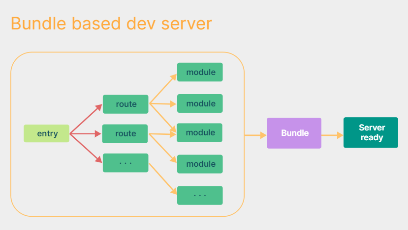
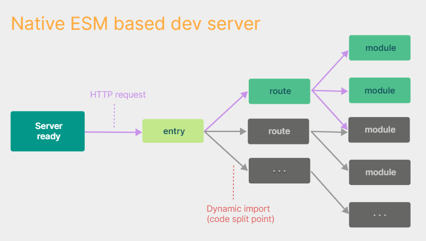

# Vue3

Vue (发音为 /vjuː/，类似 **view**) 是一款用于构建用户界面的 JS 框架。它基于标准 HTML、CSS 和 JS 构建，并提供了一套声明式的、组件化的编程模型，帮助你高效地开发用户界面。无论是简单还是复杂的界面，Vue 都可以胜任。

- ### Vue3简介

  2020年9月18日，Vue发布3.0版本，代号：One Piece（海贼王）。其中经历了：4800+次提交、40+个RFC、600+次PR、300+贡献者。

- ### Vue3相比于Vue2的优势

  1. 性能的提升：

     - 代码打包后的体积减小41%。

     - 初次渲染快55%，更新渲染快133%。

     - 内存减少54%。

       ....

  2. 源码的升级：使用Proxy代替defineProperty实现响应式、重写虚拟DOM的实现和Tree-Shaking、...

  3. 拥抱TS：Vue3可以更好的使用TypeScript。

  4. 新的特性：

     1. 组合式API：setup配置、ref与reactive、watch和watchEffect、provide与inject、...
     2. 新的内置组件：Fragment、Teleport、Suspense、...
     3. 其他的改变：新的声明周期钩子、data配置项应始终用函数写法、vue文件中可以写多个script标签（多个标签的lang属性必须相同）、移除keyCode作为v-on的修饰符、移除过滤器、...

- ### 创建Vue3项目

  - 方式1：通过Vue Cli脚手架创建。Vue Cli是Vue 2项目常用的脚手架，它是基于Webpack的。

  - 方式2：使用Vite创建（Vue3的脚手架）：

    Vite是新一代的前端打包工具。官网：https://vitejs.cn/vite3-cn/guide/，它相较于Webpack的优势：
    
    - 开发环境中，无需打包操作，可以快速的冷启动。
    
    - 更轻量快速的热重载（HMR）。
    
    - 真正的按需编译，不再等待整个应用编译完成。
    
    - 对于TS、CSS、JSX等，支持开箱即用。
    
    - 传统构建与Vite构建对比图：
    
      
    
      
    
    1. `npm create vue@latest`，这一指令将会安装并执行`create-vue`工具，它是 Vue3 官方的（基于Vite）项目脚手架。执行后按照项目构建提示创建项目即可。
    2. cd进入工程目录后安装依赖：`npm i`，然后运行项目：`npm run dev`。
    
    ##### Vue3脚手架和Vue2脚手架创建的工程，目录结构不太一样，这里简单说下：
    
    - `public/`：脚手架的根目录。里面只有一个页签图标`favicon.ico`，项目的页面`index.html`不在这里了。
    
    - `src/`：前端项目的源码目录。该目录中的所有文件都要通过Vite来编译打包。
    
    - `env.d.ts`：里面的`<reference types="vite/client"/>`可以让项目中的TS代码识别`import`导入的`.txt/.jpeg/.md/..`文件。
    
    - `index.html`（重点）：它是项目的页面，其中引入了项目的入口文件`src/main.ts`。
    
      ```html
      <div id="app"></div>
      <script type="module" src="/src/main.ts"></script><!-- 引入了主模块src/main.ts -->
      ```
    
    - `vite.config.ts`：整个Vite项目的配置文件。（对应Vue2脚手架项目中的`vue.config.js`）
    
    - `tsconfig.json/tsconfig.app.json/tsconfig.node.json`：TS的配置文件。
    
    ##### 你可能注意到了：为什么Vue2的脚手架项目中，index.html中没有导入main.js，而Vue3的基于Vite的脚手架项目中，index.html通过`<script>`导入了入口文件`main.js`？
    
    这是因为 **Vue 2 的脚手架（Vue CLI + Webpack）** 和 **Vue 3 的 Vite 脚手架** 对 `index.html` 的定位完全不同。
    
    Vue 2的 `public/index.html` 只是一个**模板文件**。Webpack 构建时会使用`HtmlWebpackPlugin`插件来生成最终的`index.html`，里面包含了`main.js`；
    
    Vite 并不像 Webpack 那样先打包再运行，而是直接运行源码。在Vite的开发模式下，通过入口文件`index.html`导入了`main.js`，然后按需编译执行的。因此开发者需要明确告诉浏览器，入口JS在哪里。
    
    ```tex
    index.html -> 浏览器加载main.js -> main.js import App.vue -> Vite按需编译
    ```
    
    ##### 为了方便学习，我们接下来还用Vue Cli（Vue2脚手架）来创建Vue 3的工程。

- ### 关于Vue3中的`main.js`

  Vue Cli创建的Vue3项目的目录结构和文件和2是类似的，唯一不同的是Vue3的入口文件。在`src/main.js`中：

  ```js
  // 采用分别引入的方式引入了createApp工厂函数
  import { createApp } from 'vue'
  import App from './App.vue'
  
  const app = createApp(App)
  app.mount('#root')  // 不是$mount()方法了
  ```

  `createApp(App)`函数会通过传入App组件，去创建一个**应用实例对象**（其实就是更轻量的vue实例对象），通过该对象的`mount()`方法将App组件挂载（填充）到id为root的HTML容器中。
  
  该对象身上还有`unmount()`可以从HTML容器中卸载App组件。

  ##### 注意：原来Vue2的入口文件写法在Vue3中不能用了。

- ### Vue3组合式API的基础——setup配置项

    - `setup`是Vue3中新增的一个组件配置项，值是一个函数。它是所有**组合式API**表演的舞台，组件中所有用到的数据、方法、生命周期钩子等，均要写在`setup`函数中（非必须）。（之前在组件中写的配置项叫**选项式API**）

    - `setup()`函数的2种返回值：

      - **若返回一个普通的JS对象，则对象中的属性和方法可以直接在Vue模板中使用。**

      - （了解）返回一个**渲染函数**，该渲染函数的返回值将作为Vue模板（虚拟DOM）被渲染到页面上。

        ```js
        import { h } from 'vue'
        export default {
            name: 'App',
            setup(){
                // 渲染函数的返回值是虚拟DOM，创建虚拟DOM需要从vue身上引入h函数（createElement）
                return ()=>{ return h('h1','你好') } // 返回的虚拟DOM会被转成真实DOM放到页面上
            }
        }
        ```

    - `setup()`函数的2个参数：

      - `props`：值为声明接收的`props`对象。

      - `context`：它是上下文对象，其中包含`attrs`、`emit()`、`slots`、`expose()`，分别对应了Vue2组件实例上的`$attrs`、`$emit()`、`$slots`。

        > `expose({ k: v })`函数用于显式地限制该组件暴露出的属性，当父组件通过ref访问该组件的实例时，将仅能访问 `expose` 函数暴露出的内容。

    - 注意：

      1. Vue3中尽量不要写Vue2的配置项了，虽然Vue3中的`methods`、`data`、`computed`...配置项仍可用，且其中可以访问到`setup()`返回的属性和方法，但Vue3的`setup()`中不能访问Vue2的`data`、`methods`的数据。（若混用后重名了，则setup优先）

      1. `setup()`函数会在`beforeCreate()`之前执行，并且其中的`this`是`undefined`。（组合式API都是函数，没实例啥事了）

      1. `setup()`不能是一个Async函数。因为Async函数的返回值是一个Promise对象，它需要再`.then()`去获取数据。

         > 其实满足一定条件后，也可以返回Promise对象，后面再说。

    - ##### SFC中的`setup`语法糖：

      > `<script setup>` 是在单文件组件 (SFC) 中使用组合式 API 的编译时语法糖。它具有更多优势：
      >
      > - 更少的样板内容，更简洁的代码。
      > - 能够使用纯 TypeScript 声明 props 和自定义事件。
      > - 更好的运行时性能 (其模板会被编译成同一作用域内的渲染函数，避免了渲染上下文代理对象)。
      > - 更好的 IDE 类型推导性能 (减少了语言服务器从代码中抽取类型的工作)。

      `<script setup>`里面的代码会被编译成组件 `setup()` 函数体中。并且，**顶层的绑定会被暴露给模板**，即：当使用 `<script setup>` 的时候，任何在 `<script setup>` 声明的顶层的绑定 (包括变量，函数声明，以及 import 导入的内容) 都能在模板中直接使用。它们都自动放到对象中`return`出去了。并且`import`**导入的组件会被自动注册**。

      `<script setup>`这种写法导致该`<script>`标签中不能写组件的其他配置项了，不过可以再写一个`<script>`标签，SFC中可以有多个`<script>`。

      比如，我们想通过`name`配置项给组件起名字，此时就必须再写一个`<script>`标签。否则组件名默认是文件名。或者可以使用插件来完成：

      1. 安装插件：`npm i vite-plugin-vue-setup-extend -D`

      2. vite.config.ts中：

         ```ts
         import VueSetupExtend from 'vite-plugin-vue-setup-extend'
         export default defineConfig({
             plugins: [
             	vue(),
             	VueSetupExtend()
             ],
         })
         ```

      3. 给script标签加name属性，给组件起名字：`<script setup lang="ts" name="abc"></script>`

      好消息，Vue 3.3中可以使用`defineOptions() `预编译宏来给组件命名：

      ```vue
      <script setup>
      defineOptions({
        name: 'School',
      })
      </script>
      ```

      > **Tips：**
      >
      > 像`defineOptions`、`defineProps()`、`defineEmits()`..这些以`defineXxx`开头、不需要导入就能在`<script setup>`中直接用的函数，叫做**编译器宏（宏函数）**，它们会随着 `<script setup>` 的处理过程一同被编译掉。 
      >
      > **宏函数的返回值会自动提升到模块作用域，也就是说它们不是`setup`函数内部的局部变量，而是可以在整个组件中访问**。
      >
      > 并且宏函数不能引用`setup()`中的局部变量，但能使用`import`导入的变量，因为它们不是局部作用域。

    - ##### `defineProps()/defineEmits()`：

      Vue3的`<script setup>`中仍然可以声明接受`props`、`emits`，通过宏函数`defineProps()/defineEmits()`，并且可以获得完整的类型推导支持：

      ```vue
      <script setup>
      const props = defineProps({
        foo: String
      })
      
      const emit = defineEmits(['change', 'delete'])
      // setup 代码
      </script>
      ```
      
      `defineProps` 接收与 `props` 选项相同的值，`defineEmits` 接收与 `emits` 选项相同的值。


- ### Vue3常用的组合式API

  Vue2中配置项写法的API函数，称为选项式API。而Vue3中的组合式API相较于选项式API的优势在于：我们可以更加优雅的组织我们的代码、函数，让相关功能的代码更加有序的组织在一起。

  组合式API可以让你在任何地方使用methods、data、computed、生命周期钩子..等组件上的配置项，可以极大复用组件代码。

  通过组合式API，可以将组件中的代码逻辑提取到一个Hook函数中，任何需要此功能的组件都可以引入该Hook使用，极大的复用了组件中的代码。即：组合式API的优势在Hook函数中体现的淋漓尽致。

  这两种 API 风格都能够覆盖大部分的应用场景。它们只是同一个底层系统所提供的两套不同的接口。实际上，**选项式 API 是在组合式 API 的基础上实现的**！关于 Vue 的基础概念和知识在它们之间都是通用的。

  > 注意：所有的组合式API都需要从vue模块中导入才能使用，并且它们都是函数，可以进行复用。

  - ##### ref()：

      在`setup()`函数体中直接定义的数据是没有响应式的。Vue3中如果想让数据变成响应式的，需要用`ref()`加工下：

      ```vue
      <template>
      	<span>我的名字是:{{name}}</span>
      	<span>我的年龄是:{{age}}</span>
      </template>
      <script lang="ts"> // 表示里面写的是TS代码
          // 组合式API都需要在vue中引入才能使用
          import { ref } from 'vue'
          export default {
              name: 'App',
              setup(){
                  let name = ref('张三')
                  let age = ref(18)
                  return {name,age} // 经过ref()加工后的name、age，Vue才做了响应式
              }
          }
      </script>
      ```

      `ref()`接受一个值并返回一个 Ref 对象。Ref 对象只有一个`value`属性指向这个值。通过 `value` 属性修改这个值时，Vue能够检测到其更改，它是响应式的。

      Vue3中，`ref()`给数据做响应式的原理是：通过`Object.defineProperty()`给RefImpl对象的原型上，定义了虚拟属性`value`，访问和修改的其实是`ref()`收集过来的数据。因此要修改`name`和`age`得通过Ref对象的`value`属性去访问和修改。

      并且在Vue模板中，如果数据是一个Ref对象，那么Vue解析时自动会去读取它的`value`属性（拆包），所以这样写即可：`{{name}}`，不需要：`{{name.value}}`

      如果传给Ref的是一个（引用类型的）对象，那么这个对象将通过 `reactive()` 转为具有深层次响应式的 Proxy 对象，然后再将该 Proxy 对象放在Ref对象的`value`属性中。而之所以要将对象包装为Proxy对象，是因为Vue要对对象内部所有层次的数据，都进行响应式处理。

      > 若要避免这种深层次的转换，请使用下文的 `shallowRef()` 来替代。

  - ##### reactive()：

      我们知道，Vue2中（对象和数组）的响应式存在以下问题：
      
      - 新增属性、删除属性，界面不会更新。
      - 直接通过下标修改数组，界面不会更新。

      虽然Vue2提供了相应的解决方案，但是Vue3用`reactive()`实现的响应式更优秀，可以直接对对象和数组进行任意的增删查改，不存在以上的问题：

      `reactive()`的作用是：给引用类型的数据（对象或数组）做响应式。（基本类型不能用它，得用ref）
      
      `reactive()`会将普通对象、数组包装为Proxy对象。语法：`const 代理对象/数组 = reactive(源对象/数组)`。

      `reactive()`会给对象/数组所有层次的数据做响应式，并且后续往里面添加的数据也是响应式的。其内部是通过ES6的`Proxy`实现的。

      > Vue3的响应式原理：
      >
      > Vue3中通过`reactive()`为源对象生成了一个Proxy代理对象。Proxy会为对象创建一个代理，从而拦截对对象的任何操作（增删改查等）。而Proxy中对源对象的增删改查又通过Reflect（反射）来完成。
      
      这种方式实现的响应式，可以捕获到对代理对象属性的增、删、改、查，因此不存在Vue2的问题。模拟Vue3的响应式：
      
      ```js
      let person = {name:'张三',age:14}
      const p = new Proxy(person, {
          // 当读取源对象person的某个属性时调用
          get(target,propName){
              console.log(`有人读取了源对象的${propName}属性`)
              return Reflect.get(target,propName)
          },
          // 当新增、修改源对象的某个属性时调用
          set(target,propName,value){
              console.log(`有人修改/新增了源对象的${propName}属性`)
              Reflect.set(target,propName,value)
          },
          // 当删除源对象的某个属性时调用
          deleteProperty(target,propName){
          	console.log(`有人删除了源对象的${propName}，我要去更新页面了`)
              return Reflect.deleteProperty(target,propName)
          }
      })
      ```
      
      注意：**Proxy会自动解包其中的任何ref对象。也就是说，Proxy对象中的ref对象不用再`.value`去取值了（深层次）**。

  - ##### computed()：

      Vue3中的计算属性是一个组合式API，是一个函数，需要在vue模块中导入才能使用：

      ```js
      import {reactive,computed} from 'vue'
      export default {
          name: 'App',
          setup(){
              // 定义响应式数据
              let person = reactive({
                  firstName: '张',
                  lastName: '三'
              })
              // 给响应式数据身上添加计算属性（简写，不考虑修改fullName计算属性）
              person.fullName = computed(()=>{
                  return person.firstName + '-' + person.lastName
              })
              return {person}
          }
      }
      ```

      `computed()`接收一个函数作为参数，该函数的返回值就作为计算属性的结果。
      
      `computed()`返回一个计算属性（`ComputedRefImpl`对象），该计算属性也是响应式的。
      
      计算属性如果会被修改，需要用完整写法，给`computed()`传一个对象参数：
      
      ```js
      person.fullName = computed({
          get(){ return person.firstName + '-' + person.lastName }
          set(v){
              const arr = v.split('-')
              person.firstName = arr[0]
              person.lastName = arr[1]
          }
      })
      ```

  - ##### watch()：

      Vue3中监视属性也是一个组合式API。使用：

      ```js
      import {reactive,watch} from 'vue'
      export default {
          name: 'App',
          setup(){
              // 响应式数据
              let sum = ref(0)
              let count = ref(0)
              // 监视ref定义的多个响应式数据
      		watch(sum, (niu,old)=>{
                  console.log('sum变了：',niu,old)
              })
              watch(count, (niu,old)=>{
              	console.log('count变了：',niu,old)
              })
              return {sum,count}
          }
      }
      ```

      - watch的第1个参数是监视的数据，可以是**Ref对象**或`reactive()`定义的**`Proxy`对象**。第2个参数是回调函数。第3个参数（可选）是配置对象：`{ immediate: true, deep: true }`。
      
      - 如果`watch()`的第1个参数是Ref对象，那么监视的是其中所有的属性。它是浅层次的监视，可以通过配置项来开启深度监视。
      
      - 如果第1个参数是Proxy对象，那么监视的是对象中所有层次的数据。它是强制的，deep配置项不起作用。此时回调中的`niu`和`old`都是该对象的内存地址，无论怎么修改对象内部的数据，`niu`和`old`都指向了同一个对象。
      
      - watch的第1个参数也可以是Ref或Proxy组成的数组，用来同时监视多个数据源。此时回调的参数`niu`和`old`也是数组。
      
      - **小技巧：**如果只想监视Proxy对象中的某个数据，那么watch的第1个参数可以放一个函数：`() => person.name`，如果要监视Proxy对象中的多个数据，那么就用函数数组：`[()=>person.name,..]`。也就是说，监视的数据也可以是**返回一个值的函数**。
      
        **特殊情况：**如果监视的Proxy中的数据，类型也是对象，并且层次比较深，那么还需要开启深度监视。

  - ##### watchEffect()：

      它和`watch()`监视属性不同的是：不用指定去监视哪个属性，监视的回调中用到了哪个响应式数据，就监视哪个属性：

      ```js
      watchEffect(()=>{
        console.log(sum.value,person.age)
      })
      ```

      当一上来组件初始化时、以及回调函数中用到的响应式数据发生变化时，都会执行该回调。

      `watchEffect()`和`computed()`有点像，都是依赖的数据发生变化后就执行。不同的是`watchEffect()`不要求返回值。

- ### （Vue3中）组件的生命周期

  

  ##### Vue3组件的生命周期和Vue2中的区别：（没有什么太大的改动）

  1. 原来的`beforeDestroy()`和`destroyed()`改为了`beforeUnmount()`和`unmounted()`。
  
  2. 由原来的`new Vue()`变为了`createApp(App)`，创建vue实例对象变为了创建**应用实例对象**。并且销毁vue实例的`vm.$destroy()`变成了`app.unmount('#root')`。
  
  3. 并且这些生命周期钩子（选项式API），Vue3中也提供了对应的组合式API函数：（且组合式API的优先级更高）
  
     - beforeCreate()/created()        ==>             setup()
     - beforeMount()                        ==>             onBeforeMount()
     - mounted()                              ==>              onMounted()
     - beforeUpdate()                      ==>              onBeforeUpdate()
     - updated()                               ==>              onUpdated()
     - beforeUnmount()                  ==>               onBeforeUnmount()
     - unmounted()                         ==>               onUnmounted()
  
     > 以上这些组合式API函数中，参数都是一个函数，该函数参数会在对应的生命周期被调用。

- ### 自定义Hook

  Hook本质上就是一个函数，里面使用了一些组合式API函数。使用自定义Hook的优势是：复用代码，让setup的逻辑更简单。我们可以在自定义Hook中，封装多个组件共用的功能代码，从而复用组件中的公共功能。

  Hook函数的名字一般叫`useXxx`，使用：

  > `src/hooks/usePoint.js`：

  ```js
  import { reactive, onMounted, onBeforeUnmount } from 'vue'
  
  export default () => {  // 获取鼠标点击位置的Hook函数
    let point = reactive({x:0,y:0})
    function savePoint(e){
      point.x = e.pageX
      point.y = e.pageY
    }
  
    onMounted(()=>{
      window.addEventListener('click',savePoint)
    })
    onBeforeUnmount(()=>{
      window.removeEventListener('click',savePoint)
    })
    return point
  }
  ```

  > `App.vue`：

  ```vue
  <template>
  	<h1>当前鼠标点击的位置是:</h1>
  	<span>x坐标:{{x}}</span>
  	<span>y坐标:{{y}}</span>
  </template>
  <script>
    import { ref } from 'vue'
    import usePoint from './hooks/usePoint'
    export default {
      name: 'App',
      setup(){
        let {x,y} = usePoint()
        return {x,y}
      }
    }
  </script>
  ```

  注意：自定义的Hook函数也不一定非得按照上面的格式来写，只要实现了Hook的功能即可。

- ### `toRef()/toRefs()`

    创建一个Ref对象，其`value`值指向另一个响应式对象中的某个属性。语法：`const name = toRef(person,'name')`

    如果参数是Vue的响应式对象（Ref/Proxy对象），那么生成的Ref对象也和原对象所关联、具有响应式。

    使用场景：只将响应式对象中的某个属性提供给外部。（如果不用toRef，那么该属性外部只能用不能改，因为外部拿不到Proxy对象只拿到了一个值）

    扩展：`toRefs()`和`toRef()`功能类似，它可以批量创建多个`Ref`对象，语法：`const p = toRefs(person)`，此时person中的属性p对象中都有，值都是Ref对象。

- ### 其他的组合式API（不常用）

    - ##### shallowReactive()与shallowRef()：

        - shallowReactive()：与reactive()不同的是，shallowReactive()只对对象浅层次的数据做响应式。
        - shallowRef()：与ref()不同的是，shallowRef()只对基本类型做响应式，引用类型（对象和数组）只变为ref对象，并不会包装为Proxy对象。

    - ##### readonly()与shallowReadonly()：

        - readonly()：将一个响应式数据进行包装，返回的新响应式数据是**深层次只读**的。
        - shallowReadonly()：类似与readonly()，只是返回的新响应式数据是**浅层次只读**的。

    - ##### toRaw()与markRaw()：

        - toRaw()：根据一个 Vue 创建的代理对象，返回其对应的原始对象。它可以返回由 `reactive()`、`readonly()`、`shallowReactive()` 或者 `shallowReadonly()` 创建的代理对应的原始对象。
        - markRaw()：将一个对象标记为不可被转为代理。返回该对象本身。该方法可以使一个对象永远不会变成响应式对象。应用场景：在`reactive()`生成的对象中添加的任何数据，默认都是响应式的，如果不希望对添加的某个数据做响应式，可以用它标记后再添加。

    - ##### customRef()：

        通过customRef()可以创建一个自定义的ref对象，并对其依赖项**跟踪（track）**和**更新触发（trigger）**进行显示控制。使用：

        ```vue
        <template>
        	<input type="text" v-model="keyword"/>
        	<h3>{{keyword}}</h3>
        </template>
        <script>
            import { customRef } from 'vue'
            export default {
                name: 'App',
                setup(){
                    // 自定义ref函数myRef，不再用原来的ref()了
                    function myRef(value){
                        /*
                            通过customRef方法来创建一个自定义的ref对象并返回。
                            方法中需要传一个函数，该函数必须返回一个对象，对象中需要有set和get方法。
                        */
                        return customRef((track,trigger)=>{ // 
                            return {
                                // 当读取自定义ref对象的value属性时，get被调用
                                get(){
                                    track() // 对返回值进行持续跟踪，只要变化就去更新ref对象的value
                                    return value
                                },
        						// 当修改自定义ref对象的value属性时，set被调用
                                set(v){
        							value = v
                                    trigger() // 通知Vue去重新渲染模版
                                }
                            }
                        })
                    }
                    let keyword = myRef('hello') // 使用自定义的ref
        			return {keyword}
                }
            }
        </script>
        ```

    - ##### 祖孙组件通信：

        Vue3中提供了`provide`和`inject`，用于支持祖孙组件间通信。

        一个父组件相对于其所有的后代组件，会作为**依赖提供者**。任何后代的组件树，无论层级有多深，都可以**注入**由父组件提供给整条链路的依赖。

        

        用法。在祖组件App中，通过`provide`将一个依赖数据提供出来：

        ```js
        import { provide, ref } from 'vue'
        export default {
            name: 'App',
            setup(){
                let data = ref('AE86')
        		provide('car', data)
            }
        }
        ```

        `provide()` 函数接收两个参数。第一个参数被称为注入名，可以是一个字符串或是一个 Symbol。后代组件会用注入名来查找期望注入的值。一个组件可以多次调用 `provide()`，使用不同的注入名，注入不同的依赖值。

        后代组件Child中，根据注入名key注入这个依赖数据：

        ```js
        import { inject } from 'vue'
        export default {
            name: 'Child',
            setup(){
        		let data = inject('car', 默认值) // 第2个参数指定没收到数据时的默认值
                return {data}
            }
        }
        ```

        注意：`provide()/inject()`方法必须在放在组件的`setup()`函数中，并且要同步执行。

    - ##### 响应式数据的判断：

        - isRef(v)：检查一个值是否是ref对象。
        - isReactive(v)：检查一个对象是否是由reactive创建的响应式代理Proxy。
        - isReadonly(v)：检查一个响应式数据是否是只读的。
        - isProxy(v)：检查一个对象是否是由reactive()、readonly()方法创建的代理对象。

- ### Vue3中的全局组件

  - ##### Teleport（传送）：

    `<Teleport>` 是一个内置组件，它可以将一个组件内部的一部分模板“传送”到该组件的 DOM 结构外层的位置去。用法：

    ```vue
    <!-- MyComponent.vue -->
    
    <!-- 在这个组件中，Teleport内部的内容，实际上会被传送（追加）到body标签内部，而不是当前组件所在的地方 -->
    <Teleport to="body">
      <div>我是内容</div>
    </teleport>
    ```

    `<Teleport>` 接收一个 `to` prop 来指定传送的目标。`to` 的值可以是一个 CSS 选择器字符串，也可以是一个 DOM 元素对象。这段代码的作用就是告诉 Vue“把以下模板片段**传送到 `body`** 标签下”。

    > TIP：
    >
    > `<Teleport>` 挂载时，传送的 `to` 目标必须已经存在于 DOM 中。理想情况下，这应该是整个 Vue 应用 DOM 树外部的一个元素。如果目标元素也是由 Vue 渲染的，你需要确保在挂载 `<Teleport>` 之前先挂载该元素。

    `<Teleport>` 只改变了渲染的 DOM 结构，它不会影响组件间的逻辑关系。

    在某些场景下可能需要视情况禁用 `<Teleport>`。举例来说，我们想要在桌面端将一个组件当做浮层来渲染，但在移动端则当作行内组件。我们可以通过对 `<Teleport>` 动态地传入一个 `disabled` prop 来处理这两种不同情况：

    ```vue
    <Teleport :disabled="isMobile">
      ...
    </Teleport>
    ```

    多个 `<Teleport>` 组件可以将其内容挂载在同一个目标元素上，而顺序就是简单的顺次追加，后挂载的将排在目标元素下更后面的位置上，但都在目标元素中。

  - ##### Suspense：

    > `<Suspense>` 是一项实验性功能。它不一定会最终成为稳定功能，并且在稳定之前相关 API 也可能会发生变化。

    Suspense组件（React也有）用于呈现Vue的异步组件。
    
    **异步组件**：通过Vue3的`defineAsyncComponent()`加载的组件：（React中的异步组件是通过`lazy()`函数加载的）
    
    ```js
    // defineAsyncComponent不是宏函数，需要导入
    import { defineAsyncComponent } from 'vue'
    
    // 动态引入，import()语句【可能】会发送网络请求
    const Child = defineAsyncComponent(() => import('./components/Child'))
    ```

    最后得到的 `AsyncComp` 是一个外层包装过的组件，仅在页面需要它渲染时才会调用加载内部实际组件的函数。它会将接收到的 props 和插槽传给内部组件，所以你可以使用这个异步的包装组件无缝地替换原始组件，同时实现延迟加载。

    但是当网络环境差，请求发生了错误时，如果页面上什么都不没有，用户还以为压根就没这个组件呢。此时可以用`<Suspense>`组件。

    `<Suspense>`组件会等待异步组件的渲染，当异步组件还没渲染到页面上时展示一些默认内容，提升用户体验。使用：
    
    ```vue
    <!-- 用Suspense组件包住异步组件 -->
    <Suspense>
      <template #default>
        <AsyncChild />
      </template>
      <template #fallback>
        <h3>loading....</h3>
      </template>
    </Suspense>
    ```
    
    `<Suspense>`内部有2个插槽，异步组件要放到`default`默认插槽中，异步组件请求成功后展示；请求失败或未完成时，展示`fallback`备用插槽的内容。
    
    **`async setup()`**：
    
    组合式 API 中组件的 `setup()` 钩子可以是异步的：
    
    ```js
    export default {
      async setup() {
        const res = await fetch(...)
        const posts = await res.json()
        return {
          posts
        }
      }
    }
    ```
    
    如果使用 `<script setup>`，那么顶层 `await` 表达式会自动让该组件成为一个异步组件，此时`setup()`钩子返回的是一个Promise对象，其中保存的是一个JS对象或渲染函数：
    
    ```vue
    <script setup>
      const res = await fetch(...)
      const posts = await res.json()
    </script>
    
    <template>
      {{ posts }}
    </template>
    ```
    
    > 严格上来说，异步组件是被`defineAsyncComponent()`包装后的组件，而顶层 `await` 的`setup()`只是让该组件变成了一个可以被`<Suspense>`处理的异步依赖。异步依赖和异步组件本质上不是同一个东西。

- ### Vue3中的其他变化

  - ##### 全局API的转移：

    Vue2中我们可以使用Vue构造器上的全局API和配置：`Vue.component()`。但是Vue3中没有了Vue构造函数，因此这些全局API都放在了应用实例对象`app`上。原来的`Vue.xxx`都变成了`app.xxx`。比如，原来的`Vue.prototype`变成了`app.config.globalProperties`。并且移除了`Vue.config.productionTip`。
  
  - ##### Vue3的ref：
  
    Vue3中不能用`vm.refs`来获取ref标记的DOM了，因为组合式API中拿不到组件实例了。就算有办法拿到了，Vue3中将组件实例保护起来了，变成了Proxy对象，之前Vue2的API同样是拿不到的。
  
    Vue3中**ref的值必须是一个Ref的容器对象**，此时Vue会将ref标记的元素放到Ref容器对象的`value`属性中。用法：
  
    1. 创建一个ref容器，用于存储ref标记的DOM元素：（就是我们之前用的ref()函数，不要传值，空出来value）
  
       ```js
       import { ref } from 'vue'
       let container = ref()
       ```
  
    2. 给标签加`ref`属性，值是创建的这个**Ref对象**：
  
       ```html
       <div ref="container"></div>
       ```
  
  - ##### expose：
  
    Vue3中，父组件默认是拿不到子组件中的任何数据的，数据必须在子组件中导出之后、父组件才能访问到。通过`setup()`钩子的第二个参数`context`可以解构出`expose`函数，通过该函数导出数据：
  
    ```js
    export default {
      setup(props, { expose }) {
        // 让组件实例处于 “关闭状态”
        // 即不向父组件暴露任何东西
        expose()
    
        const publicCount = ref(0)
        const privateCount = ref(0)
        // 有选择地暴露局部状态
        expose({ count: publicCount })
      }
    }
    ```
  
    如果是在`<script setup>`中，则可以通过 `defineExpose()` 编译器宏来显式指定要导出的内容：
  
    ```vue
    <script setup>
    import { ref } from 'vue'
    
    const a = 1
    const b = ref(2)
    
    defineExpose({
      a,
      b
    })
    </script>
    ```
  
    这样父组件拿到子组件实例之后，就可以访问其导出的内容了：`childRef.a`
  
  - ##### emit：
  
    Vue3中给组件绑定了自定义事件后，必须在组件中声明该事件：`context.emit(['事件名',..])`，否则会有警告。
  
    因为Vue3中*移除了v-on的.native修饰符*，只要通过`emit()`声明的事件都是自定义事件，否则就当做原生事件。
  
    如果是在`<script setup>`中，则可以通过 `defineExpose()` 编译器宏来声明自定义事件。
  
  - ##### （Vue 3中的）`v-model`：
  
    - Vue2中，`v-model`的原理：（自定义组件和HTML元素都是如此）
  
      v-model双向数据绑定，底层是用表单元素的`input`或`change`事件来完成的：
  
      ```js
      <input type='text' :value="username" @input="username = $event.target.value"/>
      ```
  
      它和`<input type='text' v-model="username"/>`是等价的。
  
    - 而在Vue3中，`v-model`用在组件标签上则发生了变化。Vue3中`v-model`加在组件标签上是这样的：
  
      ```js
      <MyComponent :modelValue="username" @update:modelValue="val => (username = val)"/>
      ```
  
      上面的代码相当于：`<MyComponent v-model="username"/>`，其中`update:modelValue`就是一个普通的自定义事件名。
  
      > 如果觉得modelValue有点烦，其实也可以自定义：`v-model:qwe="username"`，此时modelValue就变成了qwe，update:modelValue变成了update:qwe。这样做的好处是：组件标签上可以写多个v-model。
  
  - ##### （Vue 3中的）`v-bind`：
  
    `v-bind`可以不绑定任何属性，此时值必须是一个对象：`<h1 v-bind="{x:100,y:200}"/>`，此时就相当于：`<h1 :x="100" :y="200"/>`。
  
    因此`<Child v-bind="$attrs"/>`其实就是：当前组件的`$attrs`中（没有声明接收的props）的所有K-V，都以`props`的形式透传给了Child组件。
  
  - ##### 其他：
  
    - data配置项应该写成一个函数。
    
    - 移除了过滤器filter。
    
    - Vue2中要求组件模版中只能有一个根标签，而Vue3并不强制要求这样做，此时它自动会将多个标签自动包含在一个`Fragment`虚拟DOM中。这样就减少不必要的标签结构，理论上来说减少了内存占用。
    
    - 过渡类名v-enter和v-leave变成了`v-enter-from`和`v-leave-from`，和结束类名看起来更配了。
    
      ...
    

# Pinia

Pinia是一个符合直觉的Vue.js状态管理库（插件）。它没有Vuex那么臃肿、那么多复杂的流程，使用起来非常简单而又直接，是Vue3官方推荐的状态管理工具。使用：

- ##### Pinia环境准备：

  1. 安装：`npm i pinia`

  2. main.js入口文件中使用Pinia（Vue插件）：

     ```js
     import { createApp } from 'vue'
     import App from './App.vue'
     // 1、引入createPinia()函数，用于创建pinia实例
     import {createPinia} from 'pinia'
     
     const app = createApp(App)
     // 2、创建pinia
     const pinia = createPinia()
     // 3、安装pinia（插件）
     app.use(pinia)
     app.mount('#root')
     ```

  3. 新建src/store/目录，不同模块的store对象放在不同文件中：（创建不同的store对象，并为每个store对象创建唯一id）

     > count.js：（这个*id*是必须传入的，Pinia 将用它来连接store和devtools。为了养成习惯性的用法，将返回的函数命名为*use...*，这是一个符合组合式API风格的约定）
     >
     > ```js
     > import { defineStore } from 'pinia'
     > // 建议遵循Hook的命名。第1个参数是store的id（唯一），用于区分不同的store对象，第2个参数是配置对象
     > export const useCountStore = defineStore('count', {
     >        // 配置状态，值为返回一个对象的函数
     >        state: () => {
     >        	return { sum: 0 } // 该模块中存一个状态sum，初值为0
     >        }
     > })
     > // defineStore的返回值是一个函数，函数的执行结果是store对象（Proxy对象）。其中有sum、$state属性
     > ```
     >
     > talk.js：
     >
     > ```js
     > import { defineStore } from 'pinia'
     > const useTalkStore = defineStore('talk', {
     >     // 配置状态，值为返回一个对象的函数
     >        state: () => {
     >        	return { talk: 'haha' }
     >        }
     >    })
     > ```
     
     > **TIP**：defineStore的第2个参数也可以是一个函数（`()=>{}`），可以实现更多的高级用法：
     >
     > ```js
     > export const useCounterStore = defineStore('counter', () => {
     >     const count = ref(0)
     >     function increment() { // 该函数也可以是箭头函数
     >     	count.value++
     >     }
     > 
     >     return { count, increment }
     > })
     > ```
     >
     > - 该函数定义了一些响应式属性和方法，并且返回一个带有我们想暴露出去的属性和方法的对象。在Setup Store中：`ref()` 就是 `state` 属性，`computed()` 就是 `getters`，`function()` 就是 `actions`。
     > - **注意**：要让 pinia 正确识别 `state`，你**必须**在 setup store 中返回 **`state` 的所有属性**。这意味着，你不能在 store 中使用**私有**属性。不完整返回会影响**SSR**，开发工具和其他插件的正常运行。
     > - Setup store 比 Option Store 带来了更多的灵活性，因为你可以在一个 store 内创建侦听器，并自由地使用任何组合式函数。不过，请记住，**使用组合式函数会让 SSR 变得更加复杂**。

- #####  使用Pinia：

  - 访问store中的数据：

    ```js
    import { useCountStore } from '@/store/count'
    const countStore = useCountStore()
    ```

    > Vue模板中`{{ countStore.sum }}`即可访问。（或`{{ countStore.$state.sum }}`）

  - 修改store中的数据：（store中的数据都是响应式数据，类似于ref对象）

    > - 无业务逻辑时：
    >
    >   - 可以直接修改：`countStore.sum += 1`
    >   - 或者批量修改：`countStore.$patch({sum:888})`，它会和原来的state进行合并。
    >
    > - 有业务逻辑时：（通过Actions，你可以认为actions函数就是Vue2中的methods）
    >
    >   1. 首先在对应模块的store中需要有对应的Action。在count.js的defineStore中加配置项：
    >
    >      ```js
    >      export const useCountStore = defineStore('count', {
    >          state(){
    >              return { sum: 0 }
    >          },
    >          actions: { // actions对象中放一个个的action函数，函数中可以写复杂的业务逻辑
    >              increment(v){ this.sum+=v }, // action函数中的this就是store对象，所以不要用箭头函数
    >          }
    >      })
    >      ```
    >
    >   2. 调用sotre对象上的Action函数：`countStore.increment(100)`

- ##### getters：

  > 当state配置项中的状态数据，需要经过处理再使用时，可以使用getters配置项：（类似于computed计算属性）

  ```js
  export const useCountStore = defineStore('count',{
      state(){
          return { sum: 0 }
      },
      getters: {
          bigSum(state){ return state.sum*10 } // 每一个函数中都可以收到state参数，并且其中的this也是store对象
      }
  })
  ```

  ###### 注意：getters、actions的函数中的this都是当前store对象。

- ##### storeToRefs(store对象)：

  > 它只会把store对象中，所有的状态数据转为ref对象。然后放在一个对象中返回。

- ##### $subscribe(func)：

  > 它可以监视store中状态（数据）的修改。使用：

  ```js
  countStore.$subscribe((mutate,state)=>{ // 参数1是修改信息对象，参数2是修改的状态数据（Proxy对象）
      console.log('状态修改了',mutate,state)
  })
  ```

- ##### store的组合式写法：

  > 之前都是通过选项式写法来创建的store对象。接下来我们用组合式写法：

  ```js
  export const useCountStore = defineStore('count',()=>{ // 组合式写法第2个参数传一个函数（相当于setup()函数）
      // 直接定义响应式的数据
      let sum = ref(0)
      // 直接写action函数
      increment(v){ sum+=v }, // action函数中的this就是store对象
  	return { sum, increment }
  })
  ```

# mitt

Vue3推荐使用`mitt`来代替全局事件总线。mitt类似于pubsub，是一个用于实现任意组件间通信的JS库。它经过gzip压缩后只有200字节。使用：

1. 安装mitt：`npm i mitt`

2. 在src/utils/目录下新建一个文件emitter.js：（名字随意）

   ```js
   import mitt from 'mitt'
   export default mitt() // 调用mitt()得到emitter对象，该对象可以：绑定事件、触发事件
   ```

   > **`emitter`对象身上有这几个方法：**
   >
   > - on('事件名', callback)：绑定该事件。
   > - emit('事件名', data)：触发该事件。其中`data`会作为参数传给事件对应的`callback()`函数。
   > - off('事件名')：解绑该事件。
   > - all：拿到所有绑定的事件。该对象上有`clear()`方法可以解绑所有的自定义事件。

------

